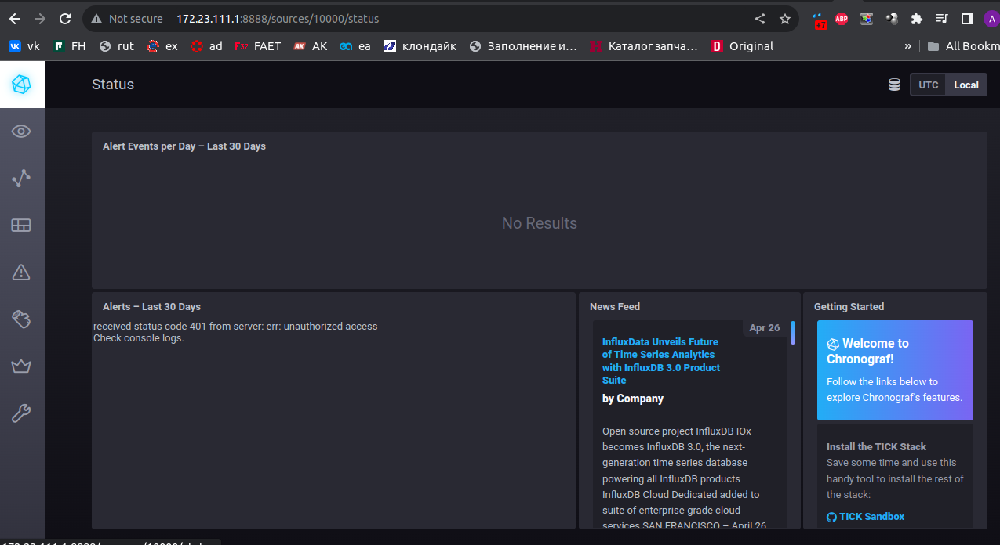
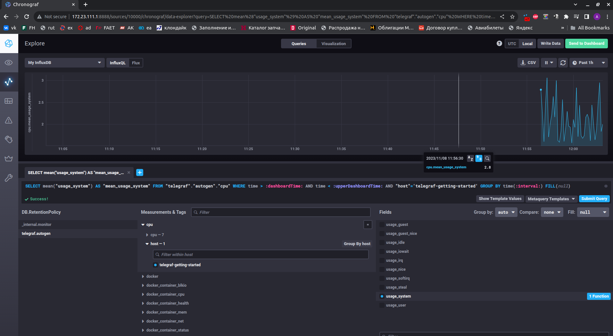
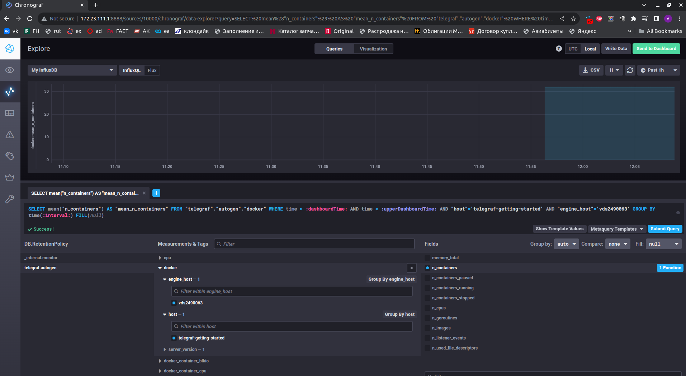

# Домашнее задание к занятию "13.Системы мониторинга"

## Обязательные задания

1. Вас пригласили настроить мониторинг на проект. На онбординге вам рассказали, что проект представляет из себя
   платформу для вычислений с выдачей текстовых отчетов, которые сохраняются на диск. Взаимодействие с платформой
   осуществляется по протоколу http. Также вам отметили, что вычисления загружают ЦПУ. Какой минимальный набор метрик вы
   выведите в мониторинг и почему?

> Для полноценного мониторинга работы системы на мой взгляд необходимы:
> - Время отклика системы (особенно с увеличением нагрузки)
> - Величина трафика (http-запросов) + количество ответов сервера с ошибками (5хх,4xx). Показывает насколько хорошо сервис справляется с трафиком
> - Загрузка CPU (load average 1,5,15 min), время использования CPU (%), загрузка RAM, FS. Показывает достаточно ли ресурсов для работы сервиса и насколько хорошо он их использует
> - Количество процессов сервиса

2. Менеджер продукта посмотрев на ваши метрики сказал, что ему непонятно что такое RAM/inodes/CPUla. Также он сказал,
   что хочет понимать, насколько мы выполняем свои обязанности перед клиентами и какое качество обслуживания. Что вы
   можете ему предложить?

> RAM - загрузка оперативной памяти  
> inodes - количество файловых дескрипторов (открытых файлов)  
> CPUla - загрузка системы (соотношение количества работающих процессов (обрабатываемых CPU) к количеству процессов в ожидании обработки (в очереди) в разрезе интервалов времени, обычно 1,5,10 мин.)

> В рамках SLA в качестве SLO можно предложить:
> - Время доступности сервиса должно быть 24/7 (99% времени), с интервалом не более 15 мин (1% от времени доступности) в сутки на временные тех. работы, форс. мажоры;
> - Время отклика сервиса - не более 3 сек.;
> - Количество ошибок в ответах - не более 1% на 10 запросов.

> Для соблюдения SLO необходимо, что бы SLI были следующими:
> - Загрузка RAM системы - не более 70%;
> - CPU LA не должны превышать значения 1.1;
> - Количество inodes не должно превышать критического порога - макс. количства inodes, при котором при котором нагрузка на FS и RAM не влияет на заявленные SLO работы сервиса; очень зависит от количества процессов сервиса в простое (CPU LA).

3. Вашей DevOps команде в этом году не выделили финансирование на построение системы сбора логов. Разработчики в свою
   очередь хотят видеть все ошибки, которые выдают их приложения. Какое решение вы можете предпринять в этой ситуации,
   чтобы разработчики получали ошибки приложения?

> Существует несколько вариантов OpenSource решений
> - Стек ELK (Elasticsearch + Logstash + Kibana). Сейчас на территории России официально недоступен
> - Стек Prometheus + Grafana + Loki. Отслеживание и агрегирование ошибок работы программы в реальном времени с нотификацией о событиях.
> - Стек Vector + noSQL DB (Clickhouse, prometheus) + GUI (Lighthouse)

4. Вы, как опытный SRE, сделали мониторинг, куда вывели отображения выполнения SLA=99% по http кодам ответов.
   Вычисляете этот параметр по следующей формуле: summ_2xx_requests/summ_all_requests. Данный параметр не поднимается выше
   70%, но при этом в вашей системе нет кодов ответа 5xx и 4xx. Где у вас ошибка?

> Ответы http-сервера, отличные от 2хх могут быть не только с кодом 4хх, 5хх, В формуле метрики не учтены другие коды ответов (1хх, 3хх).

5. Опишите основные плюсы и минусы pull и push систем мониторинга.

> Push модель:  
>
> Плюсы:
> - Настройка точек приёма метрик осуществляется на агентах, что позволяет настроить вывод метрик в несколько систем мониторирования и возможность реализовать репликацию;
> - UDP является менее затратным способом передачи данных, вследствие чего может вырасти производительность сбора метрик;
> - Работает за NAT;
> - Более гибкая настройка отправки пакетов данных с метриками. На каждом клиенте можно задать нужный нам объем данных и частоту отправки.  
>
> Минусы:
> - Затрудняется верификация данных в системах мониторирования. Эмулируя действия агента и можно размыть данные мониторинга ложной информацией;
> - Агенты могут зафлудить сервера запросами спровоцировав DDoS;
> - Протокол UDP не гарантирует доставку данных.

> Pull модель: 
> 
> Плюсы:
> - Легче контролировать подлинность данных. Есть гарантия опроса только тех агентов, которые настроены в системе мониторинга;
> - Упрощенная отладка получения данных с агентов. Так как данные запрашиваются посредством HTTP, можно самостоятельно запрашивать эти данные, используя ПО вне системы мониторинга;
> - Сервер собирает данные с агентов когда может, и если в данный момент нет свободных ресурсов - заберёт данные позже;
> - Безопасность при pull-модели гораздо выше. Не требует открытия порта сервера во вне. Проще защитить трафик, т.к. часто используется HTTP/S  
>
> Минусы:
> - Более высокие требования к ресурсам, особенно при использовании защищённых каналов связи;
> - Не работает за NAT. Надо ставить какой-нибудь прокси.


6. Какие из ниже перечисленных систем относятся к push модели, а какие к pull? А может есть гибридные?

> - Prometheus - Pull (Push с Pushgateway)
> - TICK - Push
> - Zabbix - Push (Pull с Zabbix Proxy)
> - VictoriaMetrics - Push/Pull, зависит от источника
> - Nagios - Pull  


7. Склонируйте себе [репозиторий](https://github.com/influxdata/sandbox/tree/master) и запустите TICK-стэк,
   используя технологии docker и docker-compose.

В виде решения на это упражнение приведите скриншот веб-интерфейса ПО chronograf (`http://localhost:8888`).

P.S.: если при запуске некоторые контейнеры будут падать с ошибкой - проставьте им режим `Z`, например
`./data:/var/lib:Z`

 

8. Перейдите в веб-интерфейс Chronograf (http://localhost:8888) и откройте вкладку Data explorer.

    - Нажмите на кнопку Add a query
    - Изучите вывод интерфейса и выберите БД telegraf.autogen
    - В `measurments` выберите cpu->host->telegraf-getting-started, а в `fields` выберите usage_system. Внизу появится график утилизации cpu.
    - Вверху вы можете увидеть запрос, аналогичный SQL-синтаксису. Поэкспериментируйте с запросом, попробуйте изменить группировку и интервал наблюдений.

Для выполнения задания приведите скриншот с отображением метрик утилизации cpu из веб-интерфейса.

 

9. Изучите список [telegraf inputs](https://github.com/influxdata/telegraf/tree/master/plugins/inputs).
   Добавьте в конфигурацию telegraf следующий плагин - [docker](https://github.com/influxdata/telegraf/tree/master/plugins/inputs/docker):
```
[[inputs.docker]]
  endpoint = "unix:///var/run/docker.sock"
```

Дополнительно вам может потребоваться донастройка контейнера telegraf в `docker-compose.yml` дополнительного volume и
режима privileged:
```
  telegraf:
    image: telegraf:1.4.0
    privileged: true
    volumes:
      - ./etc/telegraf.conf:/etc/telegraf/telegraf.conf:Z
      - /var/run/docker.sock:/var/run/docker.sock:Z
    links:
      - influxdb
    ports:
      - "8092:8092/udp"
      - "8094:8094"
      - "8125:8125/udp"
```

После настройке перезапустите telegraf, обновите веб интерфейс и приведите скриншотом список `measurments` в
веб-интерфейсе базы telegraf.autogen . Там должны появиться метрики, связанные с docker.

Факультативно можете изучить какие метрики собирает telegraf после выполнения данного задания.

