# Домашнее задание к занятию «Kubernetes. Причины появления. Команда kubectl»

### Цель задания

Для экспериментов и валидации ваших решений вам нужно подготовить тестовую среду для работы с Kubernetes. Оптимальное решение — развернуть на рабочей машине или на отдельной виртуальной машине MicroK8S.

### Задание 1. Установка MicroK8S

1. Установить MicroK8S на локальную машину или на удалённую виртуальную машину.
2. Установить dashboard.
3. Сгенерировать сертификат для подключения к внешнему ip-адресу.

### Ответ:
1) `microk8s kubectl get nodes`

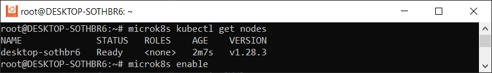

2) `microk8s enable dashboard`

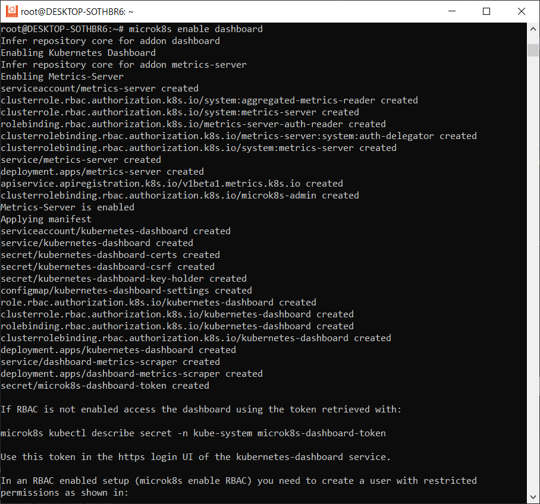

3) `microk8s kubectl describe secret -n kube-system microk8s-dashboard-token`

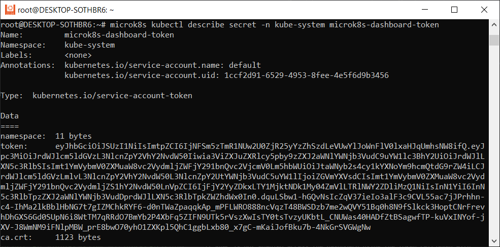

``microk8s status``

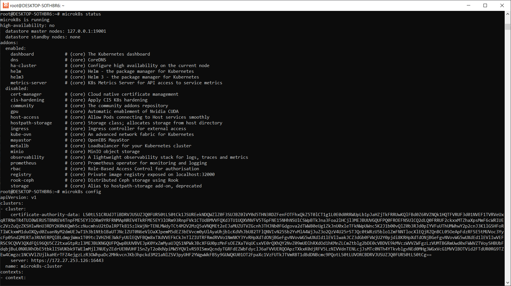

`sudo microk8s refresh-certs --cert front-proxy-client.crt`

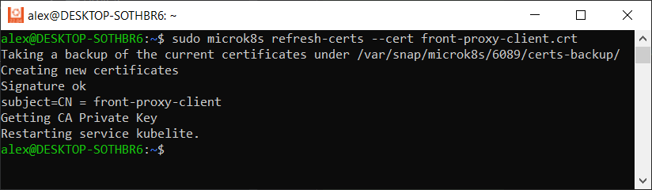

------

### Задание 2. Установка и настройка локального kubectl
1. Установить на локальную машину kubectl.
2. Настроить локально подключение к кластеру.
3. Подключиться к дашборду с помощью port-forward.

### Ответ:
1) 
* `curl -LO "https://dl.k8s.io/release/$(curl -L -s https://dl.k8s.io/release/stable.txt)/bin/linux/amd64/kubectl"`
* `install -o root -g root -m 0755 kubectl /usr/local/bin/kubectl`
* `kubectl version --client`

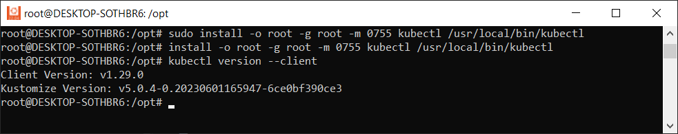

2) В инструкции пропущено, что необходимо еще установить minikube, который создает файл конфигурации, без которой доступа к кластеру у kubectl нет. Для этого делаем следующее:
* `sudo apt-get update && sudo apt-get install docker.io conntrack -y`
* `curl -Lo minikube https://storage.googleapis.com/minikube/releases/latest/minikube-linux-amd64 && chmod +x minikube && sudo mv minikube /usr/local/bin/`
* `sudo snap install kubeadm --classic`
* `minikube start --vm-driver=docker` # вышла ошибка что пользователь не состоит в группе докера, для чего выполнил команду ниже
* `sudo usermod -aG docker $USER && newgrp docker` после чего повторил команду выше и миникуб запустился
* `kubectl cluster-info`

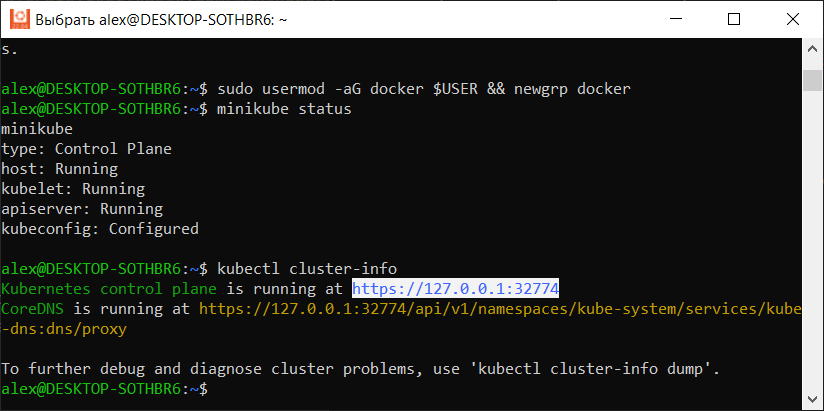

Дополнительно установлена нода Hellow-node
* `kubectl create deployment hello-node --image=k8s.gcr.io/echoserver:1.4`
* `kubectl get deployments`
* `kubectl get pods`
* `kubectl expose deployment hello-node --type=LoadBalancer --port=8080`
* `minikube service hello-node`
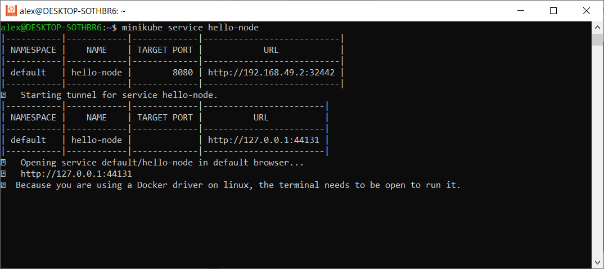

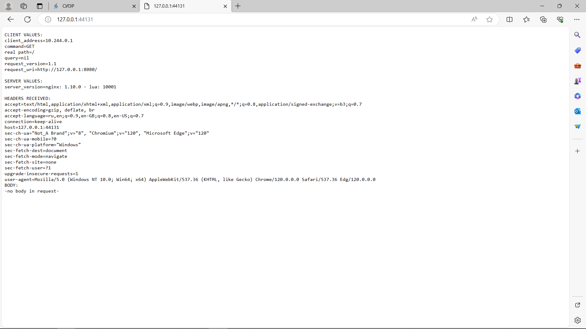

Также были подключены аддоны к миникубу
* `minikube addons enable ingress`
* `minikube addons enable dashboard`
* `minikube addons enable metrics-server`

Проверка плагинов и адреса доступа к дашборду
`minikube addons list | grep enable`
`minikube dashboard --url`
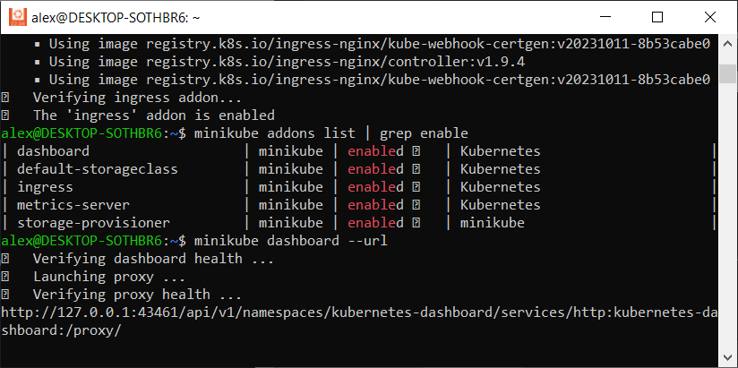

Переходим по адресу, указанному в строке и получаем следующее:
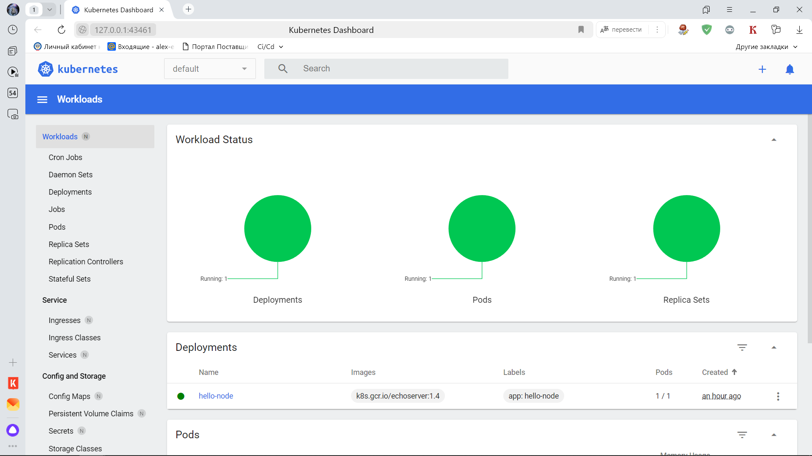

Скриншот вывода команды kubectl get nodes
`kubectl get nodes`

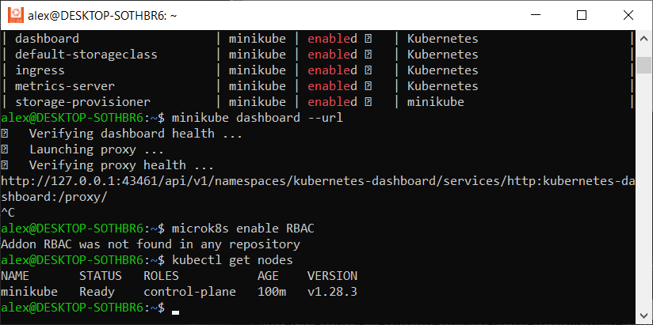

------

### Правила приёма работы

1. Домашняя работа оформляется в своём Git-репозитории в файле README.md. Выполненное домашнее задание пришлите ссылкой на .md-файл в вашем репозитории.
2. Файл README.md должен содержать скриншоты вывода команд `kubectl get nodes` и скриншот дашборда.

------

### Критерии оценки
Зачёт — выполнены все задания, ответы даны в развернутой форме, приложены соответствующие скриншоты и файлы проекта, в выполненных заданиях нет противоречий и нарушения логики.

На доработку — задание выполнено частично или не выполнено, в логике выполнения заданий есть противоречия, существенные недостатки.