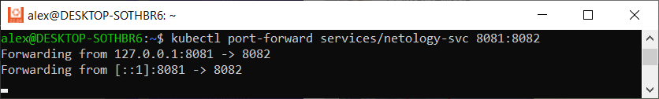
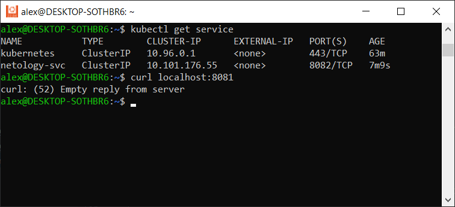

# Домашнее задание к занятию «Базовые объекты K8S»

### Цель задания

В тестовой среде для работы с Kubernetes, установленной в предыдущем ДЗ, необходимо развернуть Pod с приложением и подключиться к нему со своего локального компьютера. 

------
### Задание 1. Создать Pod с именем hello-world

1. Создать манифест (yaml-конфигурацию) Pod.
2. Использовать image - gcr.io/kubernetes-e2e-test-images/echoserver:2.2.
3. Подключиться локально к Pod с помощью `kubectl port-forward` и вывести значение (curl или в браузере).

### Ответ:

1. `vi pod.yaml` создаем манифест pod.yaml
2. Заполняем его следующей конфигурацией:

apiVersion: v1  
kind: Pod  
metadata:  
  name: hello-world  
  namespace: default  
  labels:  
    app: myapp  
spec:  
   containers:  
   - name: hello-world  
     image: gcr.io/kubernetes-e2e-test-images/echoserver:2.2  
     ports:
     - containerPort: 8081

Используем образ из задания

Применяем манифест

`kubectl apply -f pod.yaml`

alex@DESKTOP-SOTHBR6:~$ kubectl apply -f pod.yaml  
pod/hello-world created

Проверяем поды

`kubectl get pod`

* под hellow-node был создан вчера во время выполнение первой домашки

3) Подключаемся к созданному поду через kubectl port-forward

`kubectl port-forward pods/hello-world 8080`

------

### Задание 2. Создать Service и подключить его к Pod

1. Создать Pod с именем netology-web.
2. Использовать image — gcr.io/kubernetes-e2e-test-images/echoserver:2.2.
3. Создать Service с именем netology-svc и подключить к netology-web.
4. Подключиться локально к Service с помощью `kubectl port-forward` и вывести значение (curl или в браузере).

------

### Ответ:

1. `vi netology-web.yaml` создаем манифест pod.yaml
2. Заполняем его следующей конфигурацией:

apiVersion: v1
kind: Pod
metadata:
  name: netology-web
  namespace: default
  labels:
    app: myapp
spec:
   containers:
   - name: netology-web
     image: gcr.io/kubernetes-e2e-test-images/echoserver:2.2
     ports:
     - containerPort: 8082
   - 

Используем образ из задания

Применяем манифест

`kubectl apply -f netology-web.yaml`

Проверяем поды

`kubectl get pod`

3) `vi netology-svc.yaml` создаем манифест pod.yaml
4) Заполняем его следующей конфигурацией:

apiVersion: v1
kind: Service
metadata:
  name: netology-svc
  namespace: default
spec:
  ports:
    - protocol: TCP
      port: 8083
  selector:
     app: myapp

Применяем манифест

`kubectl apply -f netology-svc.yaml`

Проверяем созданный сервис

`kubectl get service`

пробрасываем порт `kubectl port-forward services/netology-svc 8081:8082`

после ввода команды в другом терминале `curl localhost:8081`

выходит следующая ошибка в обоих терминалах

В чем может быть проблема?

------

### Правила приёма работы

1. Домашняя работа оформляется в своем Git-репозитории в файле README.md. Выполненное домашнее задание пришлите ссылкой на .md-файл в вашем репозитории.
2. Файл README.md должен содержать скриншоты вывода команд `kubectl get pods`, а также скриншот результата подключения.
3. Репозиторий должен содержать файлы манифестов и ссылки на них в файле README.md.

------

### Критерии оценки
Зачёт — выполнены все задания, ответы даны в развернутой форме, приложены соответствующие скриншоты и файлы проекта, в выполненных заданиях нет противоречий и нарушения логики.

На доработку — задание выполнено частично или не выполнено, в логике выполнения заданий есть противоречия, существенные недостатки.