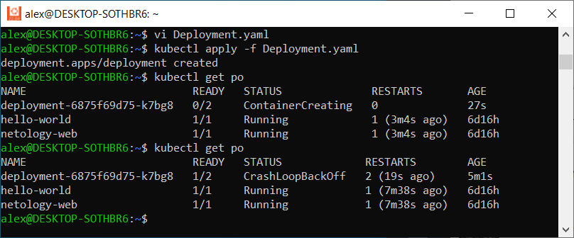
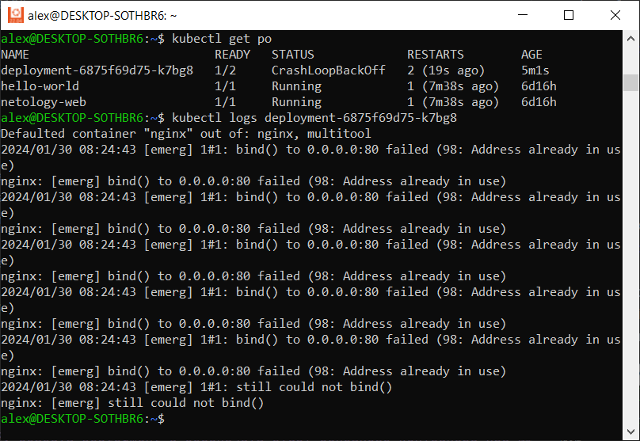
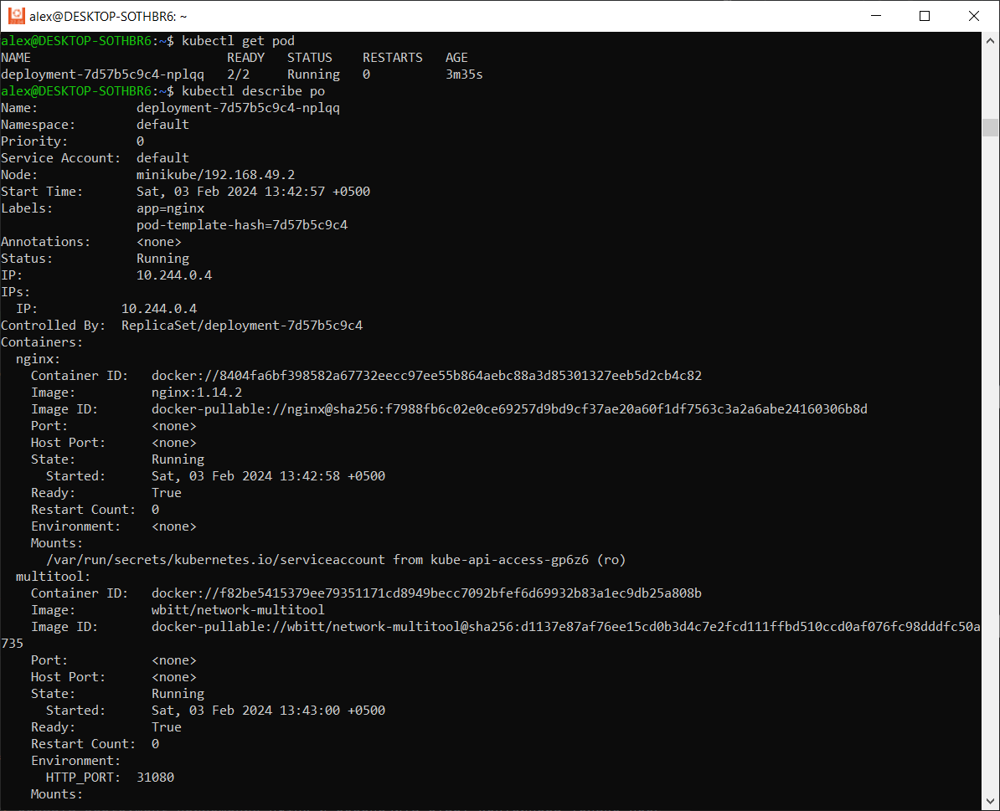
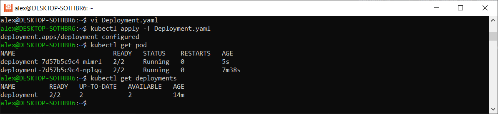
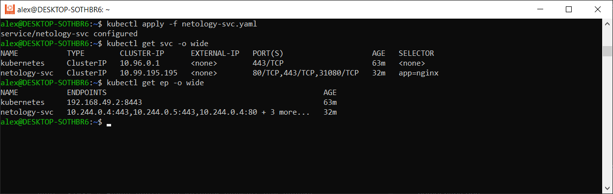
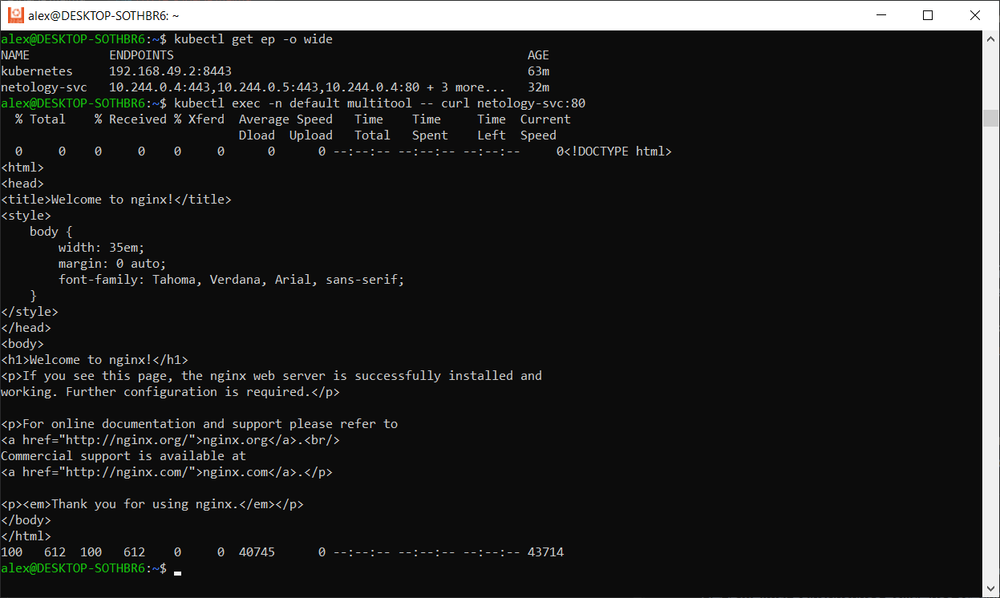
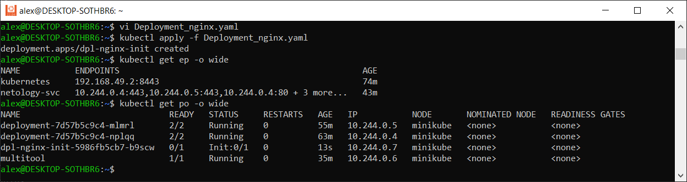
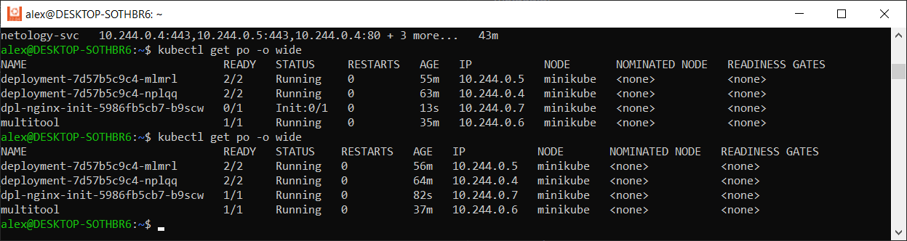
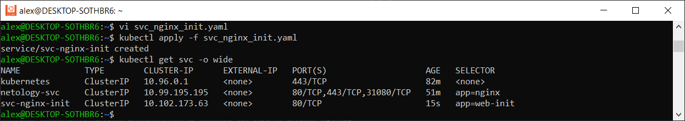
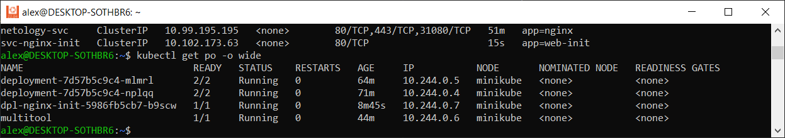

# Домашнее задание к занятию «Запуск приложений в K8S»

### Цель задания

В тестовой среде для работы с Kubernetes, установленной в предыдущем ДЗ, необходимо развернуть Deployment с приложением, состоящим из нескольких контейнеров, и масштабировать его.

------

### Чеклист готовности к домашнему заданию

1. Установленное k8s-решение (например, MicroK8S).
2. Установленный локальный kubectl.
3. Редактор YAML-файлов с подключённым git-репозиторием.

------

### Инструменты и дополнительные материалы, которые пригодятся для выполнения задания

1. [Описание](https://kubernetes.io/docs/concepts/workloads/controllers/deployment/) Deployment и примеры манифестов.
2. [Описание](https://kubernetes.io/docs/concepts/workloads/pods/init-containers/) Init-контейнеров.
3. [Описание](https://github.com/wbitt/Network-MultiTool) Multitool.

------

### Задание 1. Создать Deployment и обеспечить доступ к репликам приложения из другого Pod

1. Создать Deployment приложения, состоящего из двух контейнеров — nginx и multitool. Решить возникшую ошибку.
2. После запуска увеличить количество реплик работающего приложения до 2.
3. Продемонстрировать количество подов до и после масштабирования.
4. Создать Service, который обеспечит доступ до реплик приложений из п.1.
5. Создать отдельный Pod с приложением multitool и убедиться с помощью `curl`, что из пода есть доступ до приложений из п.1.

### Ответ

1) Создал манифест Deployment.yaml следующего содержания

apiVersion: apps/v1  
kind: Deployment  
metadata:  
  name: deployment  
#  labels:  
#     app: nginx  
spec:  
  replicas: 1  
  selector:  
    matchLabels:  
      app: nginx  
  template:  
    metadata:  
      labels:  
        app: nginx  
    spec:  
      containers:  
      - name: nginx  
        image: nginx:1.14.2  
        ports:  
        - containerPort: 80  
      - name: multitool  
        image: wbitt/network-multitool

Добавляем порт для приложения multitool через переменную

      - name: multitool  
        image: wbitt/network-multitool
        env: # добавляем переменную для установки порта.
          - name: HTTP_PORT
            value: "31080"

Применяем:

*alex@DESKTOP-SOTHBR6:~$* `kubectl apply -f Deployment.yaml`
deployment.apps/deployment configured

Ошибка устранена

2) Изменил значение replicas: 2  
Было  
alex@DESKTOP-SOTHBR6:~$ kubectl get pod  
NAME                          READY   STATUS    RESTARTS   AGE
deployment-7d57b5c9c4-nplqq   2/2     Running   0          33s

3) 

4) Взял манифест которые делали в предыдущем задании netology-svc.yaml и изменил метку

apiVersion: v1  
kind: Service  
metadata:  
  name: netology-svc  
  namespace: default  
spec:  
  ports:  
    - name: http-app  
      protocol: TCP  
      port: 80 # Номер порта, на котором слушает наш сервис  
      targetPort: 80  
    - name: https-app  
      port: 443 # Номер порта, на котором слушает наш сервис  
      protocol: TCP  
      targetPort: 443  
    - name: http-app-unst  
      port: 31080 # Номер порта, на котором слушает наш сервис  
      protocol: TCP  
      targetPort: 31080  
  selector:  
     app: nginx

alex@DESKTOP-SOTHBR6:~$ kubectl apply -f netology-svc.yaml
service/netology-svc created

5) Исправил манифест, созданный в ДЗ 1 pod.yaml

apiVersion: v1
kind: Pod
metadata:
  name: multitool
  namespace: default
  labels:
    app: nginx2
spec:
   containers:
   - name: multitool
     image: wbitt/network-multitool

alex@DESKTOP-SOTHBR6:~$ kubectl apply -f pod.yaml  
pod/multitool created

Проверяем
`kubectl exec -n default multitool -- curl netology-svc:80`

------

### Задание 2. Создать Deployment и обеспечить старт основного контейнера при выполнении условий

1. Создать Deployment приложения nginx и обеспечить старт контейнера только после того, как будет запущен сервис этого приложения.
2. Убедиться, что nginx не стартует. В качестве Init-контейнера взять busybox.
3. Создать и запустить Service. Убедиться, что Init запустился.
4. Продемонстрировать состояние пода до и после запуска сервиса.

------

### Ответ

1) Создал манифест vi Deployment_nginx.yaml

apiVersion: apps/v1  
kind: Deployment  
metadata:  
  name: dpl-nginx-init  
  namespace: default  
spec:  
  replicas: 1  
  selector:  
    matchLabels:  
      app: web-init  
  template:  
    metadata:  
      labels:  
        app: web-init  
    spec:  
      containers:  
      - name: nginx  
        image: nginx:1.19.2  
      initContainers:  
      - name: init-busybox  
        image: busybox  
        command: ['sleep', '30']

2) Запускаем

`kubectl get po -o wide`

nginx стартанул только после задержки в 30 сек

3) Создаем манифест svc_nginx_init.yaml

apiVersion: v1  
kind: Service  
metadata:  
  name: svc-nginx-init  
  namespace: default  
spec:  
  ports:  
    - name: http-app  
      port: 80  
  selector:  
    app: web-init  

4) До см п. 2

после

------

### Правила приема работы

1. Домашняя работа оформляется в своем Git-репозитории в файле README.md. Выполненное домашнее задание пришлите ссылкой на .md-файл в вашем репозитории.
2. Файл README.md должен содержать скриншоты вывода необходимых команд `kubectl` и скриншоты результатов.
3. Репозиторий должен содержать файлы манифестов и ссылки на них в файле README.md.

------