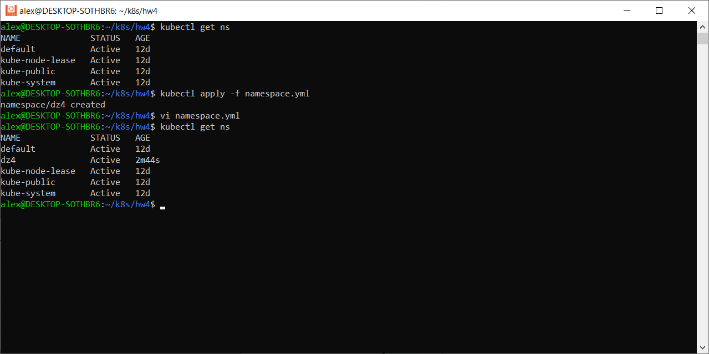

# Домашнее задание к занятию «Сетевое взаимодействие в K8S. Часть 1»

### Цель задания

В тестовой среде Kubernetes необходимо обеспечить доступ к приложению, установленному в предыдущем ДЗ и состоящему из двух контейнеров, по разным портам в разные контейнеры как внутри кластера, так и снаружи.

------

### Чеклист готовности к домашнему заданию

1. Установленное k8s-решение (например, MicroK8S).
2. Установленный локальный kubectl.
3. Редактор YAML-файлов с подключённым Git-репозиторием.

------

### Инструменты и дополнительные материалы, которые пригодятся для выполнения задания

1. [Описание](https://kubernetes.io/docs/concepts/workloads/controllers/deployment/) Deployment и примеры манифестов.
2. [Описание](https://kubernetes.io/docs/concepts/services-networking/service/) Описание Service.
3. [Описание](https://github.com/wbitt/Network-MultiTool) Multitool.

------

### Задание 1. Создать Deployment и обеспечить доступ к контейнерам приложения по разным портам из другого Pod внутри кластера

1. Создать Deployment приложения, состоящего из двух контейнеров (nginx и multitool), с количеством реплик 3 шт.
2. Создать Service, который обеспечит доступ внутри кластера до контейнеров приложения из п.1 по порту 9001 — nginx 80, по 9002 — multitool 8080.
3. Создать отдельный Pod с приложением multitool и убедиться с помощью `curl`, что из пода есть доступ до приложения из п.1 по разным портам в разные контейнеры.
4. Продемонстрировать доступ с помощью `curl` по доменному имени сервиса.
5. Предоставить манифесты Deployment и Service в решении, а также скриншоты или вывод команды п.4.

------

### Ответ

1) Создаем новый Namespace  
`vi namespace.yml`

apiVersion: v1  
kind: Namespace  
metadata:  
  name: dz4  
  namespace: dz4  

Запускаем деплоймент с тремя репликами  
Создаем деплоймент  
`vi deploy.yml`

apiVersion: apps/v1  
kind: Deployment  
metadata:  
  name: dpl-nginx-multitool-dz4  
  namespace: dz4  
spec:  
  replicas: 3  
  selector:  
    matchLabels:  
      app: web  
  template:  
    metadata:  
      labels:  
        app: web  
    spec:  
      containers:  
      - name: nginx  
        image: nginx:1.19.2  
      - name: multitool  
        image: wbitt/network-multitool  
        env:  
          - name: HTTP_PORT  
            value: "8080"  

Запускаем и проверяем ноды

`kubectl apply -f deploy.yml`  
`kubectl get pods -n dz4 -o wide`

2) Создаем службу

`vi svc.yml`

apiVersion: v1  
kind: Service  
metadata:  
  name: svc-nginx-multitool-dz4  
  namespace: dz4  
spec:  
  ports:  
    - name: http-app  
      port: 9001  
      protocol: TCP  
      targetPort: 80  
    - name: http-app-unst  
      port: 9002  
      protocol: TCP  
      targetPort: 8080  
  selector:  
    app: web  

`kubectl apply -f svc.yml`  
`kubectl get svc -n dz4 -o wide`

Проверяем доступность по адресу  
`kubectl exec -n dz4 dpl-nginx-multitool-dz4-6989c86479-msdkm -- curl 10.244.0.20:80`

3) Проверяем тестовым подом с curl предварительно посмотрев список подов

Для чего используем команду

`kubectl run mycurlpod --image=curlimages/curl -i --tty --rm -- sh`

`curl 10.244.0.20:80`

4) Проверяем доступность по имени

`kubectl exec -n dz4 dpl-nginx-multitool-dz4-6989c86479-msdkm -- curl svc-nginx-mult
itool-dz4:9001`

------

### Задание 2. Создать Service и обеспечить доступ к приложениям снаружи кластера

1. Создать отдельный Service приложения из Задания 1 с возможностью доступа снаружи кластера к nginx, используя тип NodePort.
2. Продемонстрировать доступ с помощью браузера или `curl` с локального компьютера.
3. Предоставить манифест и Service в решении, а также скриншоты или вывод команды п.2.

------

### Ответ

1) Создаем службу `vi svc_nodeport.yml`  

apiVersion: v1  
kind: Service  
metadata:  
  name: svc-nginx-multitool-dz4-node  
  namespace: dz4  
spec:  
  ports:  
    - name: http-app  
      port: 80  
      nodePort: 30000  
    - name: http-app-unst  
      port: 8080  
      nodePort: 30001  
  selector:  
    app: web  
  type: NodePort

`kubectl apply -f svc_nodeport.yml`

Проверяем 

`kubectl get svc -n dz4 -o wide`

2) Проверяем доступность

`curl 192.168.49.2:30000`

`curl 192.168.49.2:30001`

------
### Правила приёма работы

1. Домашняя работа оформляется в своем Git-репозитории в файле README.md. Выполненное домашнее задание пришлите ссылкой на .md-файл в вашем репозитории.
2. Файл README.md должен содержать скриншоты вывода необходимых команд `kubectl` и скриншоты результатов.
3. Репозиторий должен содержать тексты манифестов или ссылки на них в файле README.md.
