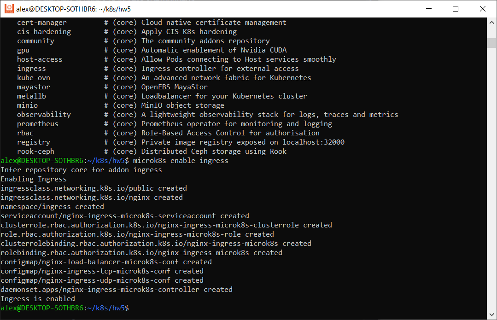

# Домашнее задание к занятию «Сетевое взаимодействие в K8S. Часть 2»

### Цель задания

В тестовой среде Kubernetes необходимо обеспечить доступ к двум приложениям снаружи кластера по разным путям.

------

### Чеклист готовности к домашнему заданию

1. Установленное k8s-решение (например, MicroK8S).
2. Установленный локальный kubectl.
3. Редактор YAML-файлов с подключённым Git-репозиторием.

------

### Инструменты и дополнительные материалы, которые пригодятся для выполнения задания

1. [Инструкция](https://microk8s.io/docs/getting-started) по установке MicroK8S.
2. [Описание](https://kubernetes.io/docs/concepts/services-networking/service/) Service.
3. [Описание](https://kubernetes.io/docs/concepts/services-networking/ingress/) Ingress.
4. [Описание](https://github.com/wbitt/Network-MultiTool) Multitool.

------

### Задание 1. Создать Deployment приложений backend и frontend

1. Создать Deployment приложения _frontend_ из образа nginx с количеством реплик 3 шт.
2. Создать Deployment приложения _backend_ из образа multitool. 
3. Добавить Service, которые обеспечат доступ к обоим приложениям внутри кластера. 
4. Продемонстрировать, что приложения видят друг друга с помощью Service.
5. Предоставить манифесты Deployment и Service в решении, а также скриншоты или вывод команды п.4.

### Ответ:

1) Создали ns

`vi namespace.yml`

apiVersion: v1      
kind: Namespace        
metadata:  
  name: dz5  
  namespace: dz5

`kubectl apply -f namespace.yml`

Создали deploy nginx (фронт)

`vi deploy_svc_nginx.yml`

apiVersion: apps/v1  
kind: Deployment  
metadata:  
    name: dpl-nginx-dz5  
    namespace: dz5  
spec:  
  replicas: 3  
  selector:  
    matchLabels:  
      app: fe-dz5  
  template:  
    metadata:  
      labels:  
        app: fe-dz5  
    spec:  
      containers:  
        - image: nginx:1.19.2  
          name: nginx  

---  
apiVersion: v1  
kind: Service  
metadata:  
  name: svc-fe-dz5  
  namespace: dz5  
spec:  
  ports:  
    - name: fe-dz5  
      port: 80  
  selector:  
    app: fe-dz5  

`kubectl apply -f deploy_svc_nginx.yml`

Проверяем

Создали тестовый под multitool

`vi pod_multitool.yml`

apiVersion: v1  
kind: Pod  
metadata:  
  name: pod-multitool-dz5  
  namespace: dz5  
spec:  
  containers:  
    - name: network-multitool-dz5  
      image: wbitt/network-multitool  

`kubectl apply -f pod_multitool.yml`

проверяем доступ

2) Создаем deploy multitool (бэк) yml с service находится внутри

`vi deploy_svc_multitool.yml`

apiVersion: apps/v1  
kind: Deployment  
metadata:  
  name: dpl-multitool-dz5  
  namespace: dz5  
spec:  
  replicas: 1  
  selector:  
    matchLabels:  
      app: be-dz5  
  template:  
    metadata:  
      labels:  
        app: be-dz5  
    spec:  
      containers:  
        - image: wbitt/network-multitool  
          name: multitool  
  
---  
apiVersion: v1  
kind: Service  
metadata:  
  name: svc-be-dz5   
  namespace: dz5  
spec:  
  ports:  
    - name: be-dz5  
      port: 80  
  selector:  
    app: be-dz5  

`kubectl apply -f deploy_svc_multitool.yml`

4) Проверяем результат и пробуем курлить

------

### Задание 2. Создать Ingress и обеспечить доступ к приложениям снаружи кластера

1. Включить Ingress-controller в MicroK8S.
2. Создать Ingress, обеспечивающий доступ снаружи по IP-адресу кластера MicroK8S так, чтобы при запросе только по адресу открывался _frontend_ а при добавлении /api - _backend_.
3. Продемонстрировать доступ с помощью браузера или `curl` с локального компьютера.
4. Предоставить манифесты и скриншоты или вывод команды п.2.

------

### Ответ:

1) Проверяем активность ingress-контроллера

`microk8s status`

По умолчанию был отключен. Включаем 

`microk8s enable ingress`

проверили что включен

2) Создаем ingress

`vi ingress.yml`

apiVersion: networking.k8s.io/v1  
kind: Ingress  
metadata:  
  name: ingress-dz5  
  namespace: dz5  
  annotations:  
    nginx.ingress.kubernetes.io/rewrite-target: /  
spec:  
  rules:  
    - host: microk8s-03-ingress.test.com  
      http:  
        paths:  
          - path: /  
            pathType: Prefix  
            backend:  
              service:  
                name: svc-fe-dz5  
                port:  
                  name: fe-dz5  
          - path: /api  
            pathType: Prefix  
            backend:  
              service:  
                name: svc-be-dz5  
                port:  
                  name: be-dz5

`kubectl apply -f ingress.yml`

Проверяем

3) Проверяем доступ

Пытаюсь проверить доступ, но не выходит ip-адрес более 15 минут, что может быть?

### Доработка

Проверяю статус нод, подов и сервисов в неймспейсе

Добавил строку microk8s-03-ingress.test.com  192.168.49.2 в файл 
sudo vi /etc/hosts

После перезагрузки строка удалилась из файла hosts. Использую WSL Ubuntu 22.04 LTS Windows10 x64, hosts берется виндусовый, поэтому добавил в него и перезагрузил ПК. Думал что правила не применились
Удалил все сервайсы, деплойменты и ингресс, поднял все заново. Но ошибка на 80 порту

Через браузер тоже не открывается. Можете подсказать, что еще можно попробовать?

И вопрос в практике устанавливали nginx controller с балансировщиком, я его не ставил. Может поэтому?
Команда `helm -n ingress-nginx install ingress-nginx ingress-nginx/ingress-nginx` выдала

## Доработка 2

В общем проблема заключалась в том, что у меня нет такого репозитория, сделал так:

Нашел в своем репозитории как называется чарт

`helm search repo`

и выполнил так, теперь взлетело

`helm -n dz5 install nginx-ingress stable/nginx-ingress`

В итоге под завелся, но не запускается. Адрес ингресу тоже не присваивается

Решил переключиться на следующие ДЗ. Много времени потратил. Чтобы модуль сдать обязательную часть я прошел.
Спасибо, что подсказывали по этому ДЗ. Видимо дело в WSL

------

### Правила приема работы

1. Домашняя работа оформляется в своем Git-репозитории в файле README.md. Выполненное домашнее задание пришлите ссылкой на .md-файл в вашем репозитории.
2. Файл README.md должен содержать скриншоты вывода необходимых команд `kubectl` и скриншоты результатов.
3. Репозиторий должен содержать тексты манифестов или ссылки на них в файле README.md.

------