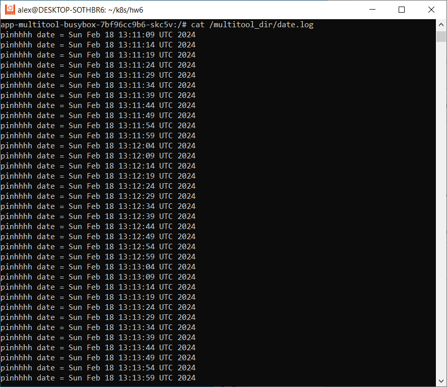

# Домашнее задание к занятию «Хранение в K8s. Часть 1»

### Цель задания

В тестовой среде Kubernetes нужно обеспечить обмен файлами между контейнерам пода и доступ к логам ноды.

------

### Чеклист готовности к домашнему заданию

1. Установленное K8s-решение (например, MicroK8S).
2. Установленный локальный kubectl.
3. Редактор YAML-файлов с подключенным GitHub-репозиторием.

------

### Дополнительные материалы для выполнения задания

1. [Инструкция по установке MicroK8S](https://microk8s.io/docs/getting-started).
2. [Описание Volumes](https://kubernetes.io/docs/concepts/storage/volumes/).
3. [Описание Multitool](https://github.com/wbitt/Network-MultiTool).

------

### Задание 1 

**Что нужно сделать**

Создать Deployment приложения, состоящего из двух контейнеров и обменивающихся данными.

1. Создать Deployment приложения, состоящего из контейнеров busybox и multitool.
2. Сделать так, чтобы busybox писал каждые пять секунд в некий файл в общей директории.
3. Обеспечить возможность чтения файла контейнером multitool.
4. Продемонстрировать, что multitool может читать файл, который периодоически обновляется.
5. Предоставить манифесты Deployment в решении, а также скриншоты или вывод команды из п. 4.

------

### Ответ:

1) Создадим новый неймспейс

apiVersion: v1
kind: Namespace
metadata:
  name: dz6
  namespace: dz6

Создаем новый Deployment

`vi deploy_busybox_multitool.yml`

2) Описываем следующий манифест

``` apiVersion: apps/v1
kind: Deployment
metadata:
  name: app-multitool-busybox
  namespace: dz6
spec:
  replicas: 1
  selector:
    matchLabels:
      app: myapp
  template:
    metadata:
      labels:
        app: myapp
    spec:
      containers:
        - name: multitool
          image: wbitt/network-multitool
          volumeMounts:
            - mountPath: "/multitool_dir"
              name: common-volume

        - name: busybox
          image: busybox
          command: ['sh', '-c', 'while true; do echo "pinhhhh date = $(date)" >> /busybox_dir/date.log; sleep 5; done']
          volumeMounts:
            - mountPath: "/busybox_dir"
              name: common-volume

      volumes:
        - name: common-volume
          emptyDir: {} 
```

3) Применяем манифест

`kubectl apply -f deploy_busybox_multitool.yml`


4) Проверяем

Подключаемся к поду и проверяем наличие волума и его содержание

`kubectl exec -n dz6  app-multitool-busybox-7bf96cc9b6-skc5v -c m
ultitool -it -- bash`


Содержимое лога




------

### Задание 2

**Что нужно сделать**

Создать DaemonSet приложения, которое может прочитать логи ноды.

1. Создать DaemonSet приложения, состоящего из multitool.
2. Обеспечить возможность чтения файла `/var/log/syslog` кластера MicroK8S.
3. Продемонстрировать возможность чтения файла изнутри пода.
4. Предоставить манифесты Deployment, а также скриншоты или вывод команды из п. 2.

------

### Ответ:

1) Создаем демонсет `vi dms_multitool.yml`

2) Создаем следующий манифест и запускаем

```
apiVersion: apps/v1
kind: DaemonSet
metadata:
  name: logs-multitool
  namespace: dz6
spec:
  selector:
    matchLabels:
      app: logs-multitool
  template:
    metadata:
      labels:
        app: logs-multitool
    spec:
      containers:
        - name: multitool
          image: wbitt/network-multitool
          volumeMounts:
            - mountPath: "/log_data"
              name: log-volume
      volumes:
        - name: log-volume # Описываем вольюм хостпас с именем log-volume
          hostPath:
            path: /var/log
```

3) Проверяем

Подключемся к демонсету `kubectl exec -n dz6 logs-multitool-fc2hr -it -- bash`


------

### Правила приёма работы

1. Домашняя работа оформляется в своём Git-репозитории в файле README.md. Выполненное задание пришлите ссылкой на .md-файл в вашем репозитории.
2. Файл README.md должен содержать скриншоты вывода необходимых команд `kubectl`, а также скриншоты результатов.
3. Репозиторий должен содержать тексты манифестов или ссылки на них в файле README.md.

------