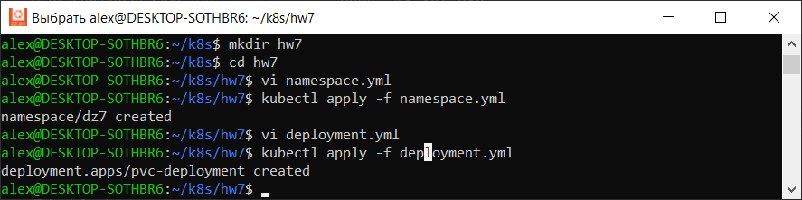
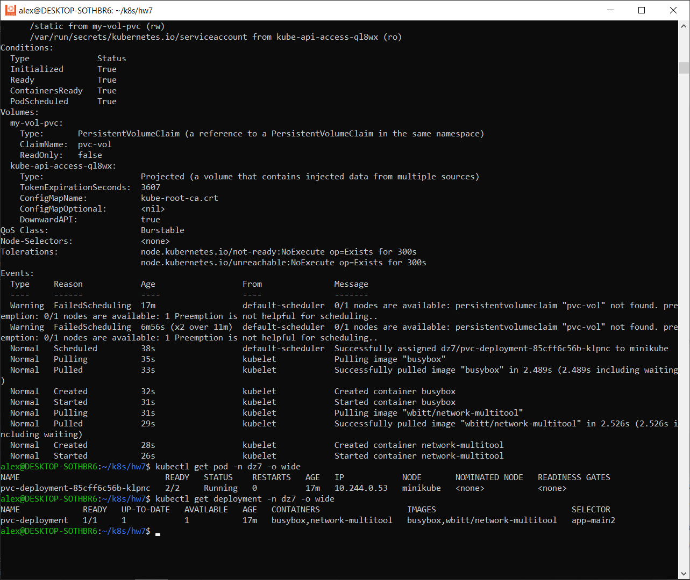
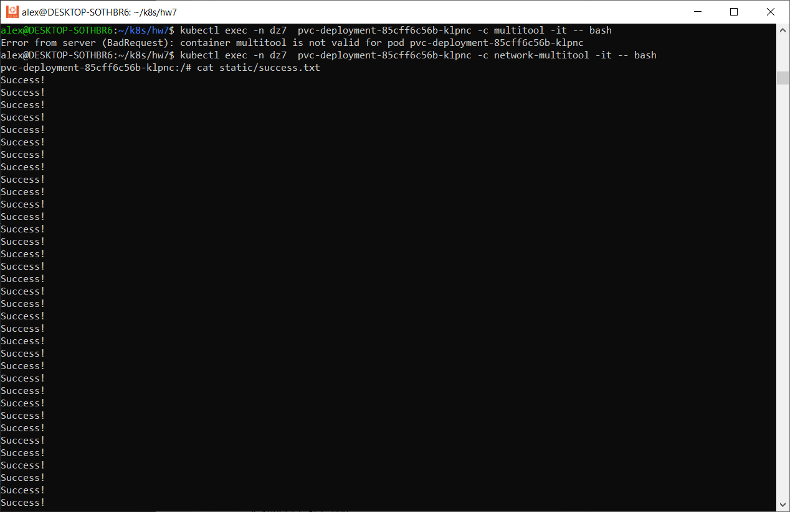
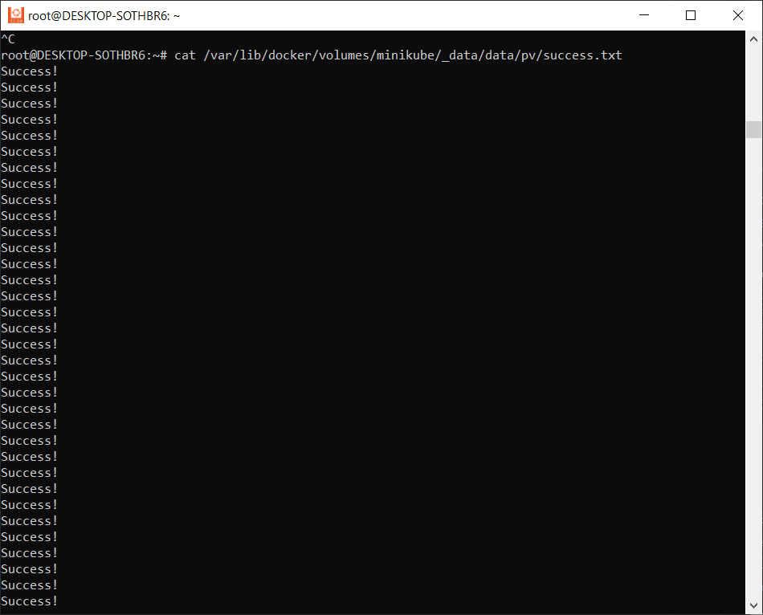
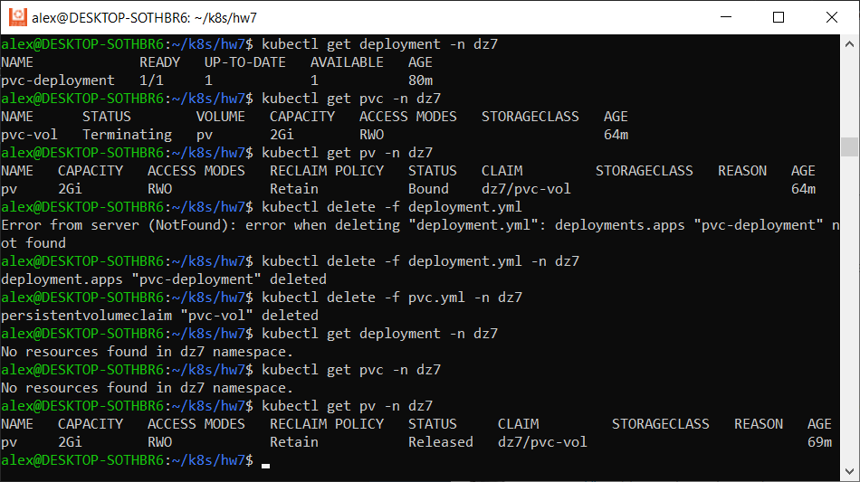
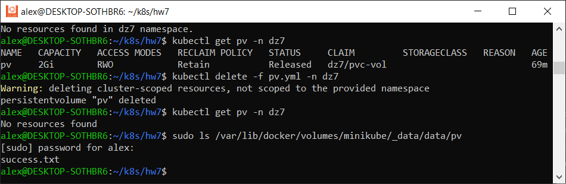
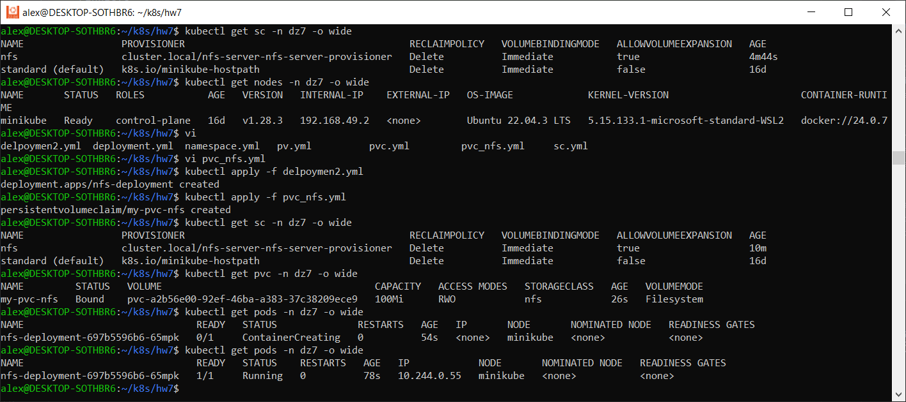
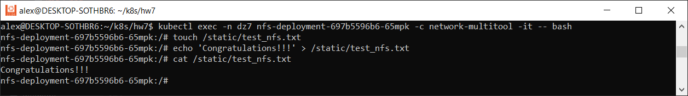
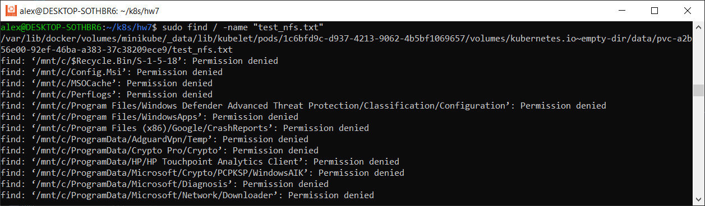
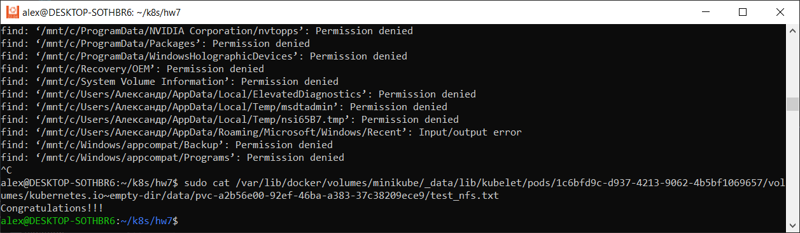

# Домашнее задание к занятию «Хранение в K8s. Часть 2»

### Цель задания

В тестовой среде Kubernetes нужно создать PV и продемострировать запись и хранение файлов.

------

### Чеклист готовности к домашнему заданию

1. Установленное K8s-решение (например, MicroK8S).
2. Установленный локальный kubectl.
3. Редактор YAML-файлов с подключенным GitHub-репозиторием.

------

### Дополнительные материалы для выполнения задания

1. [Инструкция по установке NFS в MicroK8S](https://microk8s.io/docs/nfs). 
2. [Описание Persistent Volumes](https://kubernetes.io/docs/concepts/storage/persistent-volumes/). 
3. [Описание динамического провижининга](https://kubernetes.io/docs/concepts/storage/dynamic-provisioning/). 
4. [Описание Multitool](https://github.com/wbitt/Network-MultiTool).

------

### Задание 1

**Что нужно сделать**

Создать Deployment приложения, использующего локальный PV, созданный вручную.

1. Создать Deployment приложения, состоящего из контейнеров busybox и multitool.
2. Создать PV и PVC для подключения папки на локальной ноде, которая будет использована в поде.
3. Продемонстрировать, что multitool может читать файл, в который busybox пишет каждые пять секунд в общей директории. 
4. Удалить Deployment и PVC. Продемонстрировать, что после этого произошло с PV. Пояснить, почему.
5. Продемонстрировать, что файл сохранился на локальном диске ноды. Удалить PV.  Продемонстрировать что произошло с файлом после удаления PV. Пояснить, почему.
5. Предоставить манифесты, а также скриншоты или вывод необходимых команд.

------

### Ответ:

1) Создадим новый неймспейс

apiVersion: v1
kind: Namespace
metadata:
  name: dz7
  namespace: dz7

2) Создаем Deployment

```commandline
apiVersion: apps/v1
kind: Deployment
metadata:
  name: pvc-deployment
  namespace: dz7
  labels:
    app: main2
spec:
  replicas: 1
  selector:
    matchLabels:
      app: main2
  template:
    metadata:
      labels:
        app: main2
    spec:
      containers:
      - name: busybox
        image: busybox
        command: ['sh', '-c', 'while true; do echo Success! >> /tmp/cache/success.txt; sleep 5; done']
        volumeMounts:
        - name: my-vol-pvc
          mountPath: /tmp/cache


      - name: network-multitool
        image: wbitt/network-multitool
        volumeMounts:
        - name: my-vol-pvc
          mountPath: /static
        env:
        - name: HTTP_PORT
          value: "80"
        - name: HTTPS_PORT
          value: "443"
        ports:
        - containerPort: 80
          name: http-port
        - containerPort: 443
          name: https-port
        resources:
          requests:
            cpu: "1m"
            memory: "20Mi"
          limits:
            cpu: "10m"
            memory: "20Mi"
      volumes:
      - name: my-vol-pvc
        persistentVolumeClaim:
          claimName: pvc-vol
```



Создаем PV

```commandline
apiVersion: v1
kind: PersistentVolume
metadata:
  name: pv
  namespace: dz7
spec:
  storageClassName: ""
  capacity:
    storage: 2Gi
  accessModes:
    - ReadWriteOnce
  hostPath:
    path: /data/pv
  persistentVolumeReclaimPolicy: Retain
```

Создаем PVC

```commandline
apiVersion: v1
kind: PersistentVolumeClaim
metadata:
  name: pvc-vol
  namespace: dz7
spec:
  storageClassName: ""
  accessModes:
    - ReadWriteOnce
  resources:
    requests:
      storage: 2Gi
```

Поды запустились автоматически, после биниднга PV и PVC



3) Проверяем доступность файлов

`kubectl exec -n dz7  pvc-deployment-85cff6c56b-klpnc -c network-multitool -it -- bash`



Найдем файл на ноде
`sudo find / -name "success.txt"`
/var/lib/docker/volumes/minikube/_data/data/pv/success.txt

Посмотрим содержимое
`sudo cat /var/lib/docker/volumes/minikube/_data/data/pv/success.txt`



4) Удаляем Deployment и PVC



PV остался, так как это отдельная сущность кластера, не зависящая от Deployment и PVC

5) Удаляем PV. Проверяем что файл остался на ноде



PV не удалилось, так как указали параметр Retain - после удаления PV ресурсы из внешних провайдеров автоматически не удаляются

------

### Задание 2

**Что нужно сделать**

Создать Deployment приложения, которое может хранить файлы на NFS с динамическим созданием PV.

1. Включить и настроить NFS-сервер на MicroK8S.
2. Создать Deployment приложения состоящего из multitool, и подключить к нему PV, созданный автоматически на сервере NFS.
3. Продемонстрировать возможность чтения и записи файла изнутри пода. 
4. Предоставить манифесты, а также скриншоты или вывод необходимых команд.

------

### Ответ:

1)  Включить и настроить NFS-сервер на MicroK8S.  

* Сначала скачиваем helm `curl https://raw.githubusercontent.com/helm/helm/master/scripts/get-helm-3 | bash`
* Подключаем репозиторий и обновляем `helm repo add stable https://charts.helm.sh/stable && helm repo update`
* Устанавливаем NFC `helm install nfs-server stable/nfc-server-provisioner`
* Устанавливаем пакет nfs-common на ноду `sudo apt install nfs-common -y`

2) Создаем Deployment

```commandline
apiVersion: apps/v1
kind: Deployment
metadata:
  name: nfs-deployment
  namespace: dz7
  labels:
    app: multitool-b
spec:
  replicas: 1
  selector:
    matchLabels:
      app: multitool-b
  template:
    metadata:
      labels:
        app: multitool-b
    spec:
      containers:
        - image: wbitt/network-multitool
          volumeMounts:
          - name: my-vol-pvc
            mountPath: /static
          imagePullPolicy: IfNotPresent
          name: network-multitool
          resources:
            limits:
              cpu: 200m
              memory: 512Mi
            requests:
              cpu: 100m
              memory: 256Mi
      volumes:
      - name: my-vol-pvc
        persistentVolumeClaim:
          claimName: my-pvc-nfs
```

Создаем PVC

```commandline
apiVersion: v1
kind: PersistentVolumeClaim
metadata:
  name: my-pvc-nfs
  namespace: dz7
spec:
  storageClassName: nfs
  accessModes: [ReadWriteOnce]
  resources:
    requests:
      storage: 100Mi
```

PV создался после команды  
`helm install nfs-server stable/nfs-server-provisioner`

```commandline
WARNING: This chart is deprecated
NAME: nfs-server
LAST DEPLOYED: Mon Feb 19 16:51:17 2024
NAMESPACE: default
STATUS: deployed
REVISION: 1
TEST SUITE: None
NOTES:
The NFS Provisioner service has now been installed.

A storage class named 'nfs' has now been created
and is available to provision dynamic volumes.

You can use this storageclass by creating a `PersistentVolumeClaim` with the
correct storageClassName attribute. For example:

    ---
    kind: PersistentVolumeClaim
    apiVersion: v1
    metadata:
      name: test-dynamic-volume-claim
    spec:
      storageClassName: "nfs"
      accessModes:
        - ReadWriteOnce
      resources:
        requests:
          storage: 100Mi
```

Запускаем, проверяем



3) Продемонстрировать возможность чтения и записи файла изнутри пода

Создаем файл внутри пода и вводим данные   
`kubectl exec -n dz7 nfs-deployment-697b5596b6-65mpk -c network-multitool -it -- bash`



Теперь ищем созданный файл в поде на ноде и смотрим содержимое

`sudo find / -name "test_nfs.txt"`
/var/lib/docker/volumes/minikube/_data/lib/kubelet/pods/1c6bfd9c-d937-4213-9062-4b5bf1069657/volumes/kubernetes.io~empty-dir/data/pvc-a2b56e00-92ef-46ba-a383-37c38209ece9/test_nfs.txt



Посмотрим содержимое
`sudo cat /var/lib/docker/volumes/minikube/_data/data/pv/success.txt`



------

### Правила приёма работы

1. Домашняя работа оформляется в своём Git-репозитории в файле README.md. Выполненное задание пришлите ссылкой на .md-файл в вашем репозитории.
2. Файл README.md должен содержать скриншоты вывода необходимых команд `kubectl`, а также скриншоты результатов.
3. Репозиторий должен содержать тексты манифестов или ссылки на них в файле README.md.