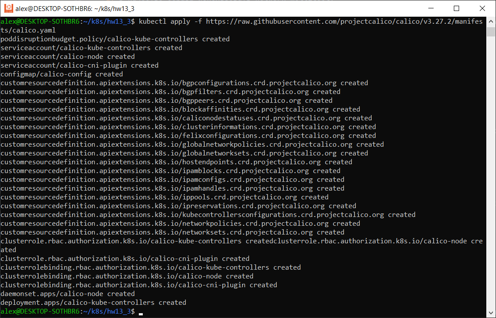
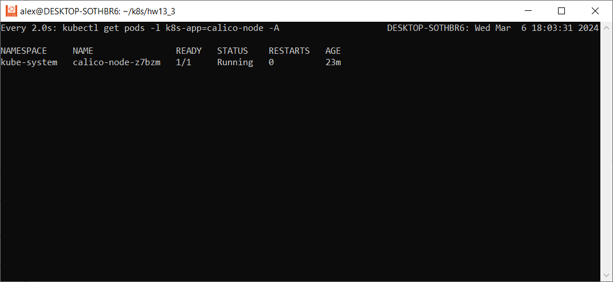
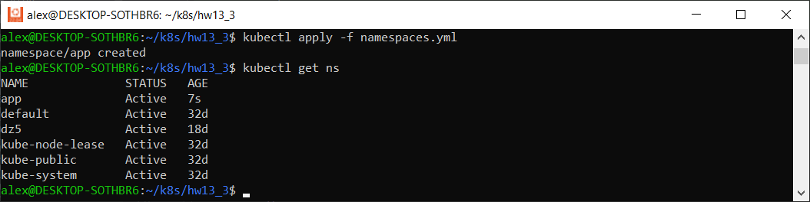
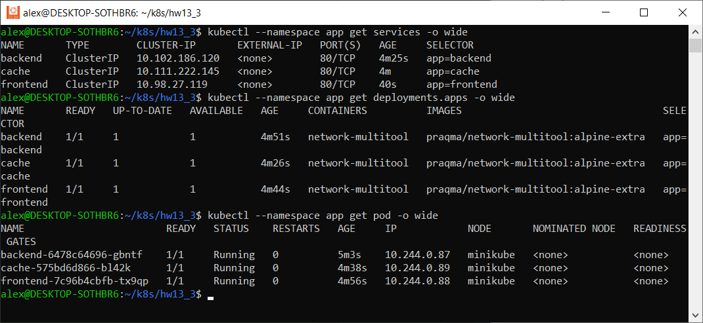
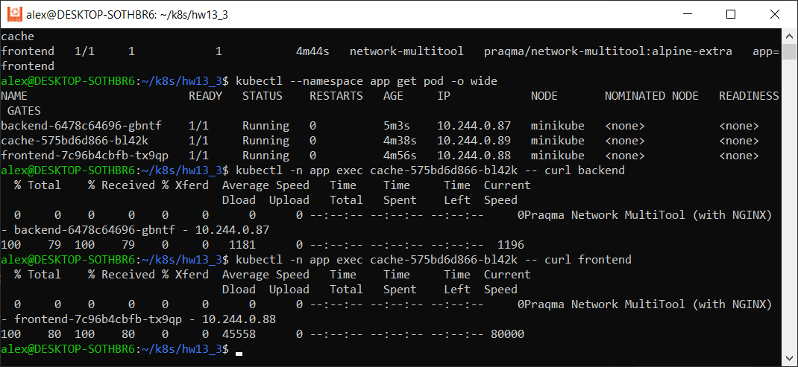
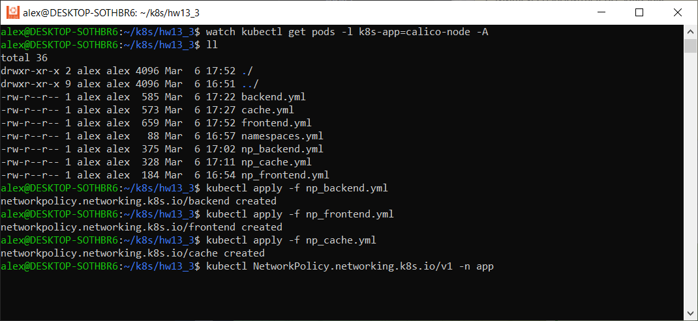
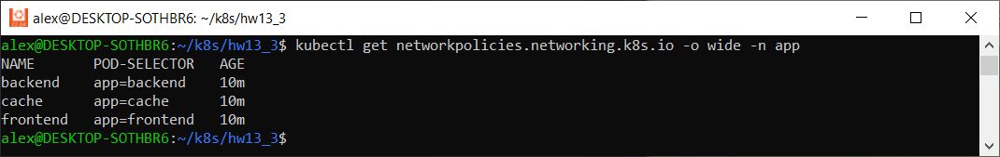
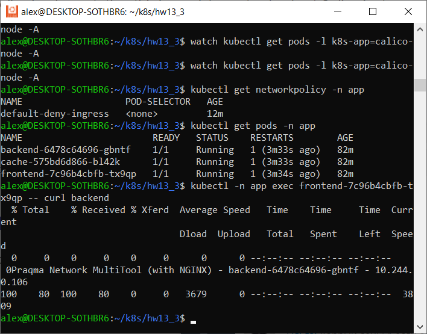
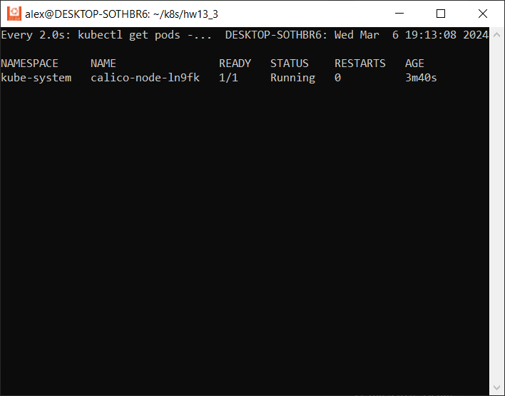

# Домашнее задание к занятию «Как работает сеть в K8s»

### Цель задания

Настроить сетевую политику доступа к подам.

### Чеклист готовности к домашнему заданию

1. Кластер K8s с установленным сетевым плагином Calico.

### Инструменты и дополнительные материалы, которые пригодятся для выполнения задания

1. [Документация Calico](https://www.tigera.io/project-calico/).
2. [Network Policy](https://kubernetes.io/docs/concepts/services-networking/network-policies/).
3. [About Network Policy](https://docs.projectcalico.org/about/about-network-policy).

-----

### Задание 1. Создать сетевую политику или несколько политик для обеспечения доступа

1. Создать deployment'ы приложений frontend, backend и cache и соответсвующие сервисы.
2. В качестве образа использовать network-multitool.
3. Разместить поды в namespace App.
4. Создать политики, чтобы обеспечить доступ frontend -> backend -> cache. Другие виды подключений должны быть запрещены.
5. Продемонстрировать, что трафик разрешён и запрещён.

---

### Ответ

1. Устанавливаем Calico.
Так как у меня установлен minikube использую следующую инструкцию 
[Документация Calico для установки на minikube] (https://docs.tigera.io/calico/latest/getting-started/kubernetes/minikube)

Запускаю minikube командой
`minikube start --network-plugin=cni`

Устанавливаю Calico через манифест (по рекомендации лектора) командой
`kubectl apply -f https://raw.githubusercontent.com/projectcalico/calico/v3.27.2/manifests/calico.yaml`



Проверяем 



2. Создаю namespase app

```commandline
apiVersion: v1
kind: Namespace
metadata:
  name: app
  namespace: app
```



3. Создаю манифесты frontend, backend и cache с соответствующими сервисами

#### backend.yml

```commandline
apiVersion: apps/v1
kind: Deployment
metadata:
  labels:
    app: backend
  name: backend
  namespace: app
spec:
  replicas: 1
  selector:
    matchLabels:
      app: backend
  template:
    metadata:
      labels:
        app: backend
    spec:
      containers:
        - image: praqma/network-multitool:alpine-extra
          imagePullPolicy: IfNotPresent
          name: network-multitool
      terminationGracePeriodSeconds: 30

---
apiVersion: v1
kind: Service
metadata:
  name: backend
  namespace: app
spec:
  ports:
    - name: web
      port: 80
  selector:
    app: backend
```

#### frontend.yml

```commandline
apiVersion: apps/v1
kind: Deployment
metadata:
  labels:
    app: frontend
  name: frontend
  namespace: app
spec:
  replicas: 1
  selector:
    matchLabels:
      app: frontend
  template:
    metadata:
      labels:
        app: frontend
    spec:
      containers:
        - image: praqma/network-multitool:alpine-extra
          imagePullPolicy: IfNotPresent
          name: network-multitool
      terminationGracePeriodSeconds: 30

---
apiVersion: v1
kind: Service
metadata:
  name: frontend
  namespace: app
spec:
  ports:
    - name: web
      port: 80
  selector:
    app: frontend
```

#### cache.yml

```commandline
apiVersion: apps/v1
kind: Deployment
metadata:
  labels:
    app: cache
  name: cache
  namespace: app
spec:
  replicas: 1
  selector:
    matchLabels:
      app: cache
  template:
    metadata:
      labels:
        app: cache
    spec:
      containers:
        - image: praqma/network-multitool:alpine-extra
          imagePullPolicy: IfNotPresent
          name: network-multitool
      terminationGracePeriodSeconds: 30

---
apiVersion: v1
kind: Service
metadata:
  name: cache
  namespace: app
spec:
  ports:
    - name: web
      port: 80
  selector:
    app: cache
```

Проверяем



4. Проверяем доступ из кеша в остальные поды

Подключаемся к поду Кеш и пробуем курлить фронт и бэк
`kubectl -n app exec cache-575bd6d866-bl42k -- curl frontend`



Так как пока никаких политик не применялось, результат для всех подов будет одинаков

5. Создаю манифесты np_frontend, np_backend и np_cache с соответствующими политиками



#### np_backend.yml

```commandline
apiVersion: networking.k8s.io/v1
kind: NetworkPolicy
metadata:
  name: backend
  namespace: app
spec:
  podSelector:
    matchLabels:
      app: backend
  policyTypes:
    - Ingress
  ingress:
    - from:
      - podSelector:
          matchLabels:
            app: frontend
      ports:
        - protocol: TCP
          port: 80
```

#### np_frontend.yml

```commandline
apiVersion: networking.k8s.io/v1
kind: NetworkPolicy
metadata:
  name: frontend
  namespace: app
spec:
  podSelector:
    matchLabels:
      app: frontend
  policyTypes:
    - Ingress
```

#### np_cache.yml

```commandline
apiVersion: networking.k8s.io/v1
kind: NetworkPolicy
metadata:
  name: cache
  namespace: app
spec:
  podSelector:
    matchLabels:
      app: cache
  policyTypes:
      - Ingress
  ingress:
    - from:
      - podSelector:
          matchLabels:
            app: backend
      ports:
        - protocol: TCP
          port: 80
```

#### Политика по умолчанию для всех подов

```commandline
apiVersion: networking.k8s.io/v1
kind: NetworkPolicy
metadata:
  name: default-deny-ingress
  namespace: app
spec:
  podSelector: {}
  policyTypes:
    - Ingress
```

Проверяем что добавились политики



6. Проверяем доступ frontend -> backend -> cache

Подключаемся к поду frontend и проверяем что в backend доступ есть, а cache нет
`kubectl -n app exec frontend-7c96b4cbfb-tx9qp -- curl backend`

`kubectl -n app exec frontend-7c96b4cbfb-tx9qp -- curl cache`

Доступ есть

Пробовал разные способы. Сейчас вообще запретил все входящие соединения



Calico работает



Возможно опять проблема с тем, что я использую WSL на Windows 10 и политики Windows в приоритете над WSL, с этим столкнулся в домашке, когда пробрасывал порты. По идее раза 3 видео пересматривал, все должно было работать нормально.

---

### Правила приёма работы

1. Домашняя работа оформляется в своём Git-репозитории в файле README.md. Выполненное домашнее задание пришлите ссылкой на .md-файл в вашем репозитории.
2. Файл README.md должен содержать скриншоты вывода необходимых команд, а также скриншоты результатов.
3. Репозиторий должен содержать тексты манифестов или ссылки на них в файле README.md.