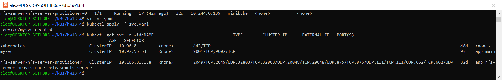
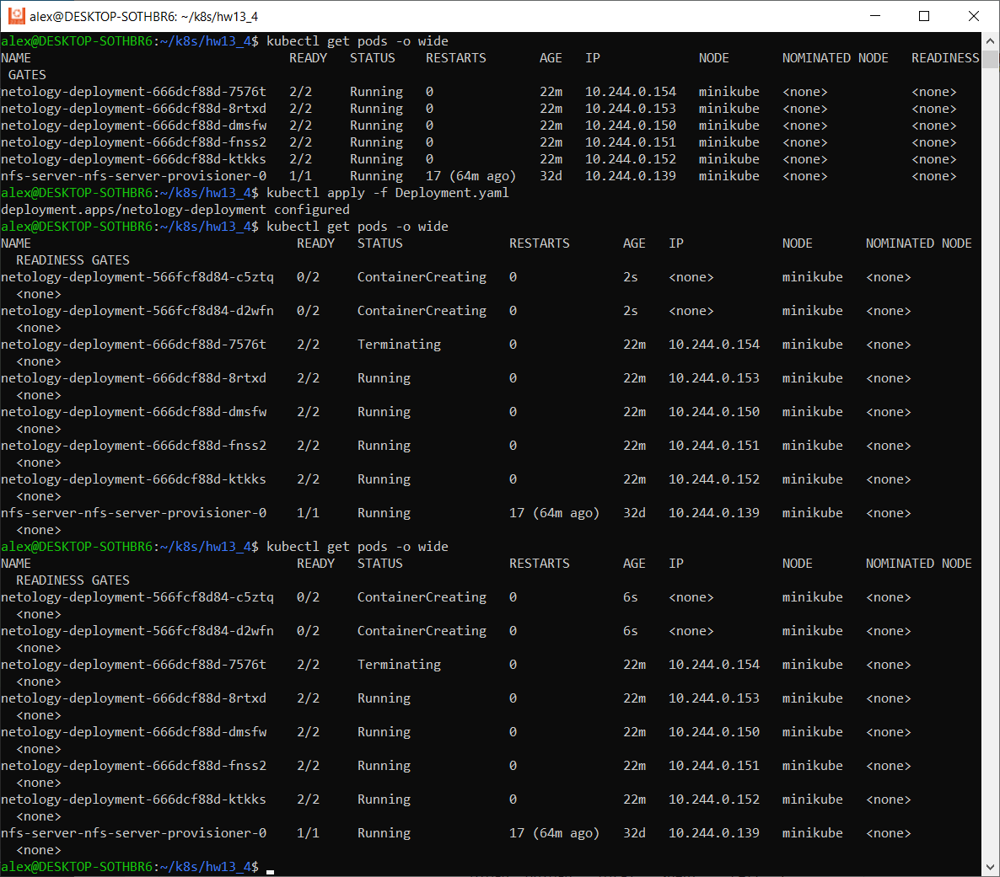
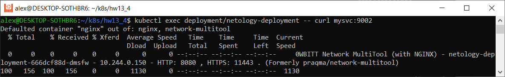

# Домашнее задание к занятию «Обновление приложений»

### Цель задания

Выбрать и настроить стратегию обновления приложения.

### Чеклист готовности к домашнему заданию

1. Кластер K8s.

### Инструменты и дополнительные материалы, которые пригодятся для выполнения задания

1. [Документация Updating a Deployment](https://kubernetes.io/docs/concepts/workloads/controllers/deployment/#updating-a-deployment).
2. [Статья про стратегии обновлений](https://habr.com/ru/companies/flant/articles/471620/).

-----

### Задание 1. Выбрать стратегию обновления приложения и описать ваш выбор

1. Имеется приложение, состоящее из нескольких реплик, которое требуется обновить.
2. Ресурсы, выделенные для приложения, ограничены, и нет возможности их увеличить.
3. Запас по ресурсам в менее загруженный момент времени составляет 20%.
4. Обновление мажорное, новые версии приложения не умеют работать со старыми.
5. Вам нужно объяснить свой выбор стратегии обновления приложения.

-----

### Ответ

Считаю, что можно использовать 2 варианта, в зависимости от различных ситуаций.
1) Если приложение уже протестировано ранее, то лучшим вариантом наверное будет использовать стратегию обновления Rolling Update, указанием параметров maxSurge maxUnavailable для избежания ситуации с нехваткой ресурсов. Проводить обновление следует естественно в менее загруженный момент времени сервиса. При данной стратегии(Rolling Update) k8s постепенно заменит все поды без ущерба производительности. И если что-то пойдет не так, можно будет быстро откатится к предыдущему состоянию.
2) Можно использовать Canary Strategy. Также указав параметры maxSurge maxUnavailable чтобы избежать нехватки ресурсов. Это позволит нам протестировать новую версию программы на реальной пользовательской базе(группа может выделяться по определенному признаку) без обязательства полного развертывания. После тестирования и собирания метрик пользователей можно постепенно переводить поды к новой версии приложения.

-----

### Задание 2. Обновить приложение

1. Создать deployment приложения с контейнерами nginx и multitool. Версию nginx взять 1.19. Количество реплик — 5.
2. Обновить версию nginx в приложении до версии 1.20, сократив время обновления до минимума. Приложение должно быть доступно.
3. Попытаться обновить nginx до версии 1.28, приложение должно оставаться доступным.
4. Откатиться после неудачного обновления.

-----

### Ответ

1. Создаем deployment и применяем

```commandline
apiVersion: apps/v1
kind: Deployment
metadata:
  name: netology-deployment
  labels:
    app: main
spec:
  replicas: 5
  selector:
    matchLabels:
      app: main
  template:
    metadata:
      labels:
        app: main
    spec:
      containers:
      - name: nginx
        image: nginx:1.19
        ports:
        - containerPort: 80

      - name: network-multitool
        image: wbitt/network-multitool
        env:
        - name: HTTP_PORT
          value: "8080"
        - name: HTTPS_PORT
          value: "11443"
        ports:
        - containerPort: 8080
          name: http-port
        - containerPort: 11443
          name: https-port
        resources:
          requests:
            cpu: "1m"
            memory: "20Mi"
          limits:
            cpu: "10m"
            memory: "20Mi"
```


2. Создаем service и применяем

```commandline
apiVersion: v1
kind: Service
metadata:
  name: mysvc
spec:
  ports:
    - name: web-nginx
      port: 9001
      targetPort: 80
    - name: web-mtools
      port: 9002
      targetPort: 8080
  selector:
    app: main
```



3. Проверяем под в реплике

`kubectl get pod netology-deployment-666dcf88d-7576t -o yaml`

```commandline
apiVersion: v1
kind: Pod
metadata:
  creationTimestamp: "2024-03-22T15:20:12Z"
  generateName: netology-deployment-666dcf88d-
  labels:
    app: main
    pod-template-hash: 666dcf88d
  name: netology-deployment-666dcf88d-7576t
  namespace: default
  ownerReferences:
  - apiVersion: apps/v1
    blockOwnerDeletion: true
    controller: true
    kind: ReplicaSet
    name: netology-deployment-666dcf88d
    uid: 786699fb-0314-4261-891f-fa41fe261273
  resourceVersion: "293548"
  uid: 0332e83d-1460-462a-894e-2cb959891699
spec:
  containers:
  - image: nginx:1.19
    imagePullPolicy: IfNotPresent
    name: nginx
    ports:
    - containerPort: 80
      protocol: TCP
    resources: {}
    terminationMessagePath: /dev/termination-log
    terminationMessagePolicy: File
    volumeMounts:
    - mountPath: /var/run/secrets/kubernetes.io/serviceaccount
      name: kube-api-access-6qcs9
      readOnly: true
  - env:
    - name: HTTP_PORT
      value: "8080"
    - name: HTTPS_PORT
      value: "11443"
    image: wbitt/network-multitool
    imagePullPolicy: Always
    name: network-multitool
    ports:
    - containerPort: 8080
      name: http-port
      protocol: TCP
    - containerPort: 11443
      name: https-port
      protocol: TCP
    resources:
      limits:
        cpu: 10m
        memory: 20Mi
      requests:
        cpu: 1m
        memory: 20Mi
    terminationMessagePath: /dev/termination-log
    terminationMessagePolicy: File
    volumeMounts:
    - mountPath: /var/run/secrets/kubernetes.io/serviceaccount
      name: kube-api-access-6qcs9
      readOnly: true
  dnsPolicy: ClusterFirst
  enableServiceLinks: true
  nodeName: minikube
  preemptionPolicy: PreemptLowerPriority
  priority: 0
  restartPolicy: Always
  schedulerName: default-scheduler
  securityContext: {}
  serviceAccount: default
  serviceAccountName: default
  terminationGracePeriodSeconds: 30
  tolerations:
  - effect: NoExecute
    key: node.kubernetes.io/not-ready
    operator: Exists
    tolerationSeconds: 300
  - effect: NoExecute
    key: node.kubernetes.io/unreachable
    operator: Exists
    tolerationSeconds: 300
  volumes:
  - name: kube-api-access-6qcs9
    projected:
      defaultMode: 420
      sources:
      - serviceAccountToken:
          expirationSeconds: 3607
          path: token
      - configMap:
          items:
          - key: ca.crt
            path: ca.crt
          name: kube-root-ca.crt
      - downwardAPI:
          items:
          - fieldRef:
              apiVersion: v1
              fieldPath: metadata.namespace
            path: namespace
status:
  conditions:
  - lastProbeTime: null
    lastTransitionTime: "2024-03-22T15:20:12Z"
    status: "True"
    type: Initialized
  - lastProbeTime: null
    lastTransitionTime: "2024-03-22T15:20:50Z"
    status: "True"
    type: Ready
  - lastProbeTime: null
    lastTransitionTime: "2024-03-22T15:20:50Z"
    status: "True"
    type: ContainersReady
  - lastProbeTime: null
    lastTransitionTime: "2024-03-22T15:20:12Z"
    status: "True"
    type: PodScheduled
  containerStatuses:
  - containerID: docker://2336a447833cc7eb35e250b174a97b630067e5cfcfa0d407a42e2c1ceb97255c
    image: wbitt/network-multitool:latest
    imageID: docker-pullable://wbitt/network-multitool@sha256:d1137e87af76ee15cd0b3d4c7e2fcd111ffbd510ccd0af076fc98dddfc50a735
    lastState: {}
    name: network-multitool
    ready: true
    restartCount: 0
    started: true
    state:
      running:
        startedAt: "2024-03-22T15:20:48Z"
  - containerID: docker://8367845b4d245657c0c1849ab80a9e9828ad414dead2b08f12de7d5310efa55c
    image: nginx:1.19
    imageID: docker-pullable://nginx@sha256:df13abe416e37eb3db4722840dd479b00ba193ac6606e7902331dcea50f4f1f2
    lastState: {}
    name: nginx
    ready: true
    restartCount: 0
    started: true
    state:
      running:
        startedAt: "2024-03-22T15:20:40Z"
  hostIP: 192.168.49.2
  phase: Running
  podIP: 10.244.0.154
  podIPs:
  - ip: 10.244.0.154
  qosClass: Burstable
  startTime: "2024-03-22T15:20:12Z"
```

4. Обновляем nginx до версии 1.20
Для чего меняем версию для образа в строке манифеста Deployment.yaml
`image: nginx:1.19` на `image: nginx:1.20`
,а также выбираем и добавляем параметры стратегии обновления для того чтобы приложение было всегда доступно. 

```commandline
strategy:
    type: RollingUpdate
    rollingUpdate:
      maxSurge: 1
      maxUnavailable: 1
``` 

Проверяем обновление



Проверяем доступность




Расширенная информация о deployment

```commandline
alex@DESKTOP-SOTHBR6:~/k8s/hw13_4$ kubectl describe deployment netology-deployment
Name:                   netology-deployment
Namespace:              default
CreationTimestamp:      Fri, 22 Mar 2024 20:20:11 +0500
Labels:                 app=main
Annotations:            deployment.kubernetes.io/revision: 2
Selector:               app=main
Replicas:               5 desired | 5 updated | 5 total | 5 available | 0 unavailable
StrategyType:           RollingUpdate
MinReadySeconds:        0
RollingUpdateStrategy:  1 max unavailable, 1 max surge
Pod Template:
  Labels:  app=main
  Containers:
   nginx:
    Image:        nginx:1.20
    Port:         80/TCP
    Host Port:    0/TCP
    Environment:  <none>
    Mounts:       <none>
   network-multitool:
    Image:       wbitt/network-multitool
    Ports:       8080/TCP, 11443/TCP
    Host Ports:  0/TCP, 0/TCP
    Limits:
      cpu:     10m
      memory:  20Mi
    Requests:
      cpu:     1m
      memory:  20Mi
    Environment:
      HTTP_PORT:   8080
      HTTPS_PORT:  11443
    Mounts:        <none>
  Volumes:         <none>
Conditions:
  Type           Status  Reason
  ----           ------  ------
  Available      True    MinimumReplicasAvailable
  Progressing    True    NewReplicaSetAvailable
OldReplicaSets:  netology-deployment-666dcf88d (0/0 replicas created)
NewReplicaSet:   netology-deployment-566fcf8d84 (5/5 replicas created)
Events:
  Type    Reason             Age    From                   Message
  ----    ------             ----   ----                   -------
  Normal  ScalingReplicaSet  27m    deployment-controller  Scaled up replica set netology-deployment-666dcf88d to 5
  Normal  ScalingReplicaSet  4m18s  deployment-controller  Scaled up replica set netology-deployment-566fcf8d84 to 1
  Normal  ScalingReplicaSet  4m18s  deployment-controller  Scaled down replica set netology-deployment-666dcf88d to 4 from 5
  Normal  ScalingReplicaSet  4m18s  deployment-controller  Scaled up replica set netology-deployment-566fcf8d84 to 2 from 1
  Normal  ScalingReplicaSet  3m48s  deployment-controller  Scaled down replica set netology-deployment-666dcf88d to 3 from 4
  Normal  ScalingReplicaSet  3m48s  deployment-controller  Scaled up replica set netology-deployment-566fcf8d84 to 3 from 2
  Normal  ScalingReplicaSet  3m43s  deployment-controller  Scaled down replica set netology-deployment-666dcf88d to 2 from 3
  Normal  ScalingReplicaSet  3m43s  deployment-controller  Scaled up replica set netology-deployment-566fcf8d84 to 4 from 3
  Normal  ScalingReplicaSet  3m43s  deployment-controller  Scaled down replica set netology-deployment-666dcf88d to 1 from 2
  Normal  ScalingReplicaSet  3m42s  deployment-controller  Scaled up replica set netology-deployment-566fcf8d84 to 5 from 4
  Normal  ScalingReplicaSet  3m35s  deployment-controller  (combined from similar events): Scaled down replica set netology-deployment-666dcf88d to 0 from 1
```

5. Обновляем nginx до версии 1.28, приложение должно оставаться доступным.
Меняем в deployment.yaml параметр image: nginx:1.19 на 1.28.


При выводе подов видим, что 2 пода не могут обновиться из-за проблем с образом, но приложение остается доступным

6. Откатываемся после неудачного обновления


Выводим расширенную информацию по deployment и видим что реплики nginx вернулись на версию 1.20

```commandline
alex@DESKTOP-SOTHBR6:~/k8s/hw13_4$ kubectl describe deployment netology-deployment
Name:                   netology-deployment
Namespace:              default
CreationTimestamp:      Fri, 22 Mar 2024 20:20:11 +0500
Labels:                 app=main
Annotations:            deployment.kubernetes.io/revision: 4
Selector:               app=main
Replicas:               5 desired | 5 updated | 5 total | 5 available | 0 unavailable
StrategyType:           RollingUpdate
MinReadySeconds:        0
RollingUpdateStrategy:  1 max unavailable, 1 max surge
Pod Template:
  Labels:  app=main
  Containers:
   nginx:
    Image:        nginx:1.20
    Port:         80/TCP
    Host Port:    0/TCP
    Environment:  <none>
    Mounts:       <none>
   network-multitool:
    Image:       wbitt/network-multitool
    Ports:       8080/TCP, 11443/TCP
    Host Ports:  0/TCP, 0/TCP
    Limits:
      cpu:     10m
      memory:  20Mi
    Requests:
      cpu:     1m
      memory:  20Mi
    Environment:
      HTTP_PORT:   8080
      HTTPS_PORT:  11443
    Mounts:        <none>
  Volumes:         <none>
Conditions:
  Type           Status  Reason
  ----           ------  ------
  Available      True    MinimumReplicasAvailable
  Progressing    True    NewReplicaSetAvailable
OldReplicaSets:  netology-deployment-666dcf88d (0/0 replicas created), netology-deployment-768978d8d4 (0/0 replicas created)
NewReplicaSet:   netology-deployment-566fcf8d84 (5/5 replicas created)
Events:
  Type    Reason             Age                From                   Message
  ----    ------             ----               ----                   -------
  Normal  ScalingReplicaSet  44m                deployment-controller  Scaled up replica set netology-deployment-666dcf88d to 5
  Normal  ScalingReplicaSet  22m                deployment-controller  Scaled up replica set netology-deployment-566fcf8d84 to 1
  Normal  ScalingReplicaSet  22m                deployment-controller  Scaled down replica set netology-deployment-666dcf88d to 4 from 5
  Normal  ScalingReplicaSet  22m                deployment-controller  Scaled up replica set netology-deployment-566fcf8d84 to 2 from 1
  Normal  ScalingReplicaSet  21m                deployment-controller  Scaled down replica set netology-deployment-666dcf88d to 3 from 4
  Normal  ScalingReplicaSet  21m                deployment-controller  Scaled up replica set netology-deployment-566fcf8d84 to 3 from 2
  Normal  ScalingReplicaSet  21m                deployment-controller  Scaled down replica set netology-deployment-666dcf88d to 2 from 3
  Normal  ScalingReplicaSet  21m                deployment-controller  Scaled up replica set netology-deployment-566fcf8d84 to 4 from 3
  Normal  ScalingReplicaSet  21m                deployment-controller  Scaled down replica set netology-deployment-666dcf88d to 1 from 2
  Normal  ScalingReplicaSet  21m                deployment-controller  (combined from similar events): Scaled down replica set netology-deployment-666dcf88d to 0 from 1
  Normal  ScalingReplicaSet  4m54s              deployment-controller  Scaled up replica set netology-deployment-768978d8d4 to 1
  Normal  ScalingReplicaSet  4m54s              deployment-controller  Scaled down replica set netology-deployment-566fcf8d84 to 4 from 5
  Normal  ScalingReplicaSet  4m54s              deployment-controller  Scaled up replica set netology-deployment-768978d8d4 to 2 from 1
  Normal  ScalingReplicaSet  58s (x2 over 21m)  deployment-controller  Scaled up replica set netology-deployment-566fcf8d84 to 5 from 4
  Normal  ScalingReplicaSet  58s                deployment-controller  Scaled down replica set netology-deployment-768978d8d4 to 0 from 2
```


-----

## Дополнительные задания — со звёздочкой*

Задания дополнительные, необязательные к выполнению, они не повлияют на получение зачёта по домашнему заданию. **Но мы настоятельно рекомендуем вам выполнять все задания со звёздочкой.** Это поможет лучше разобраться в материале.   

### Задание 3*. Создать Canary deployment

1. Создать два deployment'а приложения nginx.
2. При помощи разных ConfigMap сделать две версии приложения — веб-страницы.
3. С помощью ingress создать канареечный деплоймент, чтобы можно было часть трафика перебросить на разные версии приложения.

### Правила приёма работы

1. Домашняя работа оформляется в своем Git-репозитории в файле README.md. Выполненное домашнее задание пришлите ссылкой на .md-файл в вашем репозитории.
2. Файл README.md должен содержать скриншоты вывода необходимых команд, а также скриншоты результатов.
3. Репозиторий должен содержать тексты манифестов или ссылки на них в файле README.md.