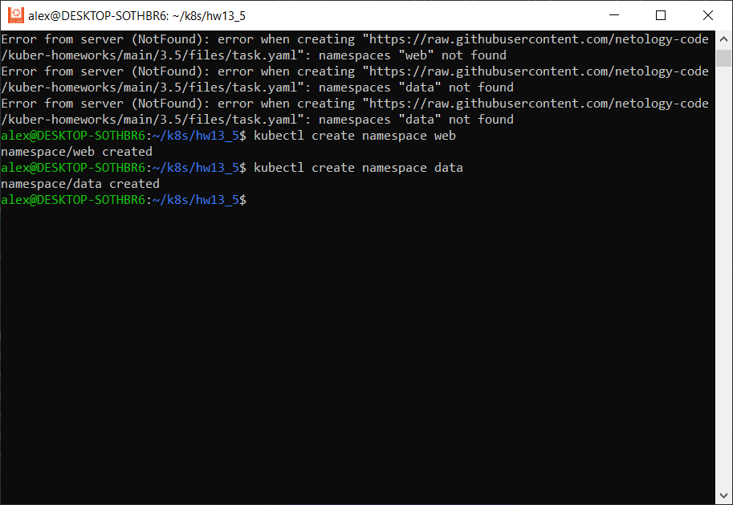
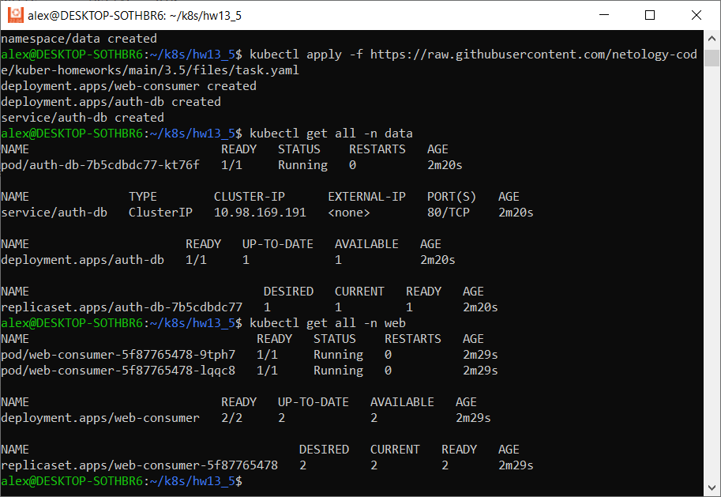
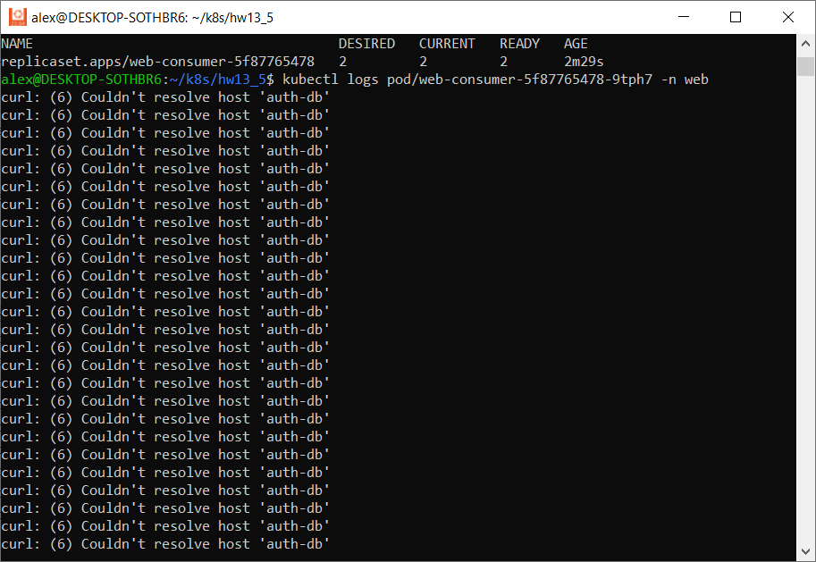
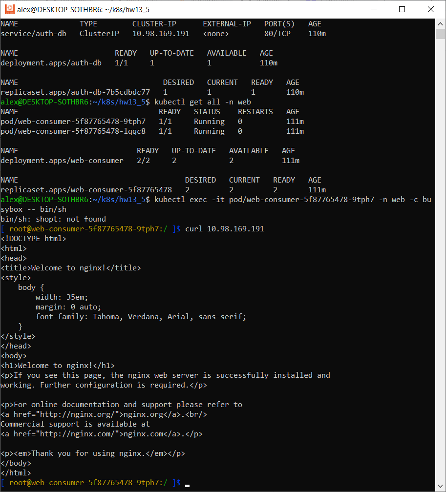
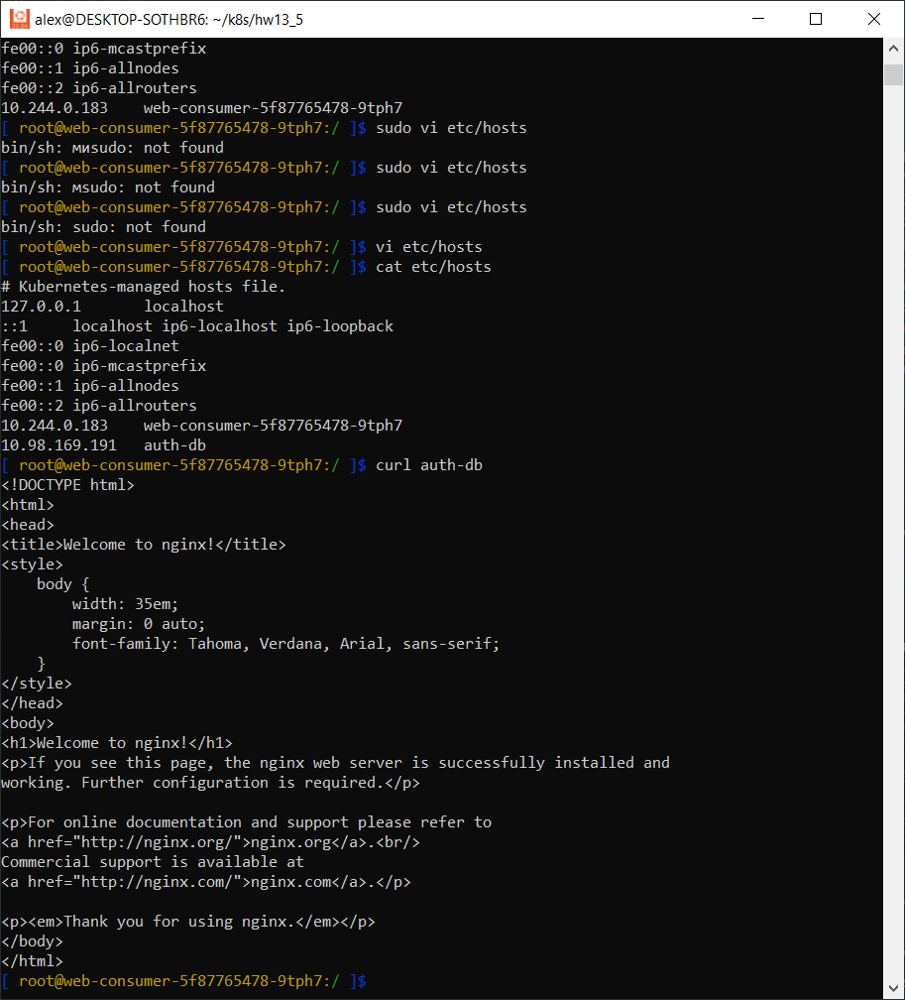
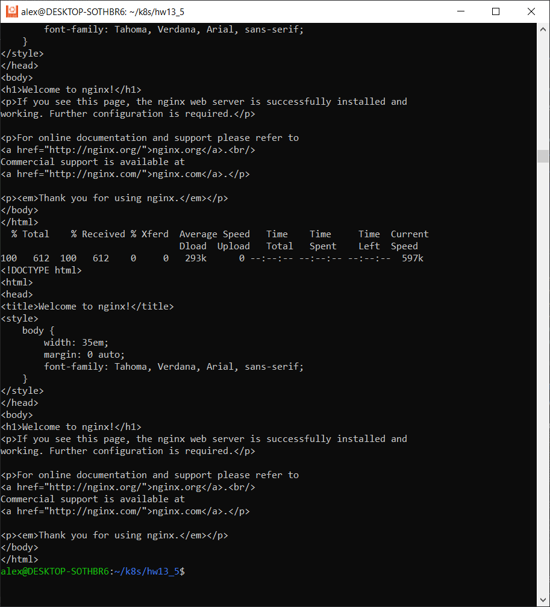

# Домашнее задание к занятию Troubleshooting

### Цель задания

Устранить неисправности при деплое приложения.

### Чеклист готовности к домашнему заданию

1. Кластер K8s.

### Задание. При деплое приложение web-consumer не может подключиться к auth-db. Необходимо это исправить

1. Установить приложение по команде:
```shell
kubectl apply -f https://raw.githubusercontent.com/netology-code/kuber-homeworks/main/3.5/files/task.yaml
```
2. Выявить проблему и описать.
3. Исправить проблему, описать, что сделано.
4. Продемонстрировать, что проблема решена.
---

### Ответ

1. Запускаем манифест

```commandline
alex@DESKTOP-SOTHBR6:~/k8s/hw13_5$ kubectl apply -f https://raw.githubusercontent.com/netology-code/kuber-homeworks/main/3.5/files/task.yaml
Error from server (NotFound): error when creating "https://raw.githubusercontent.com/netology-code/kuber-homeworks/main/3.5/files/task.yaml": namespaces "web" not found
Error from server (NotFound): error when creating "https://raw.githubusercontent.com/netology-code/kuber-homeworks/main/3.5/files/task.yaml": namespaces "data" not found
Error from server (NotFound): error when creating "https://raw.githubusercontent.com/netology-code/kuber-homeworks/main/3.5/files/task.yaml": namespaces "data" not found
```

Ошибка говорит о том, что нет необходимых неймспейсов web и data

2. Для устранения ошибки создаем соответствующие неймспейсы

`kubectl create namespace web`  
`kubectl create namespace data`



3. Повторно проверяем запуск манифеста

```commandline
alex@DESKTOP-SOTHBR6:~/k8s/hw13_5$ kubectl apply -f https://raw.githubusercontent.com/netology-code/kuber-homeworks/main/3.5/files/task.yaml
deployment.apps/web-consumer created
deployment.apps/auth-db created
service/auth-db created
```

Сервис и деплойменты создались

Проверяем что у нас внутри



4. Проверяем логи подов



5. Проверяем сервайс в неймспейсах

```commandline
alex@DESKTOP-SOTHBR6:~/k8s/hw13_5$ kubectl get svc -n data
NAME      TYPE        CLUSTER-IP      EXTERNAL-IP   PORT(S)   AGE
auth-db   ClusterIP   10.98.169.191   <none>        80/TCP    35m
alex@DESKTOP-SOTHBR6:~/k8s/hw13_5$ kubectl get svc -n web
No resources found in web namespace.
alex@DESKTOP-SOTHBR6:~/k8s/hw13_5$ kubectl describe svc -n data
Name:              auth-db
Namespace:         data
Labels:            <none>
Annotations:       <none>
Selector:          app=auth-db
Type:              ClusterIP
IP Family Policy:  SingleStack
IP Families:       IPv4
IP:                10.98.169.191
IPs:               10.98.169.191
Port:              <unset>  80/TCP
TargetPort:        80/TCP
Endpoints:         10.244.0.181:80
Session Affinity:  None
Events:            <none>
```

Далее проверяем селектор в деплойментах

```commandline
alex@DESKTOP-SOTHBR6:~/k8s/hw13_5$ kubectl describe deployments.apps -n data
Name:                   auth-db
Namespace:              data
CreationTimestamp:      Mon, 01 Apr 2024 08:52:53 +0500
Labels:                 <none>
Annotations:            deployment.kubernetes.io/revision: 1
Selector:               app=auth-db
Replicas:               1 desired | 1 updated | 1 total | 1 available | 0 unavailable
StrategyType:           RollingUpdate
MinReadySeconds:        0
RollingUpdateStrategy:  25% max unavailable, 25% max surge
Pod Template:
  Labels:  app=auth-db
  Containers:
   nginx:
    Image:        nginx:1.19.1
    Port:         80/TCP
    Host Port:    0/TCP
    Environment:  <none>
    Mounts:       <none>
  Volumes:        <none>
Conditions:
  Type           Status  Reason
  ----           ------  ------
  Available      True    MinimumReplicasAvailable
  Progressing    True    NewReplicaSetAvailable
OldReplicaSets:  <none>
NewReplicaSet:   auth-db-7b5cdbdc77 (1/1 replicas created)
Events:
  Type    Reason             Age   From                   Message
  ----    ------             ----  ----                   -------
  Normal  ScalingReplicaSet  36m   deployment-controller  Scaled up replica set auth-db-7b5cdbdc77 to 1
```

```commandline
alex@DESKTOP-SOTHBR6:~/k8s/hw13_5$ kubectl describe deployments.apps -n web
Name:                   web-consumer
Namespace:              web
CreationTimestamp:      Mon, 01 Apr 2024 08:52:53 +0500
Labels:                 <none>
Annotations:            deployment.kubernetes.io/revision: 1
Selector:               app=web-consumer
Replicas:               2 desired | 2 updated | 2 total | 2 available | 0 unavailable
StrategyType:           RollingUpdate
MinReadySeconds:        0
RollingUpdateStrategy:  25% max unavailable, 25% max surge
Pod Template:
  Labels:  app=web-consumer
  Containers:
   busybox:
    Image:      radial/busyboxplus:curl
    Port:       <none>
    Host Port:  <none>
    Command:
      sh
      -c
      while true; do curl auth-db; sleep 5; done
    Environment:  <none>
    Mounts:       <none>
  Volumes:        <none>
Conditions:
  Type           Status  Reason
  ----           ------  ------
  Available      True    MinimumReplicasAvailable
  Progressing    True    NewReplicaSetAvailable
OldReplicaSets:  <none>
NewReplicaSet:   web-consumer-5f87765478 (2/2 replicas created)
Events:          <none>
```

6) Зайдем в контейнер, проверим есть ли доступ к приложению через ip-адрес сервиса 10.98.169.191



Видим что проблема заключается конкретно в том, что контейнер не знает имя auth-db

7) Добавляем ассоциацию ip-адреса с именем в hosts контейнера

```commandline
[ root@web-consumer-5f87765478-9tph7:/ ]$ cat etc/hosts
# Kubernetes-managed hosts file.
127.0.0.1       localhost
::1     localhost ip6-localhost ip6-loopback
fe00::0 ip6-localnet
fe00::0 ip6-mcastprefix
fe00::1 ip6-allnodes
fe00::2 ip6-allrouters
10.244.0.183    web-consumer-5f87765478-9tph7
10.98.169.191   auth-db
```

Курлим по имени, все получилось



Проверяем логи приложения

`kubectl logs pod/web-consumer-5f87765478-9tph7 -n web`

Всю портянку не стал приводить, т.к. много листов получилось, заскринил последнюю страницу.



---
### Правила приёма работы

1. Домашняя работа оформляется в своём Git-репозитории в файле README.md. Выполненное домашнее задание пришлите ссылкой на .md-файл в вашем репозитории.
2. Файл README.md должен содержать скриншоты вывода необходимых команд, а также скриншоты результатов.
3. Репозиторий должен содержать тексты манифестов или ссылки на них в файле README.md.