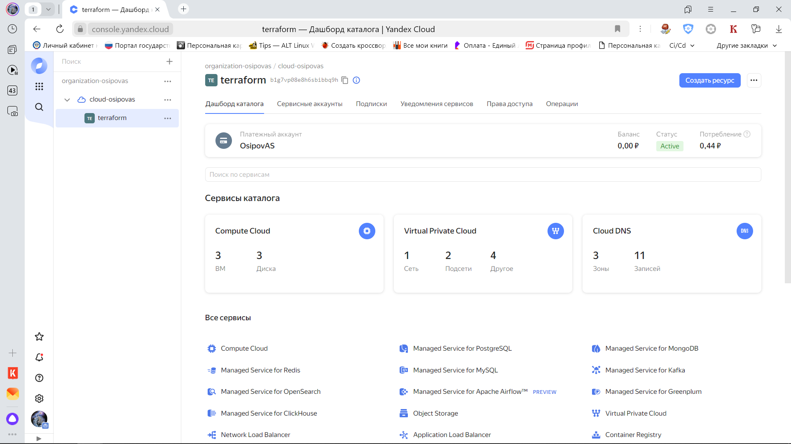
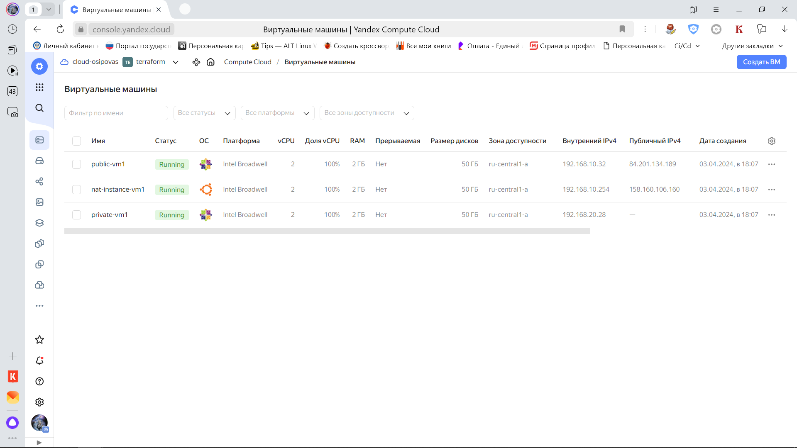
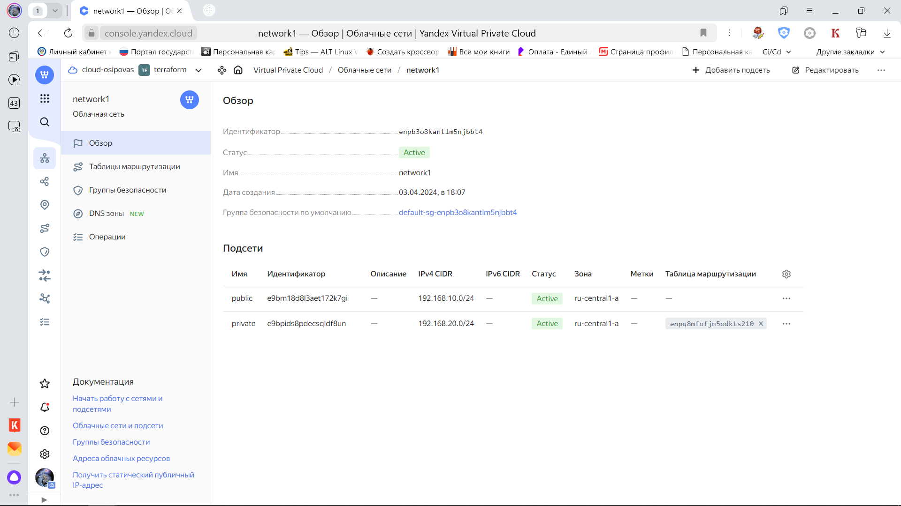
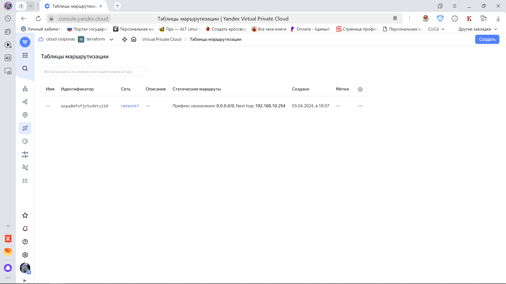
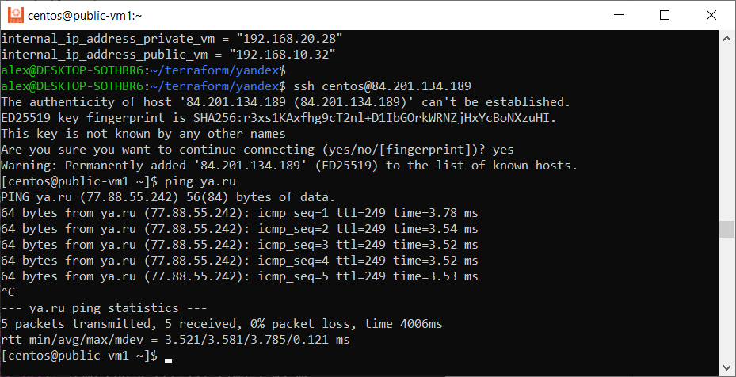
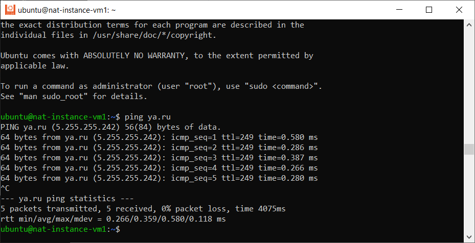
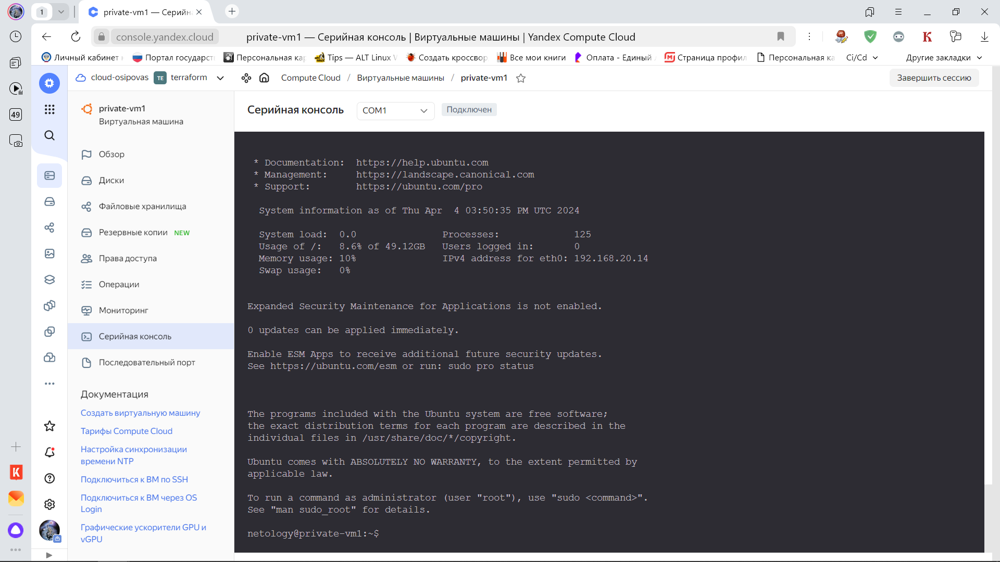
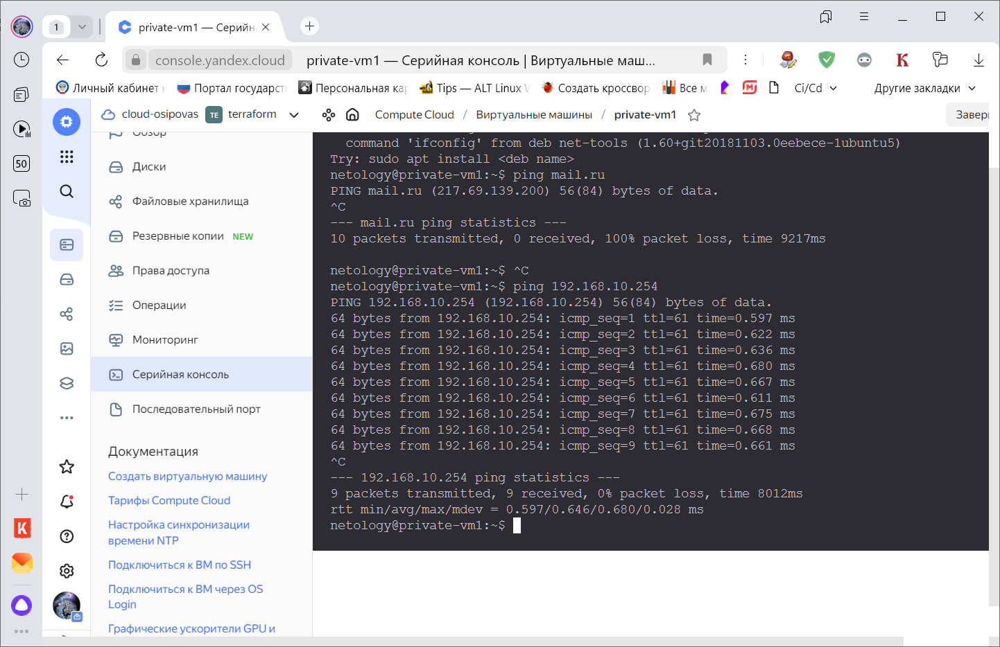

# Домашнее задание к занятию «Организация сети»

### Подготовка к выполнению задания

1. Домашнее задание состоит из обязательной части, которую нужно выполнить на провайдере Yandex Cloud, и дополнительной части в AWS (выполняется по желанию). 
2. Все домашние задания в блоке 15 связаны друг с другом и в конце представляют пример законченной инфраструктуры.  
3. Все задания нужно выполнить с помощью Terraform. Результатом выполненного домашнего задания будет код в репозитории. 
4. Перед началом работы настройте доступ к облачным ресурсам из Terraform, используя материалы прошлых лекций и домашнее задание по теме «Облачные провайдеры и синтаксис Terraform». Заранее выберите регион (в случае AWS) и зону.

---
### Задание 1. Yandex Cloud 

**Что нужно сделать**

1. Создать пустую VPC. Выбрать зону.
2. Публичная подсеть.

 - Создать в VPC subnet с названием public, сетью 192.168.10.0/24.
 - Создать в этой подсети NAT-инстанс, присвоив ему адрес 192.168.10.254. В качестве image_id использовать fd80mrhj8fl2oe87o4e1.
 - Создать в этой публичной подсети виртуалку с публичным IP, подключиться к ней и убедиться, что есть доступ к интернету.
3. Приватная подсеть.
 - Создать в VPC subnet с названием private, сетью 192.168.20.0/24.
 - Создать route table. Добавить статический маршрут, направляющий весь исходящий трафик private сети в NAT-инстанс.
 - Создать в этой приватной подсети виртуалку с внутренним IP, подключиться к ней через виртуалку, созданную ранее, и убедиться, что есть доступ к интернету.

Resource Terraform для Yandex Cloud:

- [VPC subnet](https://registry.terraform.io/providers/yandex-cloud/yandex/latest/docs/resources/vpc_subnet).
- [Route table](https://registry.terraform.io/providers/yandex-cloud/yandex/latest/docs/resources/vpc_route_table).
- [Compute Instance](https://registry.terraform.io/providers/yandex-cloud/yandex/latest/docs/resources/compute_instance).

---
### Ответ

1) Установил terraform и связал с yandex-cloud. Создал сервисный аккаунт и ключ доступа. Прописал настройки в файл provider.tf.
2) Создал ssh-ключ для дальнейшего подключения к развернутым виртуалкам
3) Пробовал в ru-central1-c и ru-central1-d, но выходила ошибка квоты, видимо в с уже не дает создавать ВМ, с сетями проблем не было
4) Проверяем манифесты

```commandline
alex@DESKTOP-SOTHBR6:~/terraform/yandex$ terraform plan
yandex_vpc_network.network-1: Refreshing state... [id=enpnq1f0vq7i8ersm8lg]
yandex_vpc_subnet.subnet-public: Refreshing state... [id=fl8htuclum65gm1j25bt]
yandex_vpc_route_table.nat-route-table: Refreshing state... [id=enpgqe0n0kgr1jq72359]
yandex_vpc_subnet.subnet-private: Refreshing state... [id=fl828st05ouopjs8rt5a]

Note: Objects have changed outside of Terraform

Terraform detected the following changes made outside of Terraform since the last "terraform apply" which may have affected this
plan:

  # yandex_vpc_network.network-1 has been deleted
  - resource "yandex_vpc_network" "network-1" {
      - id                        = "enpnq1f0vq7i8ersm8lg" -> null
        name                      = "network1"
        # (5 unchanged attributes hidden)
    }

  # yandex_vpc_route_table.nat-route-table has been deleted
  - resource "yandex_vpc_route_table" "nat-route-table" {
      - id         = "enpgqe0n0kgr1jq72359" -> null
        # (4 unchanged attributes hidden)

        # (1 unchanged block hidden)
    }

  # yandex_vpc_subnet.subnet-private has been deleted
  - resource "yandex_vpc_subnet" "subnet-private" {
      - id             = "fl828st05ouopjs8rt5a" -> null
        name           = "private"
        # (8 unchanged attributes hidden)
    }

  # yandex_vpc_subnet.subnet-public has been deleted
  - resource "yandex_vpc_subnet" "subnet-public" {
      - id             = "fl8htuclum65gm1j25bt" -> null
        name           = "public"
        # (7 unchanged attributes hidden)
    }


Unless you have made equivalent changes to your configuration, or ignored the relevant attributes using ignore_changes, the
following plan may include actions to undo or respond to these changes.

───────────────────────────────────────────────────────────────────────────────────────────────────────────────────────────────────

Terraform used the selected providers to generate the following execution plan. Resource actions are indicated with the following
symbols:
  + create

Terraform will perform the following actions:

  # yandex_compute_instance.nat-instance will be created
  + resource "yandex_compute_instance" "nat-instance" {
      + created_at                = (known after apply)
      + folder_id                 = (known after apply)
      + fqdn                      = (known after apply)
      + gpu_cluster_id            = (known after apply)
      + hostname                  = "nat-instance-vm1.netology.cloud"
      + id                        = (known after apply)
      + maintenance_grace_period  = (known after apply)
      + maintenance_policy        = (known after apply)
      + metadata                  = {
          + "ssh-keys" = <<-EOT
                ubuntu:ssh-rsa AAAAB3NzaC1yc2EAAAADAQABAAABgQDR3XW9AeXsEqCCp8mVItD4avsHRVEuBGCuoqWOAZaffz/HObt7XBlD1oDE5LdihAdD3jOGLfUpxrOhQidNuknPHKzKmgwA3xUuwFIg/W4G/s4LAzGwfjr/PIdI6//ZH/iBQaa+sWINi19PpQNY4GRmWEHhqmg0gzhiaat+RczNzrLn6ObbMItcWo/wOazL0Kja0VnfNum5LUOD33O/z/D059Z8/RFcQSExvoh5uyRbUJBAoD96OdJW5jeRbr7b9G+jHVoSGwozdPNXxYe7rFNLM8JDbFH/Ymhup/nFkEQVyXM3tJE30knYJh/TFLAonWMYId3ODCFwfR93CKcvM1kiWLvAQBqaIVnRjcKUTUxJUUvIVg6BmvYVqGVmmGQfN+qHHHOWRsXKBgN1ADu3/cbxINtghqNCUQKrAgHQEATrf2P87R0OE3RJt2CzAZyaIYFiHBrNmsgvNIGn2T7lncqTK6Tl3llBbNPs9pzqai3osSd1+Jc1jo0HjVh3j4/CJuE= alex@DESKTOP-SOTHBR6
            EOT
        }
      + name                      = "nat-instance-vm1"
      + network_acceleration_type = "standard"
      + platform_id               = "standard-v1"
      + service_account_id        = (known after apply)
      + status                    = (known after apply)
      + zone                      = "ru-central1-d"

      + boot_disk {
          + auto_delete = true
          + device_name = (known after apply)
          + disk_id     = (known after apply)
          + mode        = (known after apply)

          + initialize_params {
              + block_size  = (known after apply)
              + description = (known after apply)
              + image_id    = "fd8dmsb2cgoabg4qelih"
              + name        = "root-nat-instance-vm1"
              + size        = 50
              + snapshot_id = (known after apply)
              + type        = "network-nvme"
            }
        }

      + network_interface {
          + index              = (known after apply)
          + ip_address         = "192.168.10.254"
          + ipv4               = true
          + ipv6               = (known after apply)
          + ipv6_address       = (known after apply)
          + mac_address        = (known after apply)
          + nat                = true
          + nat_ip_address     = (known after apply)
          + nat_ip_version     = (known after apply)
          + security_group_ids = (known after apply)
          + subnet_id          = (known after apply)
        }

      + resources {
          + core_fraction = 100
          + cores         = 2
          + memory        = 2
        }
    }

  # yandex_compute_instance.private-vm will be created
  + resource "yandex_compute_instance" "private-vm" {
      + created_at                = (known after apply)
      + folder_id                 = (known after apply)
      + fqdn                      = (known after apply)
      + gpu_cluster_id            = (known after apply)
      + hostname                  = "private-vm1.netology.cloud"
      + id                        = (known after apply)
      + maintenance_grace_period  = (known after apply)
      + maintenance_policy        = (known after apply)
      + metadata                  = {
          + "ssh-keys" = <<-EOT
                ubuntu:ssh-rsa AAAAB3NzaC1yc2EAAAADAQABAAABgQDR3XW9AeXsEqCCp8mVItD4avsHRVEuBGCuoqWOAZaffz/HObt7XBlD1oDE5LdihAdD3jOGLfUpxrOhQidNuknPHKzKmgwA3xUuwFIg/W4G/s4LAzGwfjr/PIdI6//ZH/iBQaa+sWINi19PpQNY4GRmWEHhqmg0gzhiaat+RczNzrLn6ObbMItcWo/wOazL0Kja0VnfNum5LUOD33O/z/D059Z8/RFcQSExvoh5uyRbUJBAoD96OdJW5jeRbr7b9G+jHVoSGwozdPNXxYe7rFNLM8JDbFH/Ymhup/nFkEQVyXM3tJE30knYJh/TFLAonWMYId3ODCFwfR93CKcvM1kiWLvAQBqaIVnRjcKUTUxJUUvIVg6BmvYVqGVmmGQfN+qHHHOWRsXKBgN1ADu3/cbxINtghqNCUQKrAgHQEATrf2P87R0OE3RJt2CzAZyaIYFiHBrNmsgvNIGn2T7lncqTK6Tl3llBbNPs9pzqai3osSd1+Jc1jo0HjVh3j4/CJuE= alex@DESKTOP-SOTHBR6
            EOT
        }
      + name                      = "private-vm1"
      + network_acceleration_type = "standard"
      + platform_id               = "standard-v1"
      + service_account_id        = (known after apply)
      + status                    = (known after apply)
      + zone                      = "ru-central1-d"

      + boot_disk {
          + auto_delete = true
          + device_name = (known after apply)
          + disk_id     = (known after apply)
          + mode        = (known after apply)

          + initialize_params {
              + block_size  = (known after apply)
              + description = (known after apply)
              + image_id    = "fd8ko9ldjuohg4k6gmpn"
              + name        = "root-private-vm1"
              + size        = 50
              + snapshot_id = (known after apply)
              + type        = "network-nvme"
            }
        }

      + network_interface {
          + index              = (known after apply)
          + ip_address         = (known after apply)
          + ipv4               = true
          + ipv6               = (known after apply)
          + ipv6_address       = (known after apply)
          + mac_address        = (known after apply)
          + nat                = false
          + nat_ip_address     = (known after apply)
          + nat_ip_version     = (known after apply)
          + security_group_ids = (known after apply)
          + subnet_id          = (known after apply)
        }

      + resources {
          + core_fraction = 100
          + cores         = 2
          + memory        = 2
        }
    }

  # yandex_compute_instance.public-vm will be created
  + resource "yandex_compute_instance" "public-vm" {
      + created_at                = (known after apply)
      + folder_id                 = (known after apply)
      + fqdn                      = (known after apply)
      + gpu_cluster_id            = (known after apply)
      + hostname                  = "public-vm1.netology.cloud"
      + id                        = (known after apply)
      + maintenance_grace_period  = (known after apply)
      + maintenance_policy        = (known after apply)
      + metadata                  = {
          + "ssh-keys" = <<-EOT
                ubuntu:ssh-rsa AAAAB3NzaC1yc2EAAAADAQABAAABgQDR3XW9AeXsEqCCp8mVItD4avsHRVEuBGCuoqWOAZaffz/HObt7XBlD1oDE5LdihAdD3jOGLfUpxrOhQidNuknPHKzKmgwA3xUuwFIg/W4G/s4LAzGwfjr/PIdI6//ZH/iBQaa+sWINi19PpQNY4GRmWEHhqmg0gzhiaat+RczNzrLn6ObbMItcWo/wOazL0Kja0VnfNum5LUOD33O/z/D059Z8/RFcQSExvoh5uyRbUJBAoD96OdJW5jeRbr7b9G+jHVoSGwozdPNXxYe7rFNLM8JDbFH/Ymhup/nFkEQVyXM3tJE30knYJh/TFLAonWMYId3ODCFwfR93CKcvM1kiWLvAQBqaIVnRjcKUTUxJUUvIVg6BmvYVqGVmmGQfN+qHHHOWRsXKBgN1ADu3/cbxINtghqNCUQKrAgHQEATrf2P87R0OE3RJt2CzAZyaIYFiHBrNmsgvNIGn2T7lncqTK6Tl3llBbNPs9pzqai3osSd1+Jc1jo0HjVh3j4/CJuE= alex@DESKTOP-SOTHBR6
            EOT
        }
      + name                      = "public-vm1"
      + network_acceleration_type = "standard"
      + platform_id               = "standard-v1"
      + service_account_id        = (known after apply)
      + status                    = (known after apply)
      + zone                      = "ru-central1-d"

      + boot_disk {
          + auto_delete = true
          + device_name = (known after apply)
          + disk_id     = (known after apply)
          + mode        = (known after apply)

          + initialize_params {
              + block_size  = (known after apply)
              + description = (known after apply)
              + image_id    = "fd8ko9ldjuohg4k6gmpn"
              + name        = "root-public-vm1"
              + size        = 50
              + snapshot_id = (known after apply)
              + type        = "network-nvme"
            }
        }

      + network_interface {
          + index              = (known after apply)
          + ip_address         = (known after apply)
          + ipv4               = true
          + ipv6               = (known after apply)
          + ipv6_address       = (known after apply)
          + mac_address        = (known after apply)
          + nat                = true
          + nat_ip_address     = (known after apply)
          + nat_ip_version     = (known after apply)
          + security_group_ids = (known after apply)
          + subnet_id          = (known after apply)
        }

      + resources {
          + core_fraction = 100
          + cores         = 2
          + memory        = 2
        }
    }

  # yandex_vpc_network.network-1 will be created
  + resource "yandex_vpc_network" "network-1" {
      + created_at                = (known after apply)
      + default_security_group_id = (known after apply)
      + folder_id                 = (known after apply)
      + id                        = (known after apply)
      + labels                    = (known after apply)
      + name                      = "network1"
      + subnet_ids                = (known after apply)
    }

  # yandex_vpc_route_table.nat-route-table will be created
  + resource "yandex_vpc_route_table" "nat-route-table" {
      + created_at = (known after apply)
      + folder_id  = (known after apply)
      + id         = (known after apply)
      + labels     = (known after apply)
      + network_id = (known after apply)

      + static_route {
          + destination_prefix = "0.0.0.0/0"
          + next_hop_address   = "192.168.10.254"
        }
    }

  # yandex_vpc_subnet.subnet-private will be created
  + resource "yandex_vpc_subnet" "subnet-private" {
      + created_at     = (known after apply)
      + folder_id      = (known after apply)
      + id             = (known after apply)
      + labels         = (known after apply)
      + name           = "private"
      + network_id     = (known after apply)
      + route_table_id = (known after apply)
      + v4_cidr_blocks = [
          + "192.168.20.0/24",
        ]
      + v6_cidr_blocks = (known after apply)
      + zone           = "ru-central1-d"
    }

  # yandex_vpc_subnet.subnet-public will be created
  + resource "yandex_vpc_subnet" "subnet-public" {
      + created_at     = (known after apply)
      + folder_id      = (known after apply)
      + id             = (known after apply)
      + labels         = (known after apply)
      + name           = "public"
      + network_id     = (known after apply)
      + v4_cidr_blocks = [
          + "192.168.10.0/24",
        ]
      + v6_cidr_blocks = (known after apply)
      + zone           = "ru-central1-d"
    }

Plan: 7 to add, 0 to change, 0 to destroy.

Changes to Outputs:
  + external_ip_address_nat_vm     = (known after apply)
  + external_ip_address_private_vm = (known after apply)
  + external_ip_address_public_vm  = (known after apply)
  + internal_ip_address_private_vm = (known after apply)
  + internal_ip_address_public_vm  = (known after apply)

───────────────────────────────────────────────────────────────────────────────────────────────────────────────────────────────────

Note: You didn't use the -out option to save this plan, so Terraform can't guarantee to take exactly these actions if you run
"terraform apply" now.
```

5) Запускаем создание инфраструктуры

```commandline
alex@DESKTOP-SOTHBR6:~/terraform/yandex$ terraform apply -auto-approve
yandex_vpc_network.network-1: Refreshing state... [id=enpncjrhtoo3kckca0eb]
yandex_vpc_route_table.nat-route-table: Refreshing state... [id=enparbvhlmnd5l3sre10]
yandex_vpc_subnet.subnet-public: Refreshing state... [id=fl8ij4k0totn06kl1llr]
yandex_vpc_subnet.subnet-private: Refreshing state... [id=fl8qcb0ks18i5rbadki7]

Note: Objects have changed outside of Terraform

Terraform detected the following changes made outside of Terraform since the last "terraform apply" which may have affected this
plan:

  # yandex_vpc_network.network-1 has been deleted
  - resource "yandex_vpc_network" "network-1" {
      - id                        = "enpncjrhtoo3kckca0eb" -> null
        name                      = "network1"
        # (5 unchanged attributes hidden)
    }

  # yandex_vpc_route_table.nat-route-table has been deleted
  - resource "yandex_vpc_route_table" "nat-route-table" {
      - id         = "enparbvhlmnd5l3sre10" -> null
        # (4 unchanged attributes hidden)

        # (1 unchanged block hidden)
    }

  # yandex_vpc_subnet.subnet-private has been deleted
  - resource "yandex_vpc_subnet" "subnet-private" {
      - id             = "fl8qcb0ks18i5rbadki7" -> null
        name           = "private"
        # (8 unchanged attributes hidden)
    }

  # yandex_vpc_subnet.subnet-public has been deleted
  - resource "yandex_vpc_subnet" "subnet-public" {
      - id             = "fl8ij4k0totn06kl1llr" -> null
        name           = "public"
        # (7 unchanged attributes hidden)
    }


Unless you have made equivalent changes to your configuration, or ignored the relevant attributes using ignore_changes, the
following plan may include actions to undo or respond to these changes.

───────────────────────────────────────────────────────────────────────────────────────────────────────────────────────────────────

Terraform used the selected providers to generate the following execution plan. Resource actions are indicated with the following
symbols:
  + create

Terraform will perform the following actions:

  # yandex_compute_instance.nat-instance will be created
  + resource "yandex_compute_instance" "nat-instance" {
      + created_at                = (known after apply)
      + folder_id                 = (known after apply)
      + fqdn                      = (known after apply)
      + gpu_cluster_id            = (known after apply)
      + hostname                  = "nat-instance-vm1.netology.cloud"
      + id                        = (known after apply)
      + maintenance_grace_period  = (known after apply)
      + maintenance_policy        = (known after apply)
      + metadata                  = {
          + "ssh-keys" = <<-EOT
                ubuntu:ssh-rsa AAAAB3NzaC1yc2EAAAADAQABAAABgQDR3XW9AeXsEqCCp8mVItD4avsHRVEuBGCuoqWOAZaffz/HObt7XBlD1oDE5LdihAdD3jOGLfUpxrOhQidNuknPHKzKmgwA3xUuwFIg/W4G/s4LAzGwfjr/PIdI6//ZH/iBQaa+sWINi19PpQNY4GRmWEHhqmg0gzhiaat+RczNzrLn6ObbMItcWo/wOazL0Kja0VnfNum5LUOD33O/z/D059Z8/RFcQSExvoh5uyRbUJBAoD96OdJW5jeRbr7b9G+jHVoSGwozdPNXxYe7rFNLM8JDbFH/Ymhup/nFkEQVyXM3tJE30knYJh/TFLAonWMYId3ODCFwfR93CKcvM1kiWLvAQBqaIVnRjcKUTUxJUUvIVg6BmvYVqGVmmGQfN+qHHHOWRsXKBgN1ADu3/cbxINtghqNCUQKrAgHQEATrf2P87R0OE3RJt2CzAZyaIYFiHBrNmsgvNIGn2T7lncqTK6Tl3llBbNPs9pzqai3osSd1+Jc1jo0HjVh3j4/CJuE= alex@DESKTOP-SOTHBR6
            EOT
        }
      + name                      = "nat-instance-vm1"
      + network_acceleration_type = "standard"
      + platform_id               = "standard-v1"
      + service_account_id        = (known after apply)
      + status                    = (known after apply)
      + zone                      = "ru-central1-a"

      + boot_disk {
          + auto_delete = true
          + device_name = (known after apply)
          + disk_id     = (known after apply)
          + mode        = (known after apply)

          + initialize_params {
              + block_size  = (known after apply)
              + description = (known after apply)
              + image_id    = "fd8dmsb2cgoabg4qelih"
              + name        = "root-nat-instance-vm1"
              + size        = 50
              + snapshot_id = (known after apply)
              + type        = "network-nvme"
            }
        }

      + network_interface {
          + index              = (known after apply)
          + ip_address         = "192.168.10.254"
          + ipv4               = true
          + ipv6               = (known after apply)
          + ipv6_address       = (known after apply)
          + mac_address        = (known after apply)
          + nat                = true
          + nat_ip_address     = (known after apply)
          + nat_ip_version     = (known after apply)
          + security_group_ids = (known after apply)
          + subnet_id          = (known after apply)
        }

      + resources {
          + core_fraction = 100
          + cores         = 2
          + memory        = 2
        }
    }

  # yandex_compute_instance.private-vm will be created
  + resource "yandex_compute_instance" "private-vm" {
      + created_at                = (known after apply)
      + folder_id                 = (known after apply)
      + fqdn                      = (known after apply)
      + gpu_cluster_id            = (known after apply)
      + hostname                  = "private-vm1.netology.cloud"
      + id                        = (known after apply)
      + maintenance_grace_period  = (known after apply)
      + maintenance_policy        = (known after apply)
      + metadata                  = {
          + "ssh-keys" = <<-EOT
                ubuntu:ssh-rsa AAAAB3NzaC1yc2EAAAADAQABAAABgQDR3XW9AeXsEqCCp8mVItD4avsHRVEuBGCuoqWOAZaffz/HObt7XBlD1oDE5LdihAdD3jOGLfUpxrOhQidNuknPHKzKmgwA3xUuwFIg/W4G/s4LAzGwfjr/PIdI6//ZH/iBQaa+sWINi19PpQNY4GRmWEHhqmg0gzhiaat+RczNzrLn6ObbMItcWo/wOazL0Kja0VnfNum5LUOD33O/z/D059Z8/RFcQSExvoh5uyRbUJBAoD96OdJW5jeRbr7b9G+jHVoSGwozdPNXxYe7rFNLM8JDbFH/Ymhup/nFkEQVyXM3tJE30knYJh/TFLAonWMYId3ODCFwfR93CKcvM1kiWLvAQBqaIVnRjcKUTUxJUUvIVg6BmvYVqGVmmGQfN+qHHHOWRsXKBgN1ADu3/cbxINtghqNCUQKrAgHQEATrf2P87R0OE3RJt2CzAZyaIYFiHBrNmsgvNIGn2T7lncqTK6Tl3llBbNPs9pzqai3osSd1+Jc1jo0HjVh3j4/CJuE= alex@DESKTOP-SOTHBR6
            EOT
        }
      + name                      = "private-vm1"
      + network_acceleration_type = "standard"
      + platform_id               = "standard-v1"
      + service_account_id        = (known after apply)
      + status                    = (known after apply)
      + zone                      = "ru-central1-a"

      + boot_disk {
          + auto_delete = true
          + device_name = (known after apply)
          + disk_id     = (known after apply)
          + mode        = (known after apply)

          + initialize_params {
              + block_size  = (known after apply)
              + description = (known after apply)
              + image_id    = "fd8ko9ldjuohg4k6gmpn"
              + name        = "root-private-vm1"
              + size        = 50
              + snapshot_id = (known after apply)
              + type        = "network-nvme"
            }
        }

      + network_interface {
          + index              = (known after apply)
          + ip_address         = (known after apply)
          + ipv4               = true
          + ipv6               = (known after apply)
          + ipv6_address       = (known after apply)
          + mac_address        = (known after apply)
          + nat                = false
          + nat_ip_address     = (known after apply)
          + nat_ip_version     = (known after apply)
          + security_group_ids = (known after apply)
          + subnet_id          = (known after apply)
        }

      + resources {
          + core_fraction = 100
          + cores         = 2
          + memory        = 2
        }
    }

  # yandex_compute_instance.public-vm will be created
  + resource "yandex_compute_instance" "public-vm" {
      + created_at                = (known after apply)
      + folder_id                 = (known after apply)
      + fqdn                      = (known after apply)
      + gpu_cluster_id            = (known after apply)
      + hostname                  = "public-vm1.netology.cloud"
      + id                        = (known after apply)
      + maintenance_grace_period  = (known after apply)
      + maintenance_policy        = (known after apply)
      + metadata                  = {
          + "ssh-keys" = <<-EOT
                ubuntu:ssh-rsa AAAAB3NzaC1yc2EAAAADAQABAAABgQDR3XW9AeXsEqCCp8mVItD4avsHRVEuBGCuoqWOAZaffz/HObt7XBlD1oDE5LdihAdD3jOGLfUpxrOhQidNuknPHKzKmgwA3xUuwFIg/W4G/s4LAzGwfjr/PIdI6//ZH/iBQaa+sWINi19PpQNY4GRmWEHhqmg0gzhiaat+RczNzrLn6ObbMItcWo/wOazL0Kja0VnfNum5LUOD33O/z/D059Z8/RFcQSExvoh5uyRbUJBAoD96OdJW5jeRbr7b9G+jHVoSGwozdPNXxYe7rFNLM8JDbFH/Ymhup/nFkEQVyXM3tJE30knYJh/TFLAonWMYId3ODCFwfR93CKcvM1kiWLvAQBqaIVnRjcKUTUxJUUvIVg6BmvYVqGVmmGQfN+qHHHOWRsXKBgN1ADu3/cbxINtghqNCUQKrAgHQEATrf2P87R0OE3RJt2CzAZyaIYFiHBrNmsgvNIGn2T7lncqTK6Tl3llBbNPs9pzqai3osSd1+Jc1jo0HjVh3j4/CJuE= alex@DESKTOP-SOTHBR6
            EOT
        }
      + name                      = "public-vm1"
      + network_acceleration_type = "standard"
      + platform_id               = "standard-v1"
      + service_account_id        = (known after apply)
      + status                    = (known after apply)
      + zone                      = "ru-central1-a"

      + boot_disk {
          + auto_delete = true
          + device_name = (known after apply)
          + disk_id     = (known after apply)
          + mode        = (known after apply)

          + initialize_params {
              + block_size  = (known after apply)
              + description = (known after apply)
              + image_id    = "fd8ko9ldjuohg4k6gmpn"
              + name        = "root-public-vm1"
              + size        = 50
              + snapshot_id = (known after apply)
              + type        = "network-nvme"
            }
        }

      + network_interface {
          + index              = (known after apply)
          + ip_address         = (known after apply)
          + ipv4               = true
          + ipv6               = (known after apply)
          + ipv6_address       = (known after apply)
          + mac_address        = (known after apply)
          + nat                = true
          + nat_ip_address     = (known after apply)
          + nat_ip_version     = (known after apply)
          + security_group_ids = (known after apply)
          + subnet_id          = (known after apply)
        }

      + resources {
          + core_fraction = 100
          + cores         = 2
          + memory        = 2
        }
    }

  # yandex_vpc_network.network-1 will be created
  + resource "yandex_vpc_network" "network-1" {
      + created_at                = (known after apply)
      + default_security_group_id = (known after apply)
      + folder_id                 = (known after apply)
      + id                        = (known after apply)
      + labels                    = (known after apply)
      + name                      = "network1"
      + subnet_ids                = (known after apply)
    }

  # yandex_vpc_route_table.nat-route-table will be created
  + resource "yandex_vpc_route_table" "nat-route-table" {
      + created_at = (known after apply)
      + folder_id  = (known after apply)
      + id         = (known after apply)
      + labels     = (known after apply)
      + network_id = (known after apply)

      + static_route {
          + destination_prefix = "0.0.0.0/0"
          + next_hop_address   = "192.168.10.254"
        }
    }

  # yandex_vpc_subnet.subnet-private will be created
  + resource "yandex_vpc_subnet" "subnet-private" {
      + created_at     = (known after apply)
      + folder_id      = (known after apply)
      + id             = (known after apply)
      + labels         = (known after apply)
      + name           = "private"
      + network_id     = (known after apply)
      + route_table_id = (known after apply)
      + v4_cidr_blocks = [
          + "192.168.20.0/24",
        ]
      + v6_cidr_blocks = (known after apply)
      + zone           = "ru-central1-a"
    }

  # yandex_vpc_subnet.subnet-public will be created
  + resource "yandex_vpc_subnet" "subnet-public" {
      + created_at     = (known after apply)
      + folder_id      = (known after apply)
      + id             = (known after apply)
      + labels         = (known after apply)
      + name           = "public"
      + network_id     = (known after apply)
      + v4_cidr_blocks = [
          + "192.168.10.0/24",
        ]
      + v6_cidr_blocks = (known after apply)
      + zone           = "ru-central1-a"
    }

Plan: 7 to add, 0 to change, 0 to destroy.

Changes to Outputs:
  + external_ip_address_nat_vm     = (known after apply)
  + external_ip_address_private_vm = (known after apply)
  + external_ip_address_public_vm  = (known after apply)
  + internal_ip_address_private_vm = (known after apply)
  + internal_ip_address_public_vm  = (known after apply)
yandex_vpc_network.network-1: Creating...
yandex_vpc_network.network-1: Creation complete after 2s [id=enpb3o8kantlm5njbbt4]
yandex_vpc_route_table.nat-route-table: Creating...
yandex_vpc_subnet.subnet-public: Creating...
yandex_vpc_subnet.subnet-public: Creation complete after 1s [id=e9bm18d8l3aet172k7gi]
yandex_compute_instance.nat-instance: Creating...
yandex_compute_instance.public-vm: Creating...
yandex_vpc_route_table.nat-route-table: Creation complete after 1s [id=enpq8mfofjn5odkts210]
yandex_vpc_subnet.subnet-private: Creating...
yandex_vpc_subnet.subnet-private: Creation complete after 1s [id=e9bpids8pdecsqldf8un]
yandex_compute_instance.private-vm: Creating...
yandex_compute_instance.nat-instance: Still creating... [10s elapsed]
yandex_compute_instance.public-vm: Still creating... [10s elapsed]
yandex_compute_instance.private-vm: Still creating... [10s elapsed]
yandex_compute_instance.public-vm: Still creating... [20s elapsed]
yandex_compute_instance.nat-instance: Still creating... [20s elapsed]
yandex_compute_instance.private-vm: Still creating... [20s elapsed]
yandex_compute_instance.nat-instance: Still creating... [30s elapsed]
yandex_compute_instance.public-vm: Still creating... [30s elapsed]
yandex_compute_instance.private-vm: Still creating... [30s elapsed]
yandex_compute_instance.private-vm: Creation complete after 32s [id=fhmnuffa022bhm6pu7nj]
yandex_compute_instance.nat-instance: Creation complete after 35s [id=fhmdk3hbbc7h4g0i62jl]
yandex_compute_instance.public-vm: Creation complete after 38s [id=fhm7hvb1h6r071vnep39]

Apply complete! Resources: 7 added, 0 changed, 0 destroyed.

Outputs:

external_ip_address_nat_vm = "158.160.106.160"
external_ip_address_private_vm = ""
external_ip_address_public_vm = "84.201.134.189"
internal_ip_address_nat_vm = "192.168.10.254"
internal_ip_address_private_vm = "192.168.20.28"
internal_ip_address_public_vm = "192.168.10.32"
```
6) Проверяем в консоли



ВМ



Сети



Таблица маршрутизации



7) Проверяем доступ во вне с public



8) Проверяем доступ во вне с nat-instance-vm1



9) Проверяем доступ с private

Не смог подключиться к машине по SSH с других машин, выдает ошибку про SSH.
Чтобы выйти из положения создал cloud-init.yml и в нем указал пользователя для всех машин.
Также в настройках ВМ поставил галочку о возможности запуска консоли



Пинг по имени не пошел, но по адресу прошло



10) Удаляем равернутую инфраструктуру, чтобы не платить яндексу)

```commandline
alex@DESKTOP-SOTHBR6:~/terraform/yandex$ terraform destroy -auto-approve
yandex_vpc_network.network-1: Refreshing state... [id=enpb3o8kantlm5njbbt4]
yandex_vpc_subnet.subnet-public: Refreshing state... [id=e9bm18d8l3aet172k7gi]
yandex_vpc_route_table.nat-route-table: Refreshing state... [id=enpq8mfofjn5odkts210]
yandex_compute_instance.nat-instance: Refreshing state... [id=fhmdk3hbbc7h4g0i62jl]
yandex_compute_instance.public-vm: Refreshing state... [id=fhm7hvb1h6r071vnep39]
yandex_vpc_subnet.subnet-private: Refreshing state... [id=e9bpids8pdecsqldf8un]
yandex_compute_instance.private-vm: Refreshing state... [id=fhmnuffa022bhm6pu7nj]

Terraform used the selected providers to generate the following execution plan. Resource actions
are indicated with the following symbols:
  - destroy

Terraform will perform the following actions:

  # yandex_compute_instance.nat-instance will be destroyed
  - resource "yandex_compute_instance" "nat-instance" {
      - created_at                = "2024-04-03T13:07:46Z" -> null
      - folder_id                 = "b1g7vp08e8h6sbibbq9h" -> null
      - fqdn                      = "nat-instance-vm1.netology.cloud" -> null
      - hostname                  = "nat-instance-vm1.netology.cloud" -> null
      - id                        = "fhmdk3hbbc7h4g0i62jl" -> null
      - labels                    = {} -> null
      - metadata                  = {
          - "ssh-keys" = <<-EOT
                ubuntu:ssh-rsa AAAAB3NzaC1yc2EAAAADAQABAAABgQDR3XW9AeXsEqCCp8mVItD4avsHRVEuBGCuoqWOAZaffz/HObt7XBlD1oDE5LdihAdD3jOGLfUpxrOhQidNuknPHKzKmgwA3xUuwFIg/W4G/s4LAzGwfjr/PIdI6//ZH/iBQaa+sWINi19PpQNY4GRmWEHhqmg0gzhiaat+RczNzrLn6ObbMItcWo/wOazL0Kja0VnfNum5LUOD33O/z/D059Z8/RFcQSExvoh5uyRbUJBAoD96OdJW5jeRbr7b9G+jHVoSGwozdPNXxYe7rFNLM8JDbFH/Ymhup/nFkEQVyXM3tJE30knYJh/TFLAonWMYId3ODCFwfR93CKcvM1kiWLvAQBqaIVnRjcKUTUxJUUvIVg6BmvYVqGVmmGQfN+qHHHOWRsXKBgN1ADu3/cbxINtghqNCUQKrAgHQEATrf2P87R0OE3RJt2CzAZyaIYFiHBrNmsgvNIGn2T7lncqTK6Tl3llBbNPs9pzqai3osSd1+Jc1jo0HjVh3j4/CJuE= alex@DESKTOP-SOTHBR6
            EOT
        } -> null
      - name                      = "nat-instance-vm1" -> null
      - network_acceleration_type = "standard" -> null
      - platform_id               = "standard-v1" -> null
      - status                    = "running" -> null
      - zone                      = "ru-central1-a" -> null

      - boot_disk {
          - auto_delete = true -> null
          - device_name = "fhm9j9netkh39eq5os1n" -> null
          - disk_id     = "fhm9j9netkh39eq5os1n" -> null
          - mode        = "READ_WRITE" -> null

          - initialize_params {
              - block_size = 4096 -> null
              - image_id   = "fd8dmsb2cgoabg4qelih" -> null
              - name       = "root-nat-instance-vm1" -> null
              - size       = 50 -> null
              - type       = "network-ssd" -> null
            }
        }

      - metadata_options {
          - aws_v1_http_endpoint = 1 -> null
          - aws_v1_http_token    = 2 -> null
          - gce_http_endpoint    = 1 -> null
          - gce_http_token       = 1 -> null
        }

      - network_interface {
          - index              = 0 -> null
          - ip_address         = "192.168.10.254" -> null
          - ipv4               = true -> null
          - ipv6               = false -> null
          - mac_address        = "d0:0d:da:0e:2b:5b" -> null
          - nat                = true -> null
          - nat_ip_address     = "158.160.106.160" -> null
          - nat_ip_version     = "IPV4" -> null
          - security_group_ids = [] -> null
          - subnet_id          = "e9bm18d8l3aet172k7gi" -> null
        }

      - placement_policy {
          - host_affinity_rules       = [] -> null
          - placement_group_partition = 0 -> null
        }

      - resources {
          - core_fraction = 100 -> null
          - cores         = 2 -> null
          - gpus          = 0 -> null
          - memory        = 2 -> null
        }

      - scheduling_policy {
          - preemptible = false -> null
        }
    }

  # yandex_compute_instance.private-vm will be destroyed
  - resource "yandex_compute_instance" "private-vm" {
      - created_at                = "2024-04-03T13:07:47Z" -> null
      - folder_id                 = "b1g7vp08e8h6sbibbq9h" -> null
      - fqdn                      = "private-vm1.netology.cloud" -> null
      - hostname                  = "private-vm1.netology.cloud" -> null
      - id                        = "fhmnuffa022bhm6pu7nj" -> null
      - labels                    = {} -> null
      - metadata                  = {
          - "serial-port-enable" = "1"
          - "ssh-keys"           = <<-EOT
                ubuntu:ssh-rsa AAAAB3NzaC1yc2EAAAADAQABAAABgQDR3XW9AeXsEqCCp8mVItD4avsHRVEuBGCuoqWOAZaffz/HObt7XBlD1oDE5LdihAdD3jOGLfUpxrOhQidNuknPHKzKmgwA3xUuwFIg/W4G/s4LAzGwfjr/PIdI6//ZH/iBQaa+sWINi19PpQNY4GRmWEHhqmg0gzhiaat+RczNzrLn6ObbMItcWo/wOazL0Kja0VnfNum5LUOD33O/z/D059Z8/RFcQSExvoh5uyRbUJBAoD96OdJW5jeRbr7b9G+jHVoSGwozdPNXxYe7rFNLM8JDbFH/Ymhup/nFkEQVyXM3tJE30knYJh/TFLAonWMYId3ODCFwfR93CKcvM1kiWLvAQBqaIVnRjcKUTUxJUUvIVg6BmvYVqGVmmGQfN+qHHHOWRsXKBgN1ADu3/cbxINtghqNCUQKrAgHQEATrf2P87R0OE3RJt2CzAZyaIYFiHBrNmsgvNIGn2T7lncqTK6Tl3llBbNPs9pzqai3osSd1+Jc1jo0HjVh3j4/CJuE= alex@DESKTOP-SOTHBR6
            EOT
        } -> null
      - name                      = "private-vm1" -> null
      - network_acceleration_type = "standard" -> null
      - platform_id               = "standard-v1" -> null
      - service_account_id        = "ajerkkn9q5uc8uhd4d16" -> null
      - status                    = "running" -> null
      - zone                      = "ru-central1-a" -> null

      - boot_disk {
          - auto_delete = true -> null
          - device_name = "fhmdqr550rra8e9bb9tb" -> null
          - disk_id     = "fhmdqr550rra8e9bb9tb" -> null
          - mode        = "READ_WRITE" -> null

          - initialize_params {
              - block_size = 4096 -> null
              - image_id   = "fd8ko9ldjuohg4k6gmpn" -> null
              - name       = "root-private-vm1" -> null
              - size       = 50 -> null
              - type       = "network-ssd" -> null
            }
        }

      - metadata_options {
          - aws_v1_http_endpoint = 1 -> null
          - aws_v1_http_token    = 2 -> null
          - gce_http_endpoint    = 1 -> null
          - gce_http_token       = 1 -> null
        }

      - network_interface {
          - index              = 0 -> null
          - ip_address         = "192.168.20.28" -> null
          - ipv4               = true -> null
          - ipv6               = false -> null
          - mac_address        = "d0:0d:17:f3:de:a0" -> null
          - nat                = false -> null
          - security_group_ids = [] -> null
          - subnet_id          = "e9bpids8pdecsqldf8un" -> null
        }

      - placement_policy {
          - host_affinity_rules       = [] -> null
          - placement_group_partition = 0 -> null
        }

      - resources {
          - core_fraction = 100 -> null
          - cores         = 2 -> null
          - gpus          = 0 -> null
          - memory        = 2 -> null
        }

      - scheduling_policy {
          - preemptible = false -> null
        }
    }

  # yandex_compute_instance.public-vm will be destroyed
  - resource "yandex_compute_instance" "public-vm" {
      - created_at                = "2024-04-03T13:07:46Z" -> null
      - folder_id                 = "b1g7vp08e8h6sbibbq9h" -> null
      - fqdn                      = "public-vm1.netology.cloud" -> null
      - hostname                  = "public-vm1.netology.cloud" -> null
      - id                        = "fhm7hvb1h6r071vnep39" -> null
      - labels                    = {} -> null
      - metadata                  = {
          - "ssh-keys" = <<-EOT
                ubuntu:ssh-rsa AAAAB3NzaC1yc2EAAAADAQABAAABgQDR3XW9AeXsEqCCp8mVItD4avsHRVEuBGCuoqWOAZaffz/HObt7XBlD1oDE5LdihAdD3jOGLfUpxrOhQidNuknPHKzKmgwA3xUuwFIg/W4G/s4LAzGwfjr/PIdI6//ZH/iBQaa+sWINi19PpQNY4GRmWEHhqmg0gzhiaat+RczNzrLn6ObbMItcWo/wOazL0Kja0VnfNum5LUOD33O/z/D059Z8/RFcQSExvoh5uyRbUJBAoD96OdJW5jeRbr7b9G+jHVoSGwozdPNXxYe7rFNLM8JDbFH/Ymhup/nFkEQVyXM3tJE30knYJh/TFLAonWMYId3ODCFwfR93CKcvM1kiWLvAQBqaIVnRjcKUTUxJUUvIVg6BmvYVqGVmmGQfN+qHHHOWRsXKBgN1ADu3/cbxINtghqNCUQKrAgHQEATrf2P87R0OE3RJt2CzAZyaIYFiHBrNmsgvNIGn2T7lncqTK6Tl3llBbNPs9pzqai3osSd1+Jc1jo0HjVh3j4/CJuE= alex@DESKTOP-SOTHBR6
            EOT
        } -> null
      - name                      = "public-vm1" -> null
      - network_acceleration_type = "standard" -> null
      - platform_id               = "standard-v1" -> null
      - status                    = "running" -> null
      - zone                      = "ru-central1-a" -> null

      - boot_disk {
          - auto_delete = true -> null
          - device_name = "fhm7a0b6ddlcol70ies1" -> null
          - disk_id     = "fhm7a0b6ddlcol70ies1" -> null
          - mode        = "READ_WRITE" -> null

          - initialize_params {
              - block_size = 4096 -> null
              - image_id   = "fd8ko9ldjuohg4k6gmpn" -> null
              - name       = "root-public-vm1" -> null
              - size       = 50 -> null
              - type       = "network-ssd" -> null
            }
        }

      - metadata_options {
          - aws_v1_http_endpoint = 1 -> null
          - aws_v1_http_token    = 2 -> null
          - gce_http_endpoint    = 1 -> null
          - gce_http_token       = 1 -> null
        }

      - network_interface {
          - index              = 0 -> null
          - ip_address         = "192.168.10.32" -> null
          - ipv4               = true -> null
          - ipv6               = false -> null
          - mac_address        = "d0:0d:78:fd:61:89" -> null
          - nat                = true -> null
          - nat_ip_address     = "84.201.134.189" -> null
          - nat_ip_version     = "IPV4" -> null
          - security_group_ids = [] -> null
          - subnet_id          = "e9bm18d8l3aet172k7gi" -> null
        }

      - placement_policy {
          - host_affinity_rules       = [] -> null
          - placement_group_partition = 0 -> null
        }

      - resources {
          - core_fraction = 100 -> null
          - cores         = 2 -> null
          - gpus          = 0 -> null
          - memory        = 2 -> null
        }

      - scheduling_policy {
          - preemptible = false -> null
        }
    }

  # yandex_vpc_network.network-1 will be destroyed
  - resource "yandex_vpc_network" "network-1" {
      - created_at                = "2024-04-03T13:07:43Z" -> null
      - default_security_group_id = "enpb6a60vn8naub8uro0" -> null
      - folder_id                 = "b1g7vp08e8h6sbibbq9h" -> null
      - id                        = "enpb3o8kantlm5njbbt4" -> null
      - labels                    = {} -> null
      - name                      = "network1" -> null
      - subnet_ids                = [
          - "e9bm18d8l3aet172k7gi",
          - "e9bpids8pdecsqldf8un",
        ] -> null
    }

  # yandex_vpc_route_table.nat-route-table will be destroyed
  - resource "yandex_vpc_route_table" "nat-route-table" {
      - created_at = "2024-04-03T13:07:45Z" -> null
      - folder_id  = "b1g7vp08e8h6sbibbq9h" -> null
      - id         = "enpq8mfofjn5odkts210" -> null
      - labels     = {} -> null
      - network_id = "enpb3o8kantlm5njbbt4" -> null

      - static_route {
          - destination_prefix = "0.0.0.0/0" -> null
          - next_hop_address   = "192.168.10.254" -> null
        }
    }

  # yandex_vpc_subnet.subnet-private will be destroyed
  - resource "yandex_vpc_subnet" "subnet-private" {
      - created_at     = "2024-04-03T13:07:46Z" -> null
      - folder_id      = "b1g7vp08e8h6sbibbq9h" -> null
      - id             = "e9bpids8pdecsqldf8un" -> null
      - labels         = {} -> null
      - name           = "private" -> null
      - network_id     = "enpb3o8kantlm5njbbt4" -> null
      - route_table_id = "enpq8mfofjn5odkts210" -> null
      - v4_cidr_blocks = [
          - "192.168.20.0/24",
        ] -> null
      - v6_cidr_blocks = [] -> null
      - zone           = "ru-central1-a" -> null
    }

  # yandex_vpc_subnet.subnet-public will be destroyed
  - resource "yandex_vpc_subnet" "subnet-public" {
      - created_at     = "2024-04-03T13:07:45Z" -> null
      - folder_id      = "b1g7vp08e8h6sbibbq9h" -> null
      - id             = "e9bm18d8l3aet172k7gi" -> null
      - labels         = {} -> null
      - name           = "public" -> null
      - network_id     = "enpb3o8kantlm5njbbt4" -> null
      - v4_cidr_blocks = [
          - "192.168.10.0/24",
        ] -> null
      - v6_cidr_blocks = [] -> null
      - zone           = "ru-central1-a" -> null
    }

Plan: 0 to add, 0 to change, 7 to destroy.

Changes to Outputs:
  - external_ip_address_nat_vm     = "158.160.106.160" -> null
  - external_ip_address_private_vm = "" -> null
  - external_ip_address_public_vm  = "84.201.134.189" -> null
  - internal_ip_address_nat_vm     = "192.168.10.254" -> null
  - internal_ip_address_private_vm = "192.168.20.28" -> null
  - internal_ip_address_public_vm  = "192.168.10.32" -> null
yandex_compute_instance.public-vm: Destroying... [id=fhm7hvb1h6r071vnep39]
yandex_compute_instance.private-vm: Destroying... [id=fhmnuffa022bhm6pu7nj]
yandex_compute_instance.nat-instance: Destroying... [id=fhmdk3hbbc7h4g0i62jl]
yandex_compute_instance.private-vm: Still destroying... [id=fhmnuffa022bhm6pu7nj, 10s elapsed]
yandex_compute_instance.public-vm: Still destroying... [id=fhm7hvb1h6r071vnep39, 10s elapsed]
yandex_compute_instance.nat-instance: Still destroying... [id=fhmdk3hbbc7h4g0i62jl, 10s elapsed]
yandex_compute_instance.public-vm: Still destroying... [id=fhm7hvb1h6r071vnep39, 20s elapsed]
yandex_compute_instance.private-vm: Still destroying... [id=fhmnuffa022bhm6pu7nj, 20s elapsed]
yandex_compute_instance.nat-instance: Still destroying... [id=fhmdk3hbbc7h4g0i62jl, 20s elapsed]
yandex_compute_instance.private-vm: Still destroying... [id=fhmnuffa022bhm6pu7nj, 30s elapsed]
yandex_compute_instance.public-vm: Still destroying... [id=fhm7hvb1h6r071vnep39, 30s elapsed]
yandex_compute_instance.nat-instance: Still destroying... [id=fhmdk3hbbc7h4g0i62jl, 30s elapsed]
yandex_compute_instance.public-vm: Still destroying... [id=fhm7hvb1h6r071vnep39, 40s elapsed]
yandex_compute_instance.private-vm: Still destroying... [id=fhmnuffa022bhm6pu7nj, 40s elapsed]
yandex_compute_instance.nat-instance: Still destroying... [id=fhmdk3hbbc7h4g0i62jl, 40s elapsed]
yandex_compute_instance.public-vm: Destruction complete after 44s
yandex_compute_instance.private-vm: Destruction complete after 50s
yandex_vpc_subnet.subnet-private: Destroying... [id=e9bpids8pdecsqldf8un]
yandex_compute_instance.nat-instance: Still destroying... [id=fhmdk3hbbc7h4g0i62jl, 50s elapsed]
yandex_vpc_subnet.subnet-private: Destruction complete after 2s
yandex_vpc_route_table.nat-route-table: Destroying... [id=enpq8mfofjn5odkts210]
yandex_vpc_route_table.nat-route-table: Destruction complete after 1s
yandex_compute_instance.nat-instance: Still destroying... [id=fhmdk3hbbc7h4g0i62jl, 1m0s elapsed]
yandex_compute_instance.nat-instance: Still destroying... [id=fhmdk3hbbc7h4g0i62jl, 1m10s elapsed]
yandex_compute_instance.nat-instance: Destruction complete after 1m14s
yandex_vpc_subnet.subnet-public: Destroying... [id=e9bm18d8l3aet172k7gi]
yandex_vpc_subnet.subnet-public: Destruction complete after 3s
yandex_vpc_network.network-1: Destroying... [id=enpb3o8kantlm5njbbt4]
yandex_vpc_network.network-1: Destruction complete after 1s
```

---
### Задание 2. AWS* (задание со звёздочкой)

Это необязательное задание. Его выполнение не влияет на получение зачёта по домашней работе.

**Что нужно сделать**

1. Создать пустую VPC с подсетью 10.10.0.0/16.
2. Публичная подсеть.

 - Создать в VPC subnet с названием public, сетью 10.10.1.0/24.
 - Разрешить в этой subnet присвоение public IP по-умолчанию.
 - Создать Internet gateway.
 - Добавить в таблицу маршрутизации маршрут, направляющий весь исходящий трафик в Internet gateway.
 - Создать security group с разрешающими правилами на SSH и ICMP. Привязать эту security group на все, создаваемые в этом ДЗ, виртуалки.
 - Создать в этой подсети виртуалку и убедиться, что инстанс имеет публичный IP. Подключиться к ней, убедиться, что есть доступ к интернету.
 - Добавить NAT gateway в public subnet.
3. Приватная подсеть.
 - Создать в VPC subnet с названием private, сетью 10.10.2.0/24.
 - Создать отдельную таблицу маршрутизации и привязать её к private подсети.
 - Добавить Route, направляющий весь исходящий трафик private сети в NAT.
 - Создать виртуалку в приватной сети.
 - Подключиться к ней по SSH по приватному IP через виртуалку, созданную ранее в публичной подсети, и убедиться, что с виртуалки есть выход в интернет.

Resource Terraform:

1. [VPC](https://registry.terraform.io/providers/hashicorp/aws/latest/docs/resources/vpc).
1. [Subnet](https://registry.terraform.io/providers/hashicorp/aws/latest/docs/resources/subnet).
1. [Internet Gateway](https://registry.terraform.io/providers/hashicorp/aws/latest/docs/resources/internet_gateway).

### Правила приёма работы

Домашняя работа оформляется в своём Git репозитории в файле README.md. Выполненное домашнее задание пришлите ссылкой на .md-файл в вашем репозитории.
Файл README.md должен содержать скриншоты вывода необходимых команд, а также скриншоты результатов.
Репозиторий должен содержать тексты манифестов или ссылки на них в файле README.md.