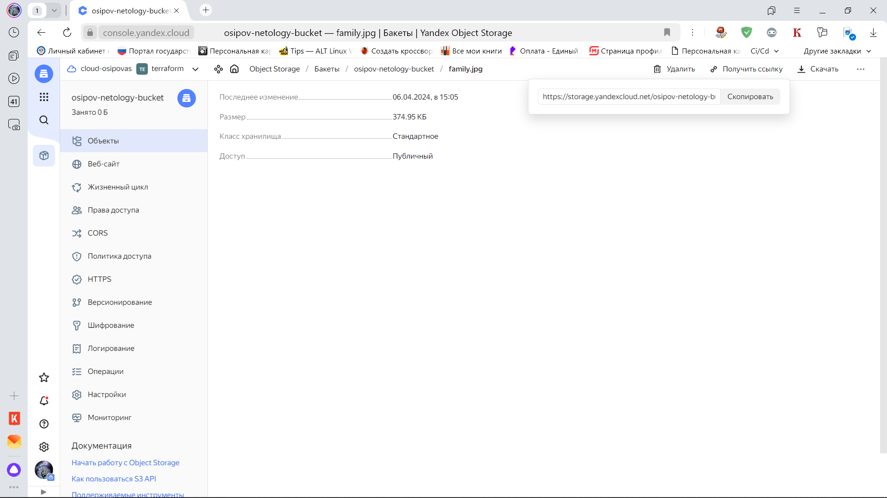
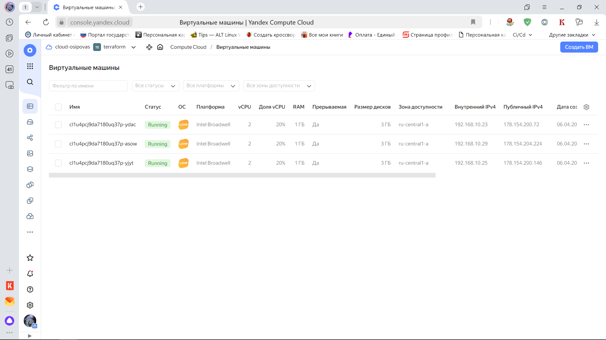
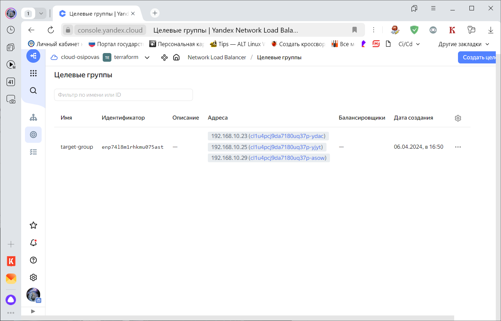
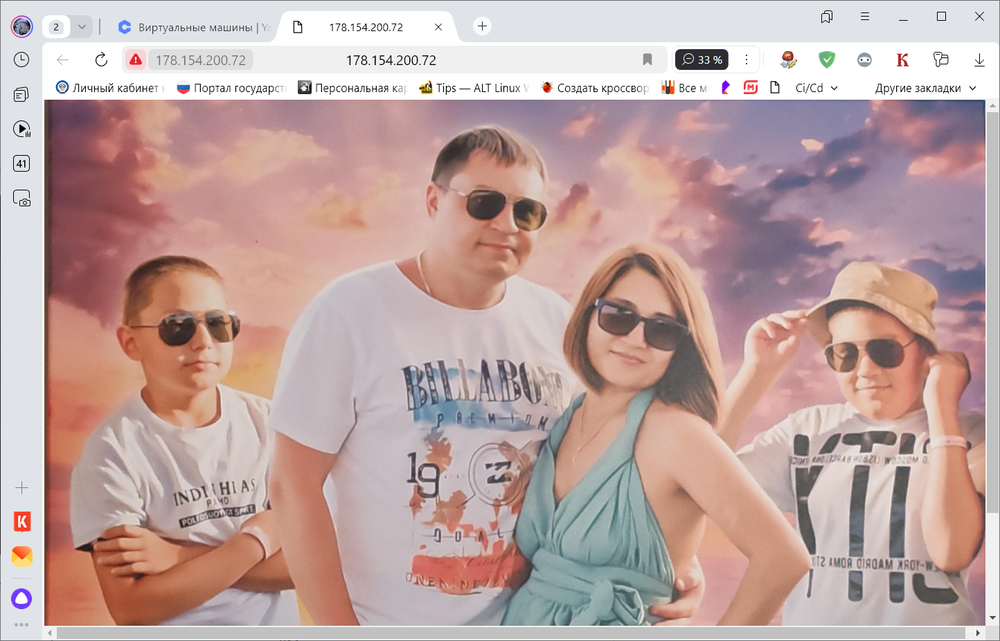
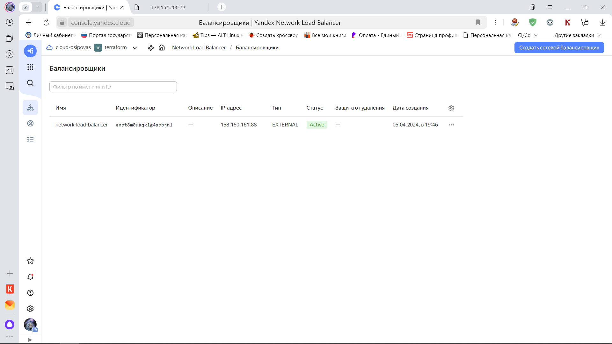
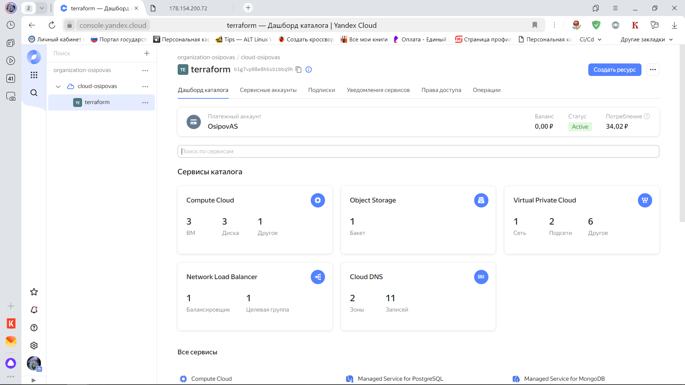
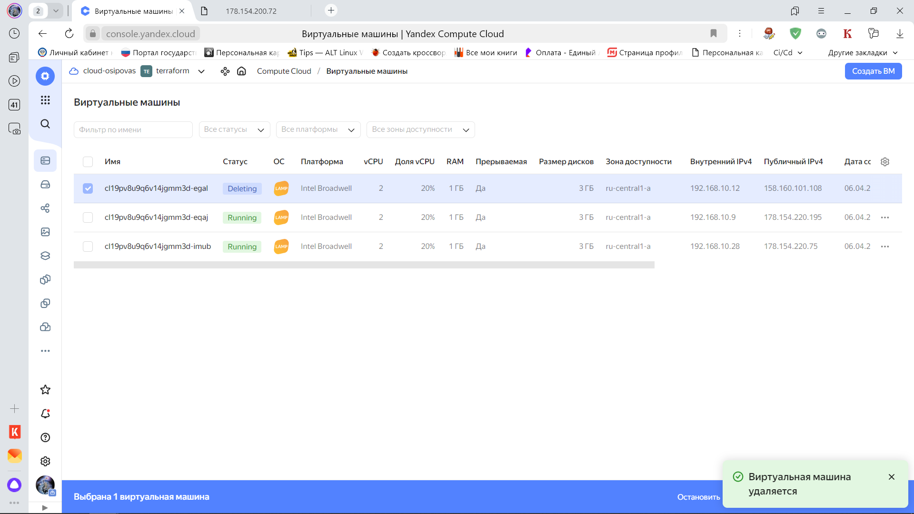
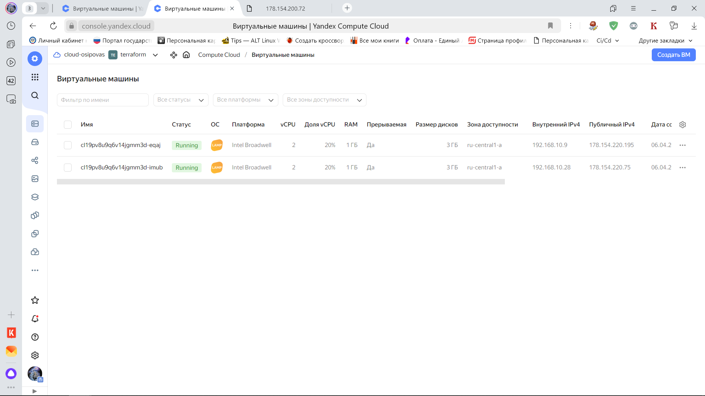
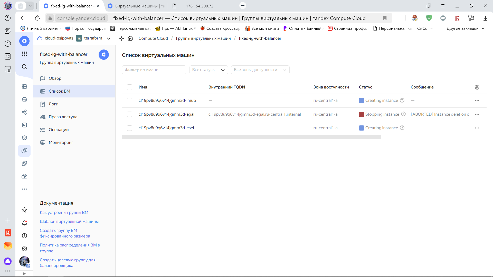
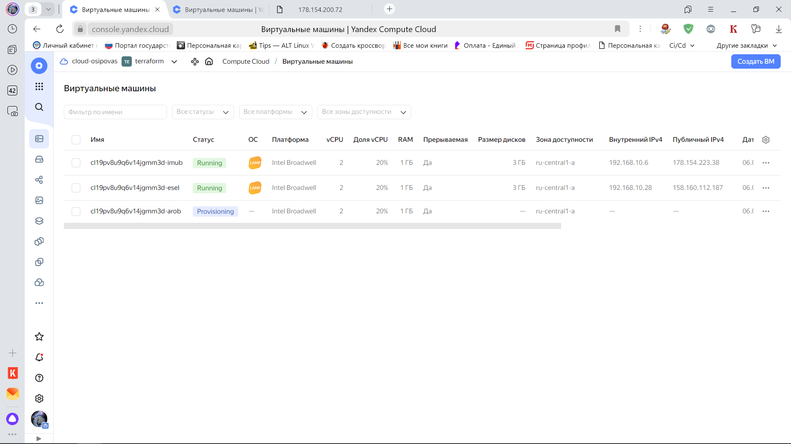

# Домашнее задание к занятию «Вычислительные мощности. Балансировщики нагрузки»  

### Подготовка к выполнению задания

1. Домашнее задание состоит из обязательной части, которую нужно выполнить на провайдере Yandex Cloud, и дополнительной части в AWS (выполняется по желанию). 
2. Все домашние задания в блоке 15 связаны друг с другом и в конце представляют пример законченной инфраструктуры.  
3. Все задания нужно выполнить с помощью Terraform. Результатом выполненного домашнего задания будет код в репозитории. 
4. Перед началом работы настройте доступ к облачным ресурсам из Terraform, используя материалы прошлых лекций и домашних заданий.

---
## Задание 1. Yandex Cloud 

**Что нужно сделать**

1. Создать бакет Object Storage и разместить в нём файл с картинкой:

 - Создать бакет в Object Storage с произвольным именем (например, _имя_студента_дата_).
 - Положить в бакет файл с картинкой.
 - Сделать файл доступным из интернета.
 
2. Создать группу ВМ в public подсети фиксированного размера с шаблоном LAMP и веб-страницей, содержащей ссылку на картинку из бакета:

 - Создать Instance Group с тремя ВМ и шаблоном LAMP. Для LAMP рекомендуется использовать `image_id = fd827b91d99psvq5fjit`.
 - Для создания стартовой веб-страницы рекомендуется использовать раздел `user_data` в [meta_data](https://cloud.yandex.ru/docs/compute/concepts/vm-metadata).
 - Разместить в стартовой веб-странице шаблонной ВМ ссылку на картинку из бакета.
 - Настроить проверку состояния ВМ.
 
3. Подключить группу к сетевому балансировщику:

 - Создать сетевой балансировщик.
 - Проверить работоспособность, удалив одну или несколько ВМ.
4. (дополнительно)* Создать Application Load Balancer с использованием Instance group и проверкой состояния.

Полезные документы:

- [Compute instance group](https://registry.terraform.io/providers/yandex-cloud/yandex/latest/docs/resources/compute_instance_group).
- [Network Load Balancer](https://registry.terraform.io/providers/yandex-cloud/yandex/latest/docs/resources/lb_network_load_balancer).
- [Группа ВМ с сетевым балансировщиком](https://cloud.yandex.ru/docs/compute/operations/instance-groups/create-with-balancer).
---

### Ответ

1) Корзина создана, при переходе по ссылке, скачивается рисунок

```commandline
alex@DESKTOP-SOTHBR6:~/terraform/yandex$ terraform apply -auto-approve

Terraform used the selected providers to generate the following execution plan. Resource actions
are indicated with the following symbols:
  + create

Terraform will perform the following actions:

  # yandex_iam_service_account.sa-bucket will be created
  + resource "yandex_iam_service_account" "sa-bucket" {
      + created_at = (known after apply)
      + folder_id  = (known after apply)
      + id         = (known after apply)
      + name       = "sa-for-bucket"
    }

  # yandex_iam_service_account_static_access_key.sa-static-key will be created
  + resource "yandex_iam_service_account_static_access_key" "sa-static-key" {
      + access_key           = (known after apply)
      + created_at           = (known after apply)
      + description          = "static access key for bucket"
      + encrypted_secret_key = (known after apply)
      + id                   = (known after apply)
      + key_fingerprint      = (known after apply)
      + secret_key           = (sensitive value)
      + service_account_id   = (known after apply)
    }

  # yandex_resourcemanager_folder_iam_member.bucket-editor will be created
  + resource "yandex_resourcemanager_folder_iam_member" "bucket-editor" {
      + folder_id = "b1g7vp08e8h6sbibbq9h"
      + id        = (known after apply)
      + member    = (known after apply)
      + role      = "storage.editor"
    }

  # yandex_storage_bucket.netology-bucket will be created
  + resource "yandex_storage_bucket" "netology-bucket" {
      + access_key            = (known after apply)
      + acl                   = "public-read"
      + bucket                = "osipov-netology-bucket"
      + bucket_domain_name    = (known after apply)
      + default_storage_class = (known after apply)
      + folder_id             = (known after apply)
      + force_destroy         = false
      + id                    = (known after apply)
      + secret_key            = (sensitive value)
      + website_domain        = (known after apply)
      + website_endpoint      = (known after apply)
    }

  # yandex_storage_object.object-1 will be created
  + resource "yandex_storage_object" "object-1" {
      + access_key   = (known after apply)
      + acl          = "public-read"
      + bucket       = "osipov-netology-bucket"
      + content_type = (known after apply)
      + id           = (known after apply)
      + key          = "family.jpg"
      + secret_key   = (sensitive value)
      + source       = "family.jpg"
    }

  # yandex_vpc_network.network-1 will be created
  + resource "yandex_vpc_network" "network-1" {
      + created_at                = (known after apply)
      + default_security_group_id = (known after apply)
      + folder_id                 = (known after apply)
      + id                        = (known after apply)
      + labels                    = (known after apply)
      + name                      = "network1"
      + subnet_ids                = (known after apply)
    }

  # yandex_vpc_route_table.nat-route-table will be created
  + resource "yandex_vpc_route_table" "nat-route-table" {
      + created_at = (known after apply)
      + folder_id  = (known after apply)
      + id         = (known after apply)
      + labels     = (known after apply)
      + network_id = (known after apply)

      + static_route {
          + destination_prefix = "0.0.0.0/0"
          + next_hop_address   = "192.168.10.254"
        }
    }

  # yandex_vpc_subnet.subnet-private will be created
  + resource "yandex_vpc_subnet" "subnet-private" {
      + created_at     = (known after apply)
      + folder_id      = (known after apply)
      + id             = (known after apply)
      + labels         = (known after apply)
      + name           = "private"
      + network_id     = (known after apply)
      + route_table_id = (known after apply)
      + v4_cidr_blocks = [
          + "192.168.20.0/24",
        ]
      + v6_cidr_blocks = (known after apply)
      + zone           = "ru-central1-a"
    }

  # yandex_vpc_subnet.subnet-public will be created
  + resource "yandex_vpc_subnet" "subnet-public" {
      + created_at     = (known after apply)
      + folder_id      = (known after apply)
      + id             = (known after apply)
      + labels         = (known after apply)
      + name           = "public"
      + network_id     = (known after apply)
      + v4_cidr_blocks = [
          + "192.168.10.0/24",
        ]
      + v6_cidr_blocks = (known after apply)
      + zone           = "ru-central1-a"
    }

Plan: 9 to add, 0 to change, 0 to destroy.
yandex_vpc_network.network-1: Creating...
yandex_iam_service_account.sa-bucket: Creating...
yandex_vpc_network.network-1: Creation complete after 3s [id=enpbeti9oen3u6nk4cu4]
yandex_vpc_route_table.nat-route-table: Creating...
yandex_vpc_subnet.subnet-public: Creating...
yandex_iam_service_account.sa-bucket: Creation complete after 3s [id=ajeroc79p6js1m3tgect]
yandex_resourcemanager_folder_iam_member.bucket-editor: Creating...
yandex_iam_service_account_static_access_key.sa-static-key: Creating...
yandex_vpc_subnet.subnet-public: Creation complete after 1s [id=e9b319lmvibtshfl3aej]
yandex_vpc_route_table.nat-route-table: Creation complete after 1s [id=enpeecekuhq501u7frkk]
yandex_vpc_subnet.subnet-private: Creating...
yandex_iam_service_account_static_access_key.sa-static-key: Creation complete after 1s [id=ajea5ncp7erspq03vt0q]
yandex_storage_bucket.netology-bucket: Creating...
yandex_vpc_subnet.subnet-private: Creation complete after 1s [id=e9bacbeoqmd1f6464118]
yandex_resourcemanager_folder_iam_member.bucket-editor: Creation complete after 3s [id=b1g7vp08e8h6sbibbq9h/storage.editor/serviceAccount:ajeroc79p6js1m3tgect]
yandex_storage_bucket.netology-bucket: Creation complete after 3s [id=osipov-netology-bucket]
yandex_storage_object.object-1: Creating...
yandex_storage_object.object-1: Creation complete after 0s [id=family.jpg]
```

Ссылка на рисунок https://storage.yandexcloud.net/osipov-netology-bucket/family.jpg



Так как манифесты будут обновляться в процессе выполнения ДЗ, манифесты приведу в виде текста:

Для выполнения 1 задачи использовались манифесты (так как за основу брались манифесты из 1 ДЗ, я только добавил новые конфигурации): 

##### bucket.tf

```commandline
// Create SA
resource "yandex_iam_service_account" "sa-bucket" {
    name      = "sa-for-bucket"
}

// Grant permissions
resource "yandex_resourcemanager_folder_iam_member" "bucket-editor" {
    folder_id = var.yandex_folder_id
    role      = "storage.editor"
    member    = "serviceAccount:${yandex_iam_service_account.sa-bucket.id}"
    depends_on = [yandex_iam_service_account.sa-bucket]
}

// Create Static Access Keys
resource "yandex_iam_service_account_static_access_key" "sa-static-key" {
    service_account_id = yandex_iam_service_account.sa-bucket.id
    description        = "static access key for bucket"
}

// Use keys to create bucket
resource "yandex_storage_bucket" "netology-bucket" {
    access_key = yandex_iam_service_account_static_access_key.sa-static-key.access_key
    secret_key = yandex_iam_service_account_static_access_key.sa-static-key.secret_key
    bucket = "osipov-netology-bucket"
    acl    = "public-read"
}

// Add picture to bucket
resource "yandex_storage_object" "object-1" {
    access_key = yandex_iam_service_account_static_access_key.sa-static-key.access_key
    secret_key = yandex_iam_service_account_static_access_key.sa-static-key.secret_key
    bucket = yandex_storage_bucket.netology-bucket.bucket
    key = "family.jpg"
    source = "family.jpg"
    acl    = "public-read"
    depends_on = [yandex_storage_bucket.netology-bucket]
}
```

##### provider.tf

```commandline
terraform {
  required_version = ">= 0.13"

  required_providers {
    yandex = {
      source  = "yandex-cloud/yandex"
    }

 }
}

provider "yandex" {
  service_account_key_file = "key.json"
  cloud_id  = "${var.yandex_cloud_id}"
  folder_id = "${var.yandex_folder_id}"
  zone      = var.a-zone
}
```

##### variables.tf

```commandline
variable "yandex_cloud_id" {
  default = "b1g9ad2qr4nsh3ege1ml"
}

variable "yandex_folder_id" {
  default = "b1g7vp08e8h6sbibbq9h"
}

variable "a-zone" {
  default = "ru-central1-a"
}

variable "nat-instance-image-id" {
  default = "fd819fea762c283b5a4v"
}

variable "nat-instance-ip" {
  default = "192.168.10.254"
}

variable "ubuntu" {
  default = "fd8dmsb2cgoabg4qelih"
}

variable "domain" {
  default = "netology.cloud"
}

variable "nat-instance-name" {
  default = "nat-instance-vm1"
}

variable "public-vm-name" {
  default = "public-vm1"
}

variable "private-vm-name" {
  default = "private-vm1"
}
```

2) Создание группы ВМ. Содержание манифеста

##### instance-group.tf

```commandline
// Create SA
resource "yandex_iam_service_account" "sa-ig" {
    name      = "sa-for-ig"
}

// Grant permissions
resource "yandex_resourcemanager_folder_iam_member" "ig-editor" {
    folder_id = var.yandex_folder_id
    role      = "editor"
    member    = "serviceAccount:${yandex_iam_service_account.sa-ig.id}"
}

// Create instance group
resource "yandex_compute_instance_group" "ig-1" {
    name               = "fixed-ig-with-balancer"
    folder_id          = var.yandex_folder_id
    service_account_id = yandex_iam_service_account.sa-ig.id

    instance_template {
        resources {
            cores  = 2
            memory = 1
            core_fraction = 20
        }
        boot_disk {
            initialize_params {
                image_id = var.lamp-instance-image-id
            }
        }
        network_interface {
            network_id  = yandex_vpc_network.network-1.id
            subnet_ids  = [yandex_vpc_subnet.subnet-public.id]
            nat         = true
        }
        scheduling_policy {
            preemptible = true  // Прерываемая
        }
        metadata = {
            ssh-keys   = "ubuntu:${file("~/.ssh/id_rsa.pub")}"
            user-data  = <<EOF
#!/bin/bash
apt install httpd -y
cd /var/www/html
echo '<html></html>' > index.html
service httpd start
EOF
      }
   }

    scale_policy {
        fixed_scale {
            size = 3
        }
    }

    allocation_policy {
        zones = [var.a-zone]
    }

    deploy_policy {
        max_unavailable  = 1
        max_creating     = 3
        max_expansion    = 1
        max_deleting     = 1
        startup_duration = 3
    }

     health_check {
        http_options {
            port    = 80
            path    = "/"
        }
    }

    depends_on = [
        yandex_storage_bucket.netology-bucket
    ]

    load_balancer {
        target_group_name = "target-group"
    }
}
```



Целевые группы



Переходим по внешнему адресу любой из ВМ, чтобы проверить что веб-сервер отображает прикрепленную картинку (использовал свою картинку из п.1)

`http://178.154.200.72/` картинка получилась большая, поэтому массштаб в браузере уменьшил)



Сворачиваем инфраструктуру

``

3) Добавляем loadbalancer

Создаем манифест

##### loadbalancer.tf

```commandline
//Create balancer
resource "yandex_lb_network_load_balancer" "load-balancer-1" {
  name = "network-load-balancer"

  listener {
    name = "lb-listener"
    port = 80
    external_address_spec {
      ip_version = "ipv4"
    }
  }

  attached_target_group {
    target_group_id = yandex_compute_instance_group.ig-1.load_balancer[0].target_group_id

    healthcheck {
      name = "http"
      http_options {
        port = 80
        path = "/"
      }
    }
  }
  depends_on = [
    yandex_compute_instance_group.ig-1
]
}
```

Проверяем что балансировщик создан



Общая инфраструктура



Пробуем удалить и проверяем, что ВМ восстановиться



ВМ удалена



Удалил и остальные, чтобы проверить как поведет себя группа инстансов




Все 3 машины восстановились. Удалил которая была с ошибкой abort и она восстановилась.



---
## Задание 2*. AWS (задание со звёздочкой)

Это необязательное задание. Его выполнение не влияет на получение зачёта по домашней работе.

**Что нужно сделать**

Используя конфигурации, выполненные в домашнем задании из предыдущего занятия, добавить к Production like сети Autoscaling group из трёх EC2-инстансов с  автоматической установкой веб-сервера в private домен.

1. Создать бакет S3 и разместить в нём файл с картинкой:

 - Создать бакет в S3 с произвольным именем (например, _имя_студента_дата_).
 - Положить в бакет файл с картинкой.
 - Сделать доступным из интернета.
2. Сделать Launch configurations с использованием bootstrap-скрипта с созданием веб-страницы, на которой будет ссылка на картинку в S3. 
3. Загрузить три ЕС2-инстанса и настроить LB с помощью Autoscaling Group.

Resource Terraform:

- [S3 bucket](https://registry.terraform.io/providers/hashicorp/aws/latest/docs/resources/s3_bucket)
- [Launch Template](https://registry.terraform.io/providers/hashicorp/aws/latest/docs/resources/launch_template).
- [Autoscaling group](https://registry.terraform.io/providers/hashicorp/aws/latest/docs/resources/autoscaling_group).
- [Launch configuration](https://registry.terraform.io/providers/hashicorp/aws/latest/docs/resources/launch_configuration).

Пример bootstrap-скрипта:

```
#!/bin/bash
yum install httpd -y
service httpd start
chkconfig httpd on
cd /var/www/html
echo "<html><h1>My cool web-server</h1></html>" > index.html
```
### Правила приёма работы

Домашняя работа оформляется в своём Git репозитории в файле README.md. Выполненное домашнее задание пришлите ссылкой на .md-файл в вашем репозитории.
Файл README.md должен содержать скриншоты вывода необходимых команд, а также скриншоты результатов.
Репозиторий должен содержать тексты манифестов или ссылки на них в файле README.md.