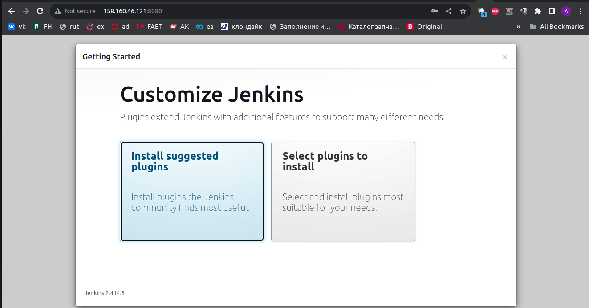
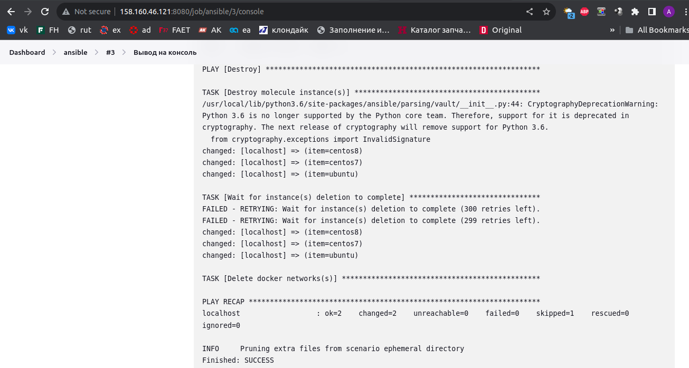
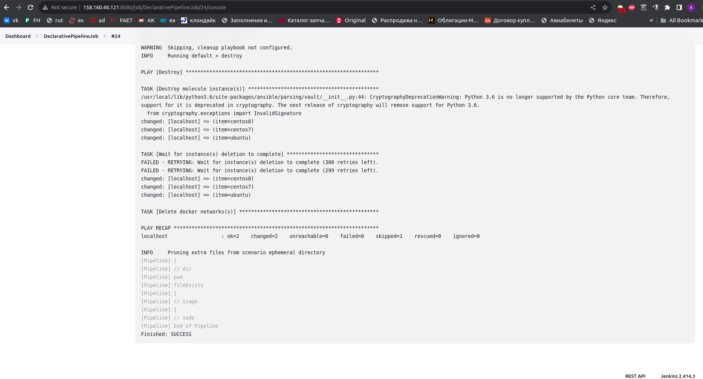
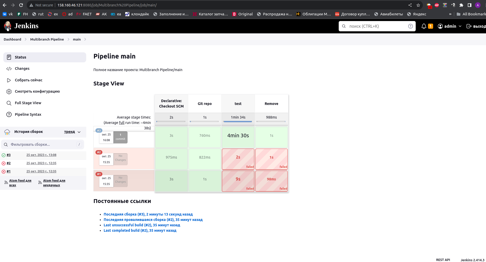
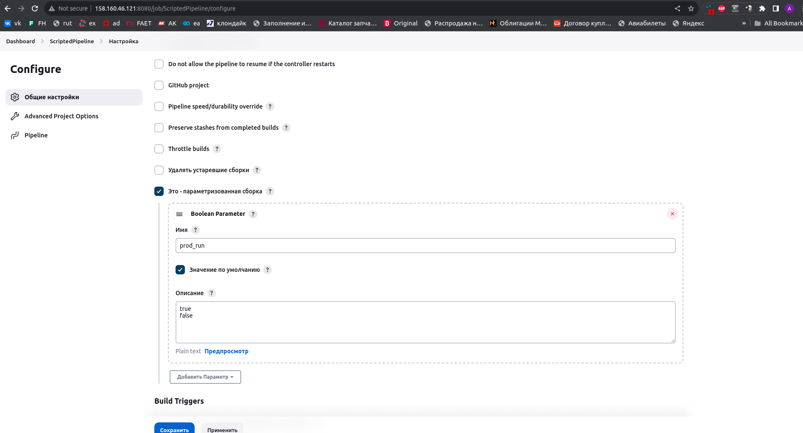

# Домашнее задание к занятию 10 «Jenkins»

## Подготовка к выполнению

1. Создать два VM: для jenkins-master и jenkins-agent.
2. Установить Jenkins при помощи playbook.
3. Запустить и проверить работоспособность.
4. Сделать первоначальную настройку.

 

## Основная часть

1. Сделать Freestyle Job, который будет запускать `molecule test` из любого вашего репозитория с ролью.

 

2. Сделать Declarative Pipeline Job, который будет запускать `molecule test` из любого вашего репозитория с ролью.



3. Перенести Declarative Pipeline в репозиторий в файл `Jenkinsfile`.

[Jenkinsfile](Jenkinsfile)

4. Создать Multibranch Pipeline на запуск `Jenkinsfile` из репозитория.



5. Создать Scripted Pipeline, наполнить его скриптом из [pipeline](./pipeline).

```bash
Started by user admin
Replayed #11
[Pipeline] Start of Pipeline
[Pipeline] node
Running on agent in /opt/jenkins_agent/workspace/ScriptedPipeline
[Pipeline] {
[Pipeline] stage
[Pipeline] { (Git checkout)
[Pipeline] git
The recommended git tool is: NONE
using credential 0db9b755-ae0c-4daf-8439-d2fbfc1609f1
Fetching changes from the remote Git repository
Checking out Revision 20bd8d945340bb742acdd9e8c1a8fb5b73cc1700 (refs/remotes/origin/master)
Commit message: "Merge branch 'master' of https://github.com/aragastmatb/example-playbook"
 > git rev-parse --resolve-git-dir /opt/jenkins_agent/workspace/ScriptedPipeline/.git # timeout=10
 > git config remote.origin.url https://github.com/aragastmatb/example-playbook.git # timeout=10
Fetching upstream changes from https://github.com/aragastmatb/example-playbook.git
 > git --version # timeout=10
 > git --version # 'git version 1.8.3.1'
using GIT_ASKPASS to set credentials 
 > git fetch --tags --progress https://github.com/aragastmatb/example-playbook.git +refs/heads/*:refs/remotes/origin/* # timeout=10
 > git rev-parse refs/remotes/origin/master^{commit} # timeout=10
 > git config core.sparsecheckout # timeout=10
 > git checkout -f 20bd8d945340bb742acdd9e8c1a8fb5b73cc1700 # timeout=10
 > git branch -a -v --no-abbrev # timeout=10
 > git branch -D master # timeout=10
 > git checkout -b master 20bd8d945340bb742acdd9e8c1a8fb5b73cc1700 # timeout=10
 > git rev-list --no-walk 20bd8d945340bb742acdd9e8c1a8fb5b73cc1700 # timeout=10
[Pipeline] }
[Pipeline] // stage
[Pipeline] stage
[Pipeline] { (Sample define secret_check)
[Pipeline] }
[Pipeline] // stage
[Pipeline] stage
[Pipeline] { (Run playbook)
[Pipeline] sh
+ ansible-playbook site.yml -i inventory/prod.yml

PLAY [Install Java] ************************************************************

TASK [Gathering Facts] *********************************************************
/usr/local/lib/python3.6/site-packages/ansible/parsing/vault/__init__.py:44: CryptographyDeprecationWarning: Python 3.6 is no longer supported by the Python core team. Therefore, support for it is deprecated in cryptography. The next release of cryptography will remove support for Python 3.6.
  from cryptography.exceptions import InvalidSignature
ok: [localhost]

TASK [java : Upload .tar.gz file containing binaries from local storage] *******
skipping: [localhost]

TASK [java : Upload .tar.gz file conaining binaries from remote storage] *******
changed: [localhost]

TASK [java : Ensure installation dir exists] ***********************************
changed: [localhost]

TASK [java : Extract java in the installation directory] ***********************
changed: [localhost]

TASK [java : Export environment variables] *************************************
changed: [localhost]

PLAY RECAP *********************************************************************
localhost                  : ok=5    changed=4    unreachable=0    failed=0    skipped=1    rescued=0    ignored=0   

[Pipeline] }
[Pipeline] // stage
[Pipeline] }
[Pipeline] // node
[Pipeline] End of Pipeline
Finished: SUCCESS
```

6. Внести необходимые изменения, чтобы Pipeline запускал `ansible-playbook` без флагов `--check --diff`, если не установлен параметр при запуске джобы (prod_run = True). По умолчанию параметр имеет значение False и запускает прогон с флагами `--check --diff`.



7. Проверить работоспособность, исправить ошибки, исправленный Pipeline вложить в репозиторий в файл `ScriptedJenkinsfile`.
8. Отправить ссылку на репозиторий с ролью и Declarative Pipeline и Scripted Pipeline.

 [Vector-role](https://github.com/Alex-Elfman/devops-netology/tree/main/8/HW8_5/playbook/roles/vector-role)  
 [Declarative pipeline](https://github.com/Alex-Elfman/devops-netology/blob/main/9/HW9_4/Jenkinsfile)  
 [Scripted Pipeline](https://github.com/Alex-Elfman/devops-netology/blob/main/9/HW9_4/ScriptedJenkinsfile)  

9. Сопроводите процесс настройки скриншотами для каждого пункта задания!!

## Необязательная часть

1. Создать скрипт на groovy, который будет собирать все Job, завершившиеся хотя бы раз неуспешно. Добавить скрипт в репозиторий с решением и названием `AllJobFailure.groovy`.
2. Создать Scripted Pipeline так, чтобы он мог сначала запустить через Yandex Cloud CLI необходимое количество инстансов, прописать их в инвентори плейбука и после этого запускать плейбук. Мы должны при нажатии кнопки получить готовую к использованию систему.

---

### Как оформить решение задания

Выполненное домашнее задание пришлите в виде ссылки на .md-файл в вашем репозитории.

---
