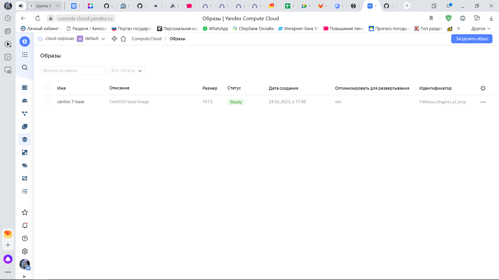
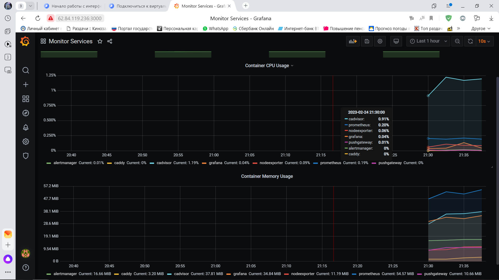

# Домашнее задание к занятию "4. Оркестрация группой Docker контейнеров на примере Docker Compose"


## Задача 1

Создать собственный образ  любой операционной системы (например, ubuntu-20.04) с помощью Packer ([инструкция](https://cloud.yandex.ru/docs/tutorials/infrastructure-management/packer-quickstart))

Для получения зачета вам необходимо предоставить скриншот страницы с созданным образом из личного кабинета YandexCloud.

## Ответ
Так как в примере CentOS 7, и использую сам везде CentOS 7, использовал CentOS 7.

> [centos@localhost devops-netology]$ vi centos7.json

> [centos@localhost devops-netology]$ [centos@localhost devops-netology]$ packer validate centos7.json

``` The configuration is valid.```

> [centos@localhost devops-netology]$ packer build centos7.json

``` 
yandex: output will be in this color.

==> yandex: Creating temporary RSA SSH key for instance...
==> yandex: Using as source image: fd8jvcoeij6u9se84dt5 (name: "centos-7-v20221121", family: "centos-7")
==> yandex: Use provided subnet id e9b7be3t9qj8qcbsmtit
==> yandex: Creating disk...
==> yandex: Creating instance...
==> yandex: Waiting for instance with id fhm8spjqf8dp76m3669n to become active...
    yandex: Detected instance IP: 158.160.44.195
==> yandex: Using SSH communicator to connect: 158.160.44.195
==> yandex: Waiting for SSH to become available...
==> yandex: Connected to SSH!
==> yandex: Stopping instance...
==> yandex: Deleting instance...
    yandex: Instance has been deleted!
==> yandex: Creating image: centos-7-base
==> yandex: Waiting for image to complete...
==> yandex: Success image create...
==> yandex: Destroying boot disk...
    yandex: Disk has been deleted!
Build 'yandex' finished after 1 minute 37 seconds.

==> Wait completed after 1 minute 37 seconds

==> Builds finished. The artifacts of successful builds are:
--> yandex: A disk image was created: centos-7-base (id: fd84das29eg56cqljetp) with family name centos 
```
> [centos@localhost devops-netology]$ yc compute image list
> 
```
+----------------------+---------------+--------+----------------------+--------+
|          ID          |     NAME      | FAMILY |     PRODUCT IDS      | STATUS |
+----------------------+---------------+--------+----------------------+--------+
| fd84das29eg56cqljetp | centos-7-base | centos | f2ei2tsbd97v7jap5rhc | READY  |
+----------------------+---------------+--------+----------------------+--------+
```


## Задача 2

**2.1** Создать вашу первую виртуальную машину в YandexCloud с помощью web-интерфейса YandexCloud. 

## Ответ
Виртуальная машина создана


**2.2*** **(Необязательное задание)**      
Создать вашу первую виртуальную машину в YandexCloud с помощью terraform (вместо использования веб-интерфейса YandexCloud).
Используйте terraform код в директории ([src/terraform](https://github.com/netology-group/virt-homeworks/tree/virt-11/05-virt-04-docker-compose/src/terraform))

Для получения зачета, вам необходимо предоставить вывод команды terraform apply и страницы свойств созданной ВМ из личного кабинета YandexCloud.

## Ответ
> [centos@localhost terraform]$ [centos@localhost terraform]$ terraform init

``` 
Initializing the backend...

Initializing provider plugins...
- Finding latest version of yandex-cloud/yandex...
- Installing yandex-cloud/yandex v0.85.0...
- Installed yandex-cloud/yandex v0.85.0 (self-signed, key ID E40F590B50BB8E40)

Partner and community providers are signed by their developers.
If you'd like to know more about provider signing, you can read about it here:
https://www.terraform.io/docs/cli/plugins/signing.html

Terraform has created a lock file .terraform.lock.hcl to record the provider
selections it made above. Include this file in your version control repository
so that Terraform can guarantee to make the same selections by default when
you run "terraform init" in the future.

Terraform has been successfully initialized!

You may now begin working with Terraform. Try running "terraform plan" to see
any changes that are required for your infrastructure. All Terraform commands
should now work.

If you ever set or change modules or backend configuration for Terraform,
rerun this command to reinitialize your working directory. If you forget, other
commands will detect it and remind you to do so if necessary.
```

Все с 0 сделал с новым каталогом, все равно такая же ошибка:

> [centos@localhost terraform]$ terraform plan

```` 
│ Error: Conflicting configuration arguments
│
│   with provider["registry.terraform.io/yandex-cloud/yandex"],
│   on provider.tf line 13, in provider "yandex":
│   13:   service_account_key_file = file ("key.json")
│
│ "service_account_key_file": conflicts with token
````
Несколько часов мучился. Решил через веб виртуалку создать. 
### Прошу помощи на будущее

## Задача 3

С помощью ansible и docker-compose разверните на виртуальной машине из предыдущего задания систему мониторинга на основе Prometheus/Grafana .
Используйте ansible код в директории ([src/ansible](https://github.com/netology-group/virt-homeworks/tree/virt-11/05-virt-04-docker-compose/src/ansible))

Для получения зачета вам необходимо предоставить вывод команды "docker ps" , все контейнеры, описанные в ([docker-compose](https://github.com/netology-group/virt-homeworks/blob/virt-11/05-virt-04-docker-compose/src/ansible/stack/docker-compose.yaml)),  должны быть в статусе "Up".

## Ответ

Т.к. через терраформ создать не получилось, использовал созданную через веб интерфейс. Поменял конфиги

> ansible-playbook provision.yml -i inventory

```
PLAY [nodes] ********************************************************************************************

TASK [Gathering Facts] **********************************************************************************
ok: [centos7.ru-central1.internal]

TASK [Create directory for ssh-keys] ********************************************************************
ok: [centos7.ru-central1.internal]

TASK [Adding rsa-key in /root/.ssh/authorized_keys] *****************************************************
ok: [centos7.ru-central1.internal]

TASK [Installing tools] *********************************************************************************
changed: [centos7.ru-central1.internal] => (item=[u'git', u'curl'])

TASK [Add docker repository] ****************************************************************************
changed: [centos7.ru-central1.internal]

TASK [Installing docker package] ************************************************************************
changed: [centos7.ru-central1.internal] => (item=[u'docker-ce', u'docker-ce-cli', u'containerd.io'])

TASK [Enable docker daemon] *****************************************************************************
changed: [centos7.ru-central1.internal]

TASK [Install docker-compose] ***************************************************************************
changed: [centos7.ru-central1.internal]

TASK [Synchronization] **********************************************************************************
changed: [centos7.ru-central1.internal]

TASK [Pull all images in compose] ***********************************************************************
changed: [centos7.ru-central1.internal]

TASK [Up all services in compose] ***********************************************************************
changed: [centos7.ru-central1.internal]

PLAY RECAP **********************************************************************************************
centos7.ru-central1.internal : ok=11   changed=8    unreachable=0    failed=0    skipped=0    rescued=0    ignored=0
```
Подключился на машину чтобы проверить:
> ssh 62.84.119.236 -p 22
 
> [centos@centos7 ~]$ sudo docker ps

Все сервисы запущены:
```
CONTAINER ID   IMAGE                              COMMAND                  CREATED         STATUS                        PORTS                                                                              NAMES
4c1ff012fd3e   grafana/grafana:7.4.2              "/run.sh"                2 minutes ago   Up About a minute             3000/tcp                                                                           grafana
5c2b7dc84207   prom/prometheus:v2.17.1            "/bin/prometheus --c…"   2 minutes ago   Up About a minute             9090/tcp                                                                           prometheus
2840cedd13a8   prom/pushgateway:v1.2.0            "/bin/pushgateway"       2 minutes ago   Up About a minute             9091/tcp                                                                           pushgateway
01f99971ce70   prom/node-exporter:v0.18.1         "/bin/node_exporter …"   2 minutes ago   Up About a minute             9100/tcp                                                                           nodeexporter
242324fbb192   prom/alertmanager:v0.20.0          "/bin/alertmanager -…"   2 minutes ago   Up About a minute             9093/tcp                                                                           alertmanager
b80dc6bcf74e   gcr.io/cadvisor/cadvisor:v0.47.0   "/usr/bin/cadvisor -…"   2 minutes ago   Up About a minute (healthy)   8080/tcp                                                                           cadvisor
6f59c4c0ff1d   stefanprodan/caddy                 "/sbin/tini -- caddy…"   2 minutes ago   Up About a minute             0.0.0.0:3000->3000/tcp, 0.0.0.0:9090-9091->9090-9091/tcp, 0.0.0.0:9093->9093/tcp   caddy
[centos@centos7 ~]$
```

## Задача 4

1. Откройте веб-браузер, зайдите на страницу http://<внешний_ip_адрес_вашей_ВМ>:3000.
2. Используйте для авторизации логин и пароль из ([.env-file](https://github.com/netology-group/virt-homeworks/blob/virt-11/05-virt-04-docker-compose/src/ansible/stack/.env)).
3. Изучите доступный интерфейс, найдите в интерфейсе автоматически созданные docker-compose панели с графиками([dashboards](https://grafana.com/docs/grafana/latest/dashboards/use-dashboards/)).
4. Подождите 5-10 минут, чтобы система мониторинга успела накопить данные.

Для получения зачета, вам необходимо предоставить: 
- Скриншот работающего веб-интерфейса Grafana с текущими метриками, как на примере ниже
<p align="center">
  
</p>

## Ответ
Подключился через веб интерфейс:


Скрин из яндекс.клауда


## Задача 5 (*)

Создать вторую ВМ и подключить её к мониторингу развёрнутому на первом сервере.

Для получения зачета, вам необходимо предоставить:
- Скриншот из Grafana, на котором будут отображаться метрики добавленного вами сервера.

Хотелось бы получить ответы по поводу 2.2. После этого бы сразу ч-з тераформ поднял 2 виртуалки и настроил мониторинг