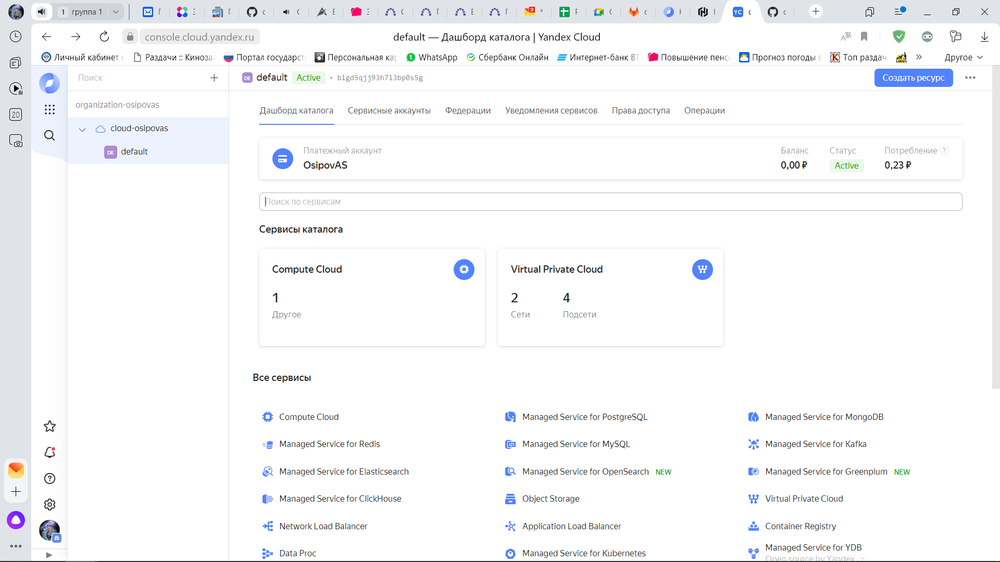

Задание
1) Установите Bitwarden плагин для браузера. Зарегестрируйтесь и сохраните несколько паролей.
Ответ:
Выполнено

2) Установите Google authenticator на мобильный телефон. Настройте вход в Bitwarden акаунт через Google authenticator OTP.
Ответ:
Выполнено

3) Установите apache2, сгенерируйте самоподписанный сертификат, настройте тестовый сайт для работы по HTTPS.
Ответ:
Устанавливаем Apache
root@vagrant:~# apt install apache2
Генерируем закрытый ключ и сертификат:
root@vagrant:~# openssl req -x509 -nodes -days 365 -newkey rsa:2048 -keyout /etc/ssl/private/ssl-cert-snakeoil.key -out /etc/ssl/certs/ssl-cert-snakeoil.pem -subj "/C=RU/ST=Tyumen/L=NV/O=Netolgy/OU=devops/CN=localhost"
Включаем mod_ssl:
root@vagrant:~# a2enmod ssl
Активируем HTTPS сайт по умолчанию:
root@vagrant:~# a2ensite default-ssl

4) Проверьте на TLS уязвимости произвольный сайт в интернете (кроме сайтов МВД, ФСБ, МинОбр, НацБанк, РосКосмос, РосАтом, РосНАНО и любых госкомпаний, объектов КИИ, ВПК ... и тому подобное).
Ответ: 
docker run --rm -ti  drwetter/testssl.sh -U --sneaky https://ya.ru
...
 Further IP addresses:   2a02:6b8::2:242
 rDNS (87.250.250.242):  ya.ru.
 Service detected:       HTTP

 Testing vulnerabilities

 Heartbleed (CVE-2014-0160)                not vulnerable (OK), no heartbeat extension
 CCS (CVE-2014-0224)                       not vulnerable (OK)
 Ticketbleed (CVE-2016-9244), experiment.  not vulnerable (OK)
 ROBOT                                     not vulnerable (OK)
 Secure Renegotiation (RFC 5746)           supported (OK)
 Secure Client-Initiated Renegotiation     not vulnerable (OK)
 CRIME, TLS (CVE-2012-4929)                not vulnerable (OK)
 BREACH (CVE-2013-3587)                    no gzip/deflate/compress/br HTTP compression (OK)  - only supplied "/" tested
 POODLE, SSL (CVE-2014-3566)               not vulnerable (OK)
 TLS_FALLBACK_SCSV (RFC 7507)              Downgrade attack prevention supported (OK)
 SWEET32 (CVE-2016-2183, CVE-2016-6329)    VULNERABLE, uses 64 bit block ciphers
 FREAK (CVE-2015-0204)                     not vulnerable (OK)
 DROWN (CVE-2016-0800, CVE-2016-0703)      not vulnerable on this host and port (OK)
                                           make sure you don't use this certificate elsewhere with SSLv2 enabled services
                                           https://censys.io/ipv4?q=26EB381642B07A05F7CA935101FC6492F91F7F0721995A8E577EDFB6723EBD1F could help you to find out
 LOGJAM (CVE-2015-4000), experimental      not vulnerable (OK): no DH EXPORT ciphers, no DH key detected with <= TLS 1.2
 BEAST (CVE-2011-3389)                     TLS1: ECDHE-RSA-AES128-SHA AES128-SHA
                                                 DES-CBC3-SHA
                                           VULNERABLE -- but also supports higher protocols  TLSv1.1 TLSv1.2 (likely mitigated)
 LUCKY13 (CVE-2013-0169), experimental     potentially VULNERABLE, uses cipher block chaining (CBC) ciphers with TLS. Check patches
 Winshock (CVE-2014-6321), experimental    not vulnerable (OK)
 RC4 (CVE-2013-2566, CVE-2015-2808)        no RC4 ciphers detected (OK)

5) Установите на Ubuntu ssh сервер, сгенерируйте новый приватный ключ. Скопируйте свой публичный ключ на другой сервер. Подключитесь к серверу по SSH-ключу.
Ответ:
vagrant@netologyVM1:~$ ssh-keygen
Generating public/private rsa key pair.
Enter file in which to save the key (/home/vagrant/.ssh/id_rsa):
....
vagrant@netologyVM1:~$ ssh-copy-id -i .ssh/id_rsa vagrant@172.28.128.60
....
vagrant@netologyVM1:~$ ssh vagrant@172.28.128.60
Welcome to Ubuntu 20.04.2 LTS (GNU/Linux 5.4.0-80-generic x86_64)
....
vagrant@netologyVM2:~$

6) Переименуйте файлы ключей из задания 5. Настройте файл конфигурации SSH клиента, так чтобы вход на удаленный сервер осуществлялся по имени сервера.
Ответ:
vagrant@netologyVM1:~$ sudo mv ~/.ssh/id_rsa ~/.ssh/id_rsa_netology
vagrant@netologyVM1:~$ sudo nano ~/.ssh/config
Host netologyVM2
        HostName 172.28.128.60
        User vagrant
        Port 22
        IdentityFile ~/.ssh/id_rsa_netology
vagrant@netologyVM1:~$ ssh netologyVM2
Welcome to Ubuntu 20.04.2 LTS (GNU/Linux 5.4.0-80-generic x86_64)
....
vagrant@netologyVM2:~$

7) Соберите дамп трафика утилитой tcpdump в формате pcap, 100 пакетов. Откройте файл pcap в Wireshark.
Ответ:
# tcpdump -nnei any -c 100 -w 100packets.pcap
tcpdump: listening on any, link-type LINUX_SLL (Linux cooked v1), capture size 262144 bytes
100 packets captured
178 packets received by filter
0 packets dropped by kernel
Скриншот приложен в файле Wireshark.png

#После возвращения на доработку добавил скриншот в файл с помощью PyCharm, разметку markdown применил 
