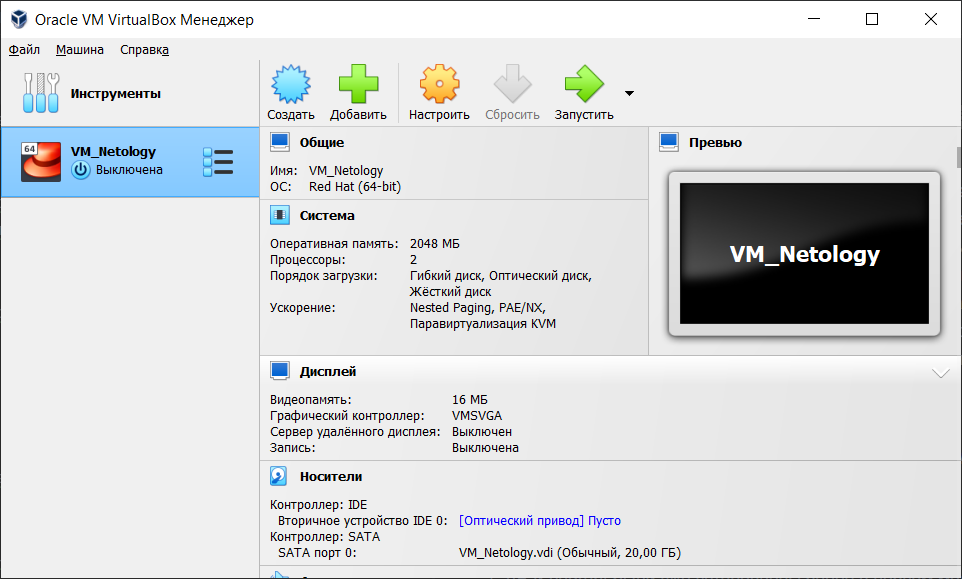

Домашнее задание к занятию "2. Применение принципов IaaC в работе с виртуальными машинами"

Задача 1
Опишите своими словами основные преимущества применения на практике IaaC паттернов.
Какой из принципов IaaC является основополагающим?

Ответ:
1) Скорость развертывания;
2) Идентичность готовых ВМ;
3) Простота подготовки окружения для разработки.
Основополагающий принцип IaaC - декларативный, хотя судя по презентации - интеллектуальный. Но я предполагаю использовать Ansible в своей работе в дальнейшем и для нее принципы - декларативный и императивный (указано в презентации). Почему декларативный, потому что мы задаем все необходимые нам действия в конфигурации, а результат достигается путем выполнения 1 команды. 

Задача 2
Чем Ansible выгодно отличается от других систем управление конфигурациями?
Какой, на ваш взгляд, метод работы систем конфигурации более надёжный push или pull?

Ответ:
В первую очередь Ansible выгодно отличается от остальных систем управления конфигурациями низким порогом входа специалиста, т.е. требования к квалификации инженера достаточно комфортны и не требуют особых навыков разработи. Также немаловажно, что применение Ansible не требует установки агентов на управляемых ВМ.
Надежность методов работы систем конфигурации в различных условиях отличается. Думаю если команда разработчиков более одного человека, то более надежным методом является push, когда для разработки используются свои ветки.

Задача 3
Установить на личный компьютер:

VirtualBox
Vagrant
Terraform
Ansible
Приложить вывод команд установленных версий каждой из программ, оформленный в markdown.

Ответ:
1) VB и Vagrant были уже установлены ранее в первом модуле (для скачивания дистрибутива Vagrant использовал VPN)

C:\Users\Александр>vagrant -v
Vagrant 2.3.4
2) PS C:\WINDOWS\system32> terraform -v
Terraform v1.3.7
on windows_amd64
3) В описании задачи не указано на какую ОС ставить Ansible. С помощью интернета нашел статью http://onreader.mdl.ru/MasteringAnsible.3ed/content/Ch03.html где в магазине Windows нашел Ubuntu и поставил на виндовс. Повторю все действия выше там.
Результаты вывода команд в установленной в Windows Ubuntu
netology@DESKTOP-SOTHBR6:~$ vagrant -v
Vagrant 2.2.19

netology@DESKTOP-SOTHBR6:~$ ansible --version
ansible 2.10.8
  config file = None
  configured module search path = ['/home/netology/.ansible/plugins/modules', '/usr/share/ansible/plugins/modules']
  ansible python module location = /usr/lib/python3/dist-packages/ansible
  executable location = /usr/bin/ansible
  python version = 3.10.6 (main, Nov 14 2022, 16:10:14) [GCC 11.3.0]

VirtualBox выводит следующее:
netology@DESKTOP-SOTHBR6:~$ virtualbox
WARNING: The character device /dev/vboxdrv does not exist.
         Please install the virtualbox-dkms package and the appropriate
         headers, most likely linux-headers-Microsoft.

         You will not be able to start VMs until this problem is fixed.
/usr/lib/virtualbox/VirtualBox: error while loading shared libraries: libQt5Core.so.5: cannot open shared object file: No such file or directory
netology@DESKTOP-SOTHBR6:~$ virtualboxvm
VirtualBoxVM: supR3HardenedMainGetTrustedMain: dlopen("/usr/lib/virtualbox/VirtualBoxVM.so",) failed: libQt5Core.so.5: cannot open shared object file: No such file or directory

Terraform не ставится, выходит ошибка 404
Часа 2 искал в просторах интернета с чем связано, не нашел. Прошу помощи.
Чтобы выполнить 4 задачу, выполнил все на созданной ранее VM на CentOS 7.9

[centos@localhost ~]$ vagrant -v
Vagrant 2.3.4

[centos@localhost ~]$ terraform --version
Terraform v1.3.7
on linux_amd64

[centos@localhost ~]$ ansible --version
ansible 2.9.27
  config file = /etc/ansible/ansible.cfg
  configured module search path = [u'/home/centos/.ansible/plugins/modules', u'/usr/share/ansible/plugins/modules']
  ansible python module location = /usr/lib/python2.7/site-packages/ansible
  executable location = /usr/bin/ansible
  python version = 2.7.5 (default, Jun 28 2022, 15:30:04) [GCC 4.8.5 20150623 (Red Hat 4.8.5-44)]

[centos@localhost ~]$ vboxmanage -v
5.2.44r139111

Задача 4
Воспроизвести практическую часть лекции самостоятельно.

Создать виртуальную машину.
Зайти внутрь ВМ, убедиться, что Docker установлен с помощью команды
docker ps
Ответ:
Немного изменил конфигурацию, запустил на создание
[centos@localhost Netology_Project]$ nano Vagrantfile
[centos@localhost Netology_Project]$ [centos@localhost Netology_Project]$ vagrant destroy
    VM1.osipov: Are you sure you want to destroy the 'VM1.osipov' VM? [y/N] y
==> VM1.osipov: Destroying VM and associated drives...
[centos@localhost Netology_Project]$ vagrant up
Bringing machine 'VM1.osipov' up with 'virtualbox' provider...
==> VM1.osipov: Importing base box 'bento/ubuntu-20.04'...
==> VM1.osipov: Matching MAC address for NAT networking...
==> VM1.osipov: Checking if box 'bento/ubuntu-20.04' version '202212.11.0' is up to date...
==> VM1.osipov: Setting the name of the VM: VM1.osipov
==> VM1.osipov: Clearing any previously set network interfaces...
==> VM1.osipov: Preparing network interfaces based on configuration...
    VM1.osipov: Adapter 1: nat
    VM1.osipov: Adapter 2: hostonly
==> VM1.osipov: Forwarding ports...
    VM1.osipov: 22 (guest) => 20011 (host) (adapter 1)
    VM1.osipov: 22 (guest) => 2222 (host) (adapter 1)
==> VM1.osipov: Running 'pre-boot' VM customizations...
==> VM1.osipov: Booting VM...
==> VM1.osipov: Waiting for machine to boot. This may take a few minutes...
    VM1.osipov: SSH address: 127.0.0.1:2222
    VM1.osipov: SSH username: vagrant
    VM1.osipov: SSH auth method: private key
Выходит ошибка по таймайту:
Timed out while waiting for the machine to boot. This means that
Vagrant was unable to communicate with the guest machine within
the configured ("config.vm.boot_timeout" value) time period.

If you look above, you should be able to see the error(s) that
Vagrant had when attempting to connect to the machine. These errors
are usually good hints as to what may be wrong.

If you're using a custom box, make sure that networking is properly
working and you're able to connect to the machine. It is a common
problem that networking isn't setup properly in these boxes.
Verify that authentication configurations are also setup properly,
as well.

If the box appears to be booting properly, you may want to increase
the timeout ("config.vm.boot_timeout") value.

Перепробовал все решения, описанные на данном ресурсе и помеченные как решенные https://stackru.com/questions/27237123/vagrant-zavisaet-pri-metode-autentifikatsii-ssh-zakryityij-klyuch , но не помогло ниодно решение

Файл конфигурации приложил Vagrantfile