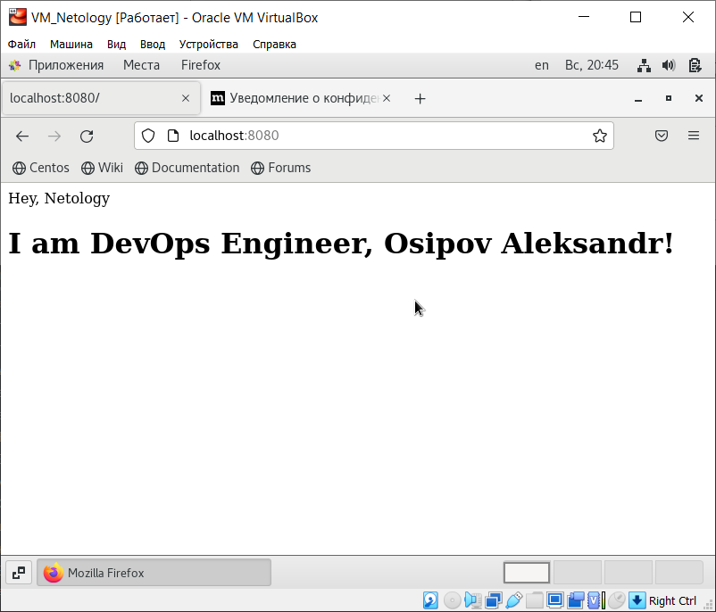

# Домашнее задание к занятию "3. Введение. Экосистема. Архитектура. Жизненный цикл Docker контейнера"

---

## Задача 1

Сценарий выполения задачи:

- создайте свой репозиторий на https://hub.docker.com;
- выберете любой образ, который содержит веб-сервер Nginx;
- создайте свой fork образа;
- реализуйте функциональность:
запуск веб-сервера в фоне с индекс-страницей, содержащей HTML-код ниже:
```
<html>
<head>
Hey, Netology
</head>
<body>
<h1>I’m DevOps Engineer!</h1>
</body>
</html>
```
Опубликуйте созданный форк в своем репозитории и предоставьте ответ в виде ссылки на https://hub.docker.com/username_repo.
---
## Ответ
1. Создан репозиторий alexelfman/osipov_aleksandr
2. > docker pull nginx
   > docker image ls

REPOSITORY    TAG       IMAGE ID       CREATED         SIZE
nginx         latest    3f8a00f137a0   3 days ago      142MB

3. Создание докерфайла
> vi dockerfile

``` FROM nginx
RUN echo '<html><head>Hey, Netology</head><body><h1>I am DevOps Engineer, Osipov Aleksandr!</h1></body></html>' > /usr/share/nginx/html/index.html
```
Создаем образ
4. > docker build -f dockerfile -t alexelfman/osipov_aleksandr:5.3 .
   
Авторизуемся в docker.hub:
>  docker login -u alexelfman

Отправляем в удаленный репозиторий наш образ 
> docker push alexelfman/osipov_aleksandr:5.3

Ссылка на образ https://hub.docker.com/layers/alexelfman/osipov_aleksandr/5.3/images/sha256-189fe46361d9d8e9ce02c826ad58463f8bf3414ed313b0d917fb08992d946ff8?context=repo

Запускаем контейнер и проверяем статус:
> docker run -d -p 8080:80 alexelfman/osipov_aleksandr:5.3
> 
> docker ps
> 
``` CONTAINER ID   IMAGE                             COMMAND                  CREATED              STATUS              PORTS                                   NAMES
767d23eb2b26   alexelfman/osipov_aleksandr:5.3   "/docker-entrypoint.…"   About a minute ago   Up About a minute   0.0.0.0:8080->80/tcp, :::8080->80/tcp   heuristic_williams
```
Открываем окно браузера на ВМ



## Задача 2

Посмотрите на сценарий ниже и ответьте на вопрос:
"Подходит ли в этом сценарии использование Docker контейнеров или лучше подойдет виртуальная машина, физическая машина? Может быть возможны разные варианты?"

Детально опишите и обоснуйте свой выбор.

--

Сценарий:

- Высоконагруженное монолитное java веб-приложение;
- Nodejs веб-приложение;
- Мобильное приложение c версиями для Android и iOS;
- Шина данных на базе Apache Kafka;
- Elasticsearch кластер для реализации логирования продуктивного веб-приложения - три ноды elasticsearch, два logstash и две ноды kibana;
- Мониторинг-стек на базе Prometheus и Grafana;
- MongoDB, как основное хранилище данных для java-приложения;
- Gitlab сервер для реализации CI/CD процессов и приватный (закрытый) Docker Registry.
---
## Ответ

#### Высоконагруженное монолитное java веб-приложение;
Физическая машина, чтобы не расходовать ресурсы на виртуализацию, к тому же из-за монолитности не будет проблем с разворачиванием на разных машинах.

#### Nodejs веб-приложение;
Docker, для более простого воспроизведения зависимостей в рабочих средах

#### Мобильное приложение c версиями для Android и iOS;
Виртуальные машины, проще для тестирования, размещения на одной хостовой машине

#### Шина данных на базе Apache Kafka;
Docker, есть готовые образы для apache kafka, на руку изолированность приложений, а также легкий откат на стабильные версии в случае обнаружения багов в продакшене

#### Elasticsearch кластер для реализации логирования продуктивного веб-приложения - три ноды elasticsearch, два logstash и две ноды kibana;
Docker, Elasticsearch доступен для установки как образ docker, проще удалять логи, удобнее при кластеризации - меньше времени на запуск контейнеров.

#### Мониторинг-стек на базе Prometheus и Grafana;
Docker. Есть готовые образы, приложения не хранят данные, что удобно при контейниризации, удобно масштабировать и быстро разворачивать.

#### MongoDB, как основное хранилище данных для java-приложения;
Физическая машина как наиболее надежное, отказоустойчивое решение. Либо виртуальный сервер. У нас на проекте отдельная ВМ

#### Gitlab сервер для реализации CI/CD процессов и приватный (закрытый) Docker Registry
Могут быть применены все варианты, в зависимости от наличия соответствующих ресурсов. Но для большей изолированности лучше использовать docker. К тому же в связи в внедрением санкционных мер, репозитории для установки на физический либо виртуальный сервер не доступны с территории РФ. 

## Задача 3

- Запустите первый контейнер из образа ***centos*** c любым тэгом в фоновом режиме, подключив папку ```/data``` из текущей рабочей директории на хостовой машине в ```/data``` контейнера;
- Запустите второй контейнер из образа ***debian*** в фоновом режиме, подключив папку ```/data``` из текущей рабочей директории на хостовой машине в ```/data``` контейнера;
- Подключитесь к первому контейнеру с помощью ```docker exec``` и создайте текстовый файл любого содержания в ```/data```;
- Добавьте еще один файл в папку ```/data``` на хостовой машине;
- Подключитесь во второй контейнер и отобразите листинг и содержание файлов в ```/data``` контейнера.
## Ответ
> docker run -v /data:/data --name centos-container -d -t centos
> 
> docker run -v /data:/data --name debian-container -d -t debian
> 
Просматриваем запущенные образы
> docker ps
>
```CONTAINER ID   IMAGE                             COMMAND                  CREATED              STATUS              PORTS                                   NAMES
2f84e8c4355e   debian                            "bash"                   16 seconds ago       Up 16 seconds                                               debian-container
33908d160cfe   centos                            "/bin/bash"              About a minute ago   Up About a minute                                           centos-container
767d23eb2b26   alexelfman/osipov_aleksandr:5.3   "/docker-entrypoint.…"   27 minutes ago       Up 27 minutes       0.0.0.0:8080->80/tcp, :::8080->80/tcp   heuristic_williams
```

Создаем новый файл
> docker exec centos-container /bin/bash -c "echo test_message>/data/write.md"

Добавляем новый файл с содержимым ```Hello, Netology!```

> sudo nano /data/test.md

Подключаемся ко второй машине и смотрим содержимое каталога ```/data```
> docker exec -it debian-container /bin/bash

root@2f84e8c4355e:/# ls data/
```test.md  write.md```

## Задача 4 (*)

Воспроизвести практическую часть лекции самостоятельно.

Соберите Docker образ с Ansible, загрузите на Docker Hub и пришлите ссылку вместе с остальными ответами к задачам.
## Ответ
> vi dockerfile_ansible
```
FROM alpine:3.14

RUN  CARGO_NET_GIT_FETCH_WITH_CLI=1 && \
     apk --no-cache add \
sudo python3 py3-pip openssl ca-certificates sshpass openssh-client rsync git && \
     apk --no-cache add --virtual build-dependencies python3-dev libffi-dev musl-dev gcc cargo openssl-dev \
        libressl-dev \
        build-base && \
     pip install --upgrade pip wheel && \
     pip install --upgrade cryptography cffi && \
     pip install ansible==2.9.24 && \
     pip install mitogen ansible-lint jmespath && \
     pip install --upgrade pywinrm && \
     apk del build-dependencies && \
     rm -rf /var/cache/apk/* && \
     rm -rf /root/.cache/pip && \
     rm -rf /root/.cargo

RUN  mkdir /ansible && \
     mkdir -p /etc/ansible && \
     echo 'localhost' > /etc/ansible/hosts

WORKDIR /ansible

CMD [ "ansible-playbook", "--version" ]
```

> docker build -f dockerfile_ansible -t alexelfman/osipov_aleksandr/ansible:2.9.24 .

Собрал образ и отправил в хаб.

> docker build -f dockerfile_ansible -t alexelfman/osipov_aleksandr/ansible:2.9.24 .
> 
В процессе создания образа возникло несколько предупреждений

> WARNING: Running pip as the 'root' user can result in broken permissions and conflicting behaviour with the system package manager. It is recommended to use a virtual environment instead: https://pip.pypa.io/warnings/venv
> 
В результате образ не создался, вывел следующее:
``` 
ERROR: Cannot uninstall 'packaging'. It is a distutils installed project and thus we cannot accurately determine which files belong to it which would lead to only a partial uninstall.
The command '/bin/sh -c CARGO_NET_GIT_FETCH_WITH_CLI=1 &&      apk --no-cache add sudo python3 py3-pip openssl ca-certificates sshpass openssh-client rsync git &&      apk --no-cache add --virtual build-dependencies python3-dev libffi-dev musl-dev gcc cargo openssl-dev         libressl-dev         build-base &&      pip install --upgrade pip wheel &&      pip install --upgrade cryptography cffi &&      pip install ansible==2.9.24 &&      pip install mitogen ansible-lint jmespath &&      pip install --upgrade pywinrm &&      apk del build-dependencies &&      rm -rf /var/cache/apk/* &&      rm -rf /root/.cache/pip &&      rm -rf /root/.cargo' returned a non-zero code: 1
```

---